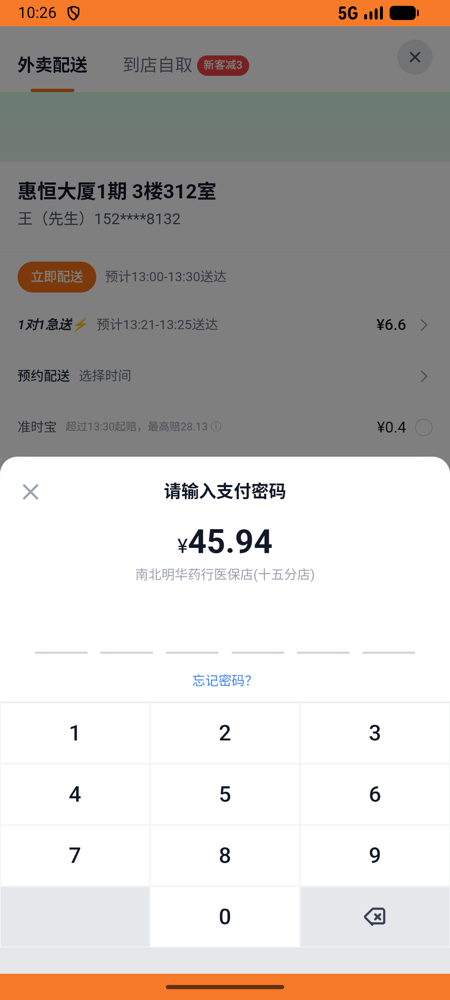

# kanbing_v020_place_order_three_medicines  ⚠️

- **Brand**: `daishushenghuo`
- **Class**: `DaishushenghuoKanbingV020PlaceOrderThreeMedicinesTask`
- **Pass@3**: **1/3**  (score = 1.00)
- **Elapsed**: 787s (~13.1 min)
- **Model**: `doubao-seed-2-0-pro-260215`
- **Raw log**: [./raw_logs/DaishushenghuoKanbingV020PlaceOrderThreeMedicinesTask.log](./raw_logs/DaishushenghuoKanbingV020PlaceOrderThreeMedicinesTask.log)
- **Generated**: 2026-05-13T21:34:47+08:00

## Task Goal

> 【当前账户档案】账号：demo@rlbox.ai；昵称：张三；支付密码：123456；默认收货地址（JSON）：{"recipient": "王", "phone": "15212348132", "address": "惠恒大厦1期 3楼312室"}。请基于以上档案完成下列任务：在南北明华药行医保店(十五分店)一次下单 3 种药品（999感冒灵¥13.61 + 小柴胡¥17.86 + 蒲地蓝消炎片¥19.48，配送费¥0，总计¥50.95，订单待支付）

## Attempts

| # | Outcome | Steps | Terminated | Reason | Start → End |
|---|---------|-------|------------|--------|-------------|
| 1 | ❌ failed | 31 | answer | – | – |
| 2 | ✅ passed | 40 | answer | – | – |

## Failure Details

### Episode 1 — ❌ failed

- steps_used: `31`
- terminated_reason: `answer`
- death shot: 
  - state: [`./death_shots/DaishushenghuoKanbingV020PlaceOrderThreeMedicinesTask/episode_001/step_031.json`](./death_shots/DaishushenghuoKanbingV020PlaceOrderThreeMedicinesTask/episode_001/step_031.json)

---

> 本摘要由 `sengclaw/scripts/pipeline/log_summarizer.py` 自动生成。 原始完整 log 见上方 Raw log 链接（含每 step 的 messages / tool_call / screenshot 引用）。
