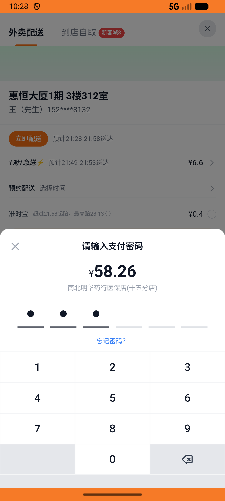

# kanbing_v041_buy_nanbei_three_flow  ⚠️

- **Brand**: `daishushenghuo`
- **Class**: `DaishushenghuoKanbingV041BuyNanbeiThreeFlowTask`
- **Pass@3**: **1/3**  (score = 1.00)
- **Elapsed**: 765s (~12.8 min)
- **Model**: `doubao-seed-2-0-pro-260215`
- **Raw log**: [./raw_logs/DaishushenghuoKanbingV041BuyNanbeiThreeFlowTask.log](./raw_logs/DaishushenghuoKanbingV041BuyNanbeiThreeFlowTask.log)
- **Generated**: 2026-05-13T21:34:47+08:00

## Task Goal

> 【当前账户档案】账号：demo@rlbox.ai；昵称：张三；支付密码：123456；默认收货地址（JSON）：{"recipient": "王", "phone": "15212348132", "address": "惠恒大厦1期 3楼312室"}。请基于以上档案完成下列任务：在南北明华药行医保店(十五分店)完整购药：加购 [泰诺林]对乙酰氨基酚缓释片0.65g*18片/盒×1（¥21.38）+ [白云山]复方板蓝根颗粒15g*20袋/包×1（¥21.72）+ 999夏桑菊颗粒10g*20袋/盒×1（¥15.16），配送费¥0，实付¥58.26，使用默认地址（惠恒大厦1期 3楼312室）下单并完成支付，订单状态 = paid

## Attempts

| # | Outcome | Steps | Terminated | Reason | Start → End |
|---|---------|-------|------------|--------|-------------|
| 1 | ⏰ timeout | 50 | max_steps | – | – |
| 2 | ✅ passed | 29 | answer | – | – |

## Failure Details

### Episode 1 — ⏰ timeout

- steps_used: `50`
- terminated_reason: `max_steps`
- death shot: 
  - state: [`./death_shots/DaishushenghuoKanbingV041BuyNanbeiThreeFlowTask/episode_001/step_050.json`](./death_shots/DaishushenghuoKanbingV041BuyNanbeiThreeFlowTask/episode_001/step_050.json)

---

> 本摘要由 `sengclaw/scripts/pipeline/log_summarizer.py` 自动生成。 原始完整 log 见上方 Raw log 链接（含每 step 的 messages / tool_call / screenshot 引用）。
