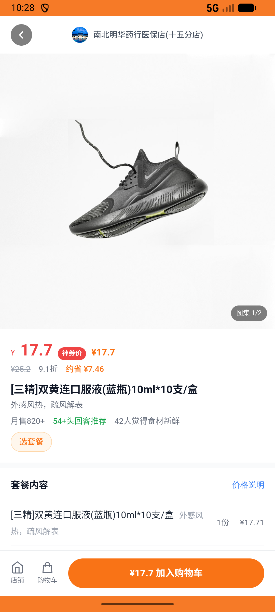

# kanbing_v034_cheapest_shuanghuanglian  ⚠️

- **Brand**: `daishushenghuo`
- **Class**: `DaishushenghuoKanbingV034CheapestShuanghuanglianTask`
- **Pass@3**: **1/3**  (score = 1.00)
- **Elapsed**: 1422s (~23.7 min)
- **Model**: `doubao-seed-2-0-pro-260215`
- **Raw log**: [./raw_logs/DaishushenghuoKanbingV034CheapestShuanghuanglianTask.log](./raw_logs/DaishushenghuoKanbingV034CheapestShuanghuanglianTask.log)
- **Generated**: 2026-05-14T11:14:58+08:00

## Task Goal

> 【当前账户档案】账号：demo@rlbox.ai；昵称：张三；支付密码：123456；默认收货地址（JSON）：{"recipient": "王", "phone": "15212348132", "address": "惠恒大厦1期 3楼312室"}。请基于以上档案完成下列任务：比价 [三精]双黄连口服液(蓝瓶)10ml*10支/盒，在最便宜的药店加购 1 盒

## Attempts

| # | Outcome | Steps | Terminated | Reason | Start → End |
|---|---------|-------|------------|--------|-------------|
| 1 | ❌ failed | 32 | answer | – | – |
| 2 | ❌ failed | 44 | answer | – | – |
| 3 | ✅ passed | 44 | answer | – | – |

## Failure Details

### Episode 1 — ❌ failed

- steps_used: `32`
- terminated_reason: `answer`
- death shot: 
  - state: [`./death_shots/DaishushenghuoKanbingV034CheapestShuanghuanglianTask/episode_001/step_032.json`](./death_shots/DaishushenghuoKanbingV034CheapestShuanghuanglianTask/episode_001/step_032.json)

### Episode 2 — ❌ failed

- steps_used: `44`
- terminated_reason: `answer`
- death shot: 
  - state: [`./death_shots/DaishushenghuoKanbingV034CheapestShuanghuanglianTask/episode_002/step_044.json`](./death_shots/DaishushenghuoKanbingV034CheapestShuanghuanglianTask/episode_002/step_044.json)

---

> 本摘要由 `sengclaw/scripts/pipeline/log_summarizer.py` 自动生成。 原始完整 log 见上方 Raw log 链接（含每 step 的 messages / tool_call / screenshot 引用）。
