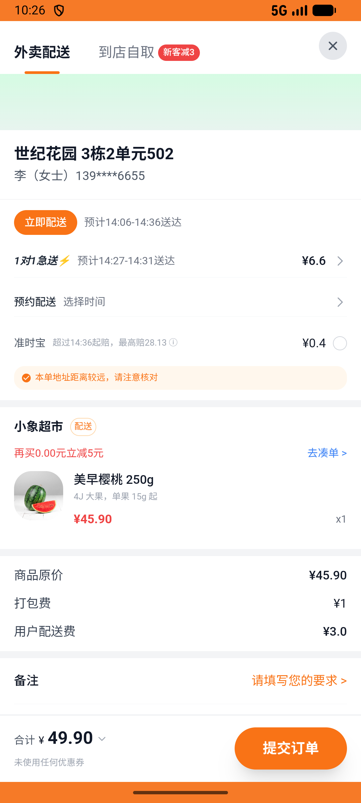

# xxsm_v029_place_order_address_fields_consistent  ❌

- **Brand**: `daishushenghuo`
- **Class**: `DaishushenghuoXxsmV029PlaceOrderAddressFieldsConsistentTask`
- **Pass@3**: **0/3**  (score = 0.00)
- **Elapsed**: 515s (~8.6 min)
- **Model**: `doubao-seed-2-0-pro-260215`
- **Raw log**: [./raw_logs/DaishushenghuoXxsmV029PlaceOrderAddressFieldsConsistentTask.log](./raw_logs/DaishushenghuoXxsmV029PlaceOrderAddressFieldsConsistentTask.log)
- **Generated**: 2026-05-18T14:10:36+08:00

## Task Goal

> 【当前账户档案】账号：demo@rlbox.ai；昵称：张三；支付密码：123456；默认收货地址（JSON）：{"recipient": "王", "phone": "15212348132", "address": "惠恒大厦1期 3楼312室"}。请基于以上档案完成下列任务：小象超市下单时切到地址「李/世纪花园 3栋2单元502」（验 address_id 关联与 delivery_address/phone/name 三字段全部一致）

## Attempts

| # | Outcome | Steps | Terminated | Reason | Start → End |
|---|---------|-------|------------|--------|-------------|
| 1 | ❌ failed | 14 | answer | – | – |
| 2 | ❌ failed | 5 | answer | – | – |
| 3 | ❌ failed | 5 | answer | – | – |

## Failure Details

### Episode 1 — ❌ failed

- steps_used: `14`
- terminated_reason: `answer`
- death shot: 
  - state: [`./death_shots/DaishushenghuoXxsmV029PlaceOrderAddressFieldsConsistentTask/episode_001/step_014.json`](./death_shots/DaishushenghuoXxsmV029PlaceOrderAddressFieldsConsistentTask/episode_001/step_014.json)

### Episode 2 — ❌ failed

- steps_used: `5`
- terminated_reason: `answer`
- death shot: 
  - state: [`./death_shots/DaishushenghuoXxsmV029PlaceOrderAddressFieldsConsistentTask/episode_002/step_005.json`](./death_shots/DaishushenghuoXxsmV029PlaceOrderAddressFieldsConsistentTask/episode_002/step_005.json)

### Episode 3 — ❌ failed

- steps_used: `5`
- terminated_reason: `answer`
- death shot: 
  - state: [`./death_shots/DaishushenghuoXxsmV029PlaceOrderAddressFieldsConsistentTask/episode_003/step_005.json`](./death_shots/DaishushenghuoXxsmV029PlaceOrderAddressFieldsConsistentTask/episode_003/step_005.json)

---

> 本摘要由 `sengclaw/scripts/pipeline/log_summarizer.py` 自动生成。 原始完整 log 见上方 Raw log 链接（含每 step 的 messages / tool_call / screenshot 引用）。
