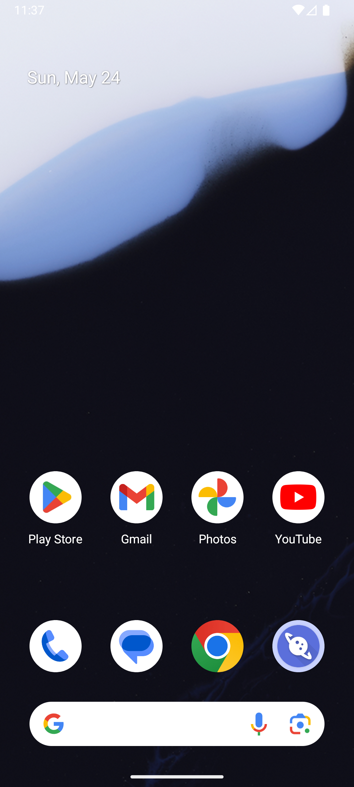

# address_v004_add_school_address  ⚠️

- **Brand**: `daishushenghuo`
- **Class**: `DaishushenghuoAddressV004AddSchoolAddressTask`
- **Pass@3**: **1/3**  (score = 1.00)
- **Elapsed**: 254s (~4.2 min)
- **Model**: `doubao-seed-2-0-lite-260428`
- **Raw log**: [./raw_logs/DaishushenghuoAddressV004AddSchoolAddressTask.log](./raw_logs/DaishushenghuoAddressV004AddSchoolAddressTask.log)
- **Generated**: 2026-05-24T22:43:27+08:00

## Task Goal

> 【当前账户档案】账号：demo@rlbox.ai；昵称：张三；支付密码：123456；默认收货地址（JSON）：{"recipient": "王", "phone": "15212348132", "address": "惠恒大厦1期 3楼312室"}。请基于以上档案使用袋鼠生活应用完成以下任务：新增学校收货地址（联系人：赵同学 15088889999，北京市海淀区北京大学燕园28号楼，类型：学校）

## Attempts

| # | Outcome | Steps | Terminated | Reason | Start → End |
|---|---------|-------|------------|--------|-------------|
| 1 | 💥 error | 0 | exception | exception: 404 Not Found for url: http://localhost:6800/screenshot?return_b64=True \\| detail: No available devices found | 2026-05-24 22:39:13 → 2026-05-24 22:39:25 |
| 2 | ❌ failed | 6 | answer | – | 2026-05-24 22:39:56 → 2026-05-24 22:40:46 |
| 3 | ✅ passed | 18 | answer | – | 2026-05-24 22:41:17 → 2026-05-24 22:43:27 |

## Failure Details

### Episode 1 — 💥 error

- steps_used: `0`
- terminated_reason: `exception`
- reason:

  ```
  exception: 404 Not Found for url: http://localhost:6800/screenshot?return_b64=True | detail: No available devices found
  ```

### Episode 2 — ❌ failed

- steps_used: `6`
- terminated_reason: `answer`
- death shot: 
  - state: [`./death_shots/DaishushenghuoAddressV004AddSchoolAddressTask/episode_002/step_006.json`](./death_shots/DaishushenghuoAddressV004AddSchoolAddressTask/episode_002/step_006.json)
  - digest: [`episode_digest.md`](./death_shots/DaishushenghuoAddressV004AddSchoolAddressTask/episode_002/episode_digest.md)

---

> 本摘要由 `sengclaw/scripts/pipeline/log_summarizer.py` 自动生成。 原始完整 log 见上方 Raw log 链接（含每 step 的 messages / tool_call / screenshot 引用）。
