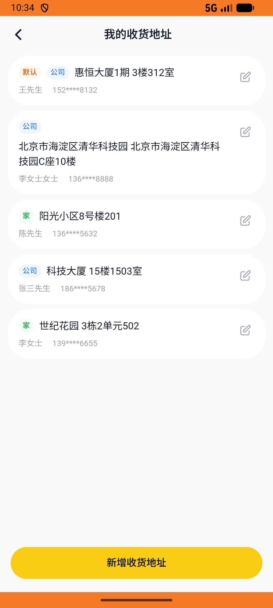

# address_v002_add_company_address  ⚠️

- **Brand**: `daishushenghuo`
- **Class**: `DaishushenghuoAddressV002AddCompanyAddressTask`
- **Pass@3**: **1/3**  (score = 1.00)
- **Elapsed**: 470s (~7.8 min)
- **Model**: `doubao-seed-2-0-lite-260428`
- **Raw log**: [./raw_logs/DaishushenghuoAddressV002AddCompanyAddressTask.log](./raw_logs/DaishushenghuoAddressV002AddCompanyAddressTask.log)
- **Generated**: 2026-05-25T00:33:27+08:00

## Task Goal

> 【当前账户档案】账号：demo@rlbox.ai；昵称：张三；支付密码：123456；默认收货地址（JSON）：{"recipient": "王", "phone": "15212348132", "address": "惠恒大厦1期 3楼312室"}。请基于以上档案使用袋鼠生活（com.daishushenghuo）应用完成以下任务：新增公司收货地址（联系人：李女士 13666668888，北京市海淀区清华科技园C座10楼，类型：公司）

## Attempts

| # | Outcome | Steps | Terminated | Reason | Start → End |
|---|---------|-------|------------|--------|-------------|
| 1 | ✅ passed | 21 | answer | – | 2026-05-25 00:25:37 → 2026-05-25 00:28:12 |
| 2 | ❌ failed | 26 | answer | – | 2026-05-25 00:28:43 → 2026-05-25 00:31:43 |
| 3 | ❌ failed | 9 | answer | – | 2026-05-25 00:32:14 → 2026-05-25 00:33:26 |

## Failure Details

### Episode 2 — ❌ failed

- steps_used: `26`
- terminated_reason: `answer`
- death shot: 
  - state: [`./death_shots/DaishushenghuoAddressV002AddCompanyAddressTask/episode_002/step_026.json`](./death_shots/DaishushenghuoAddressV002AddCompanyAddressTask/episode_002/step_026.json)
  - digest: [`episode_digest.md`](./death_shots/DaishushenghuoAddressV002AddCompanyAddressTask/episode_002/episode_digest.md)

### Episode 3 — ❌ failed

- steps_used: `9`
- terminated_reason: `answer`
- death shot: 
  - state: [`./death_shots/DaishushenghuoAddressV002AddCompanyAddressTask/episode_003/step_009.json`](./death_shots/DaishushenghuoAddressV002AddCompanyAddressTask/episode_003/step_009.json)
  - digest: [`episode_digest.md`](./death_shots/DaishushenghuoAddressV002AddCompanyAddressTask/episode_003/episode_digest.md)

---

> 本摘要由 `sengclaw/scripts/pipeline/log_summarizer.py` 自动生成。 原始完整 log 见上方 Raw log 链接（含每 step 的 messages / tool_call / screenshot 引用）。
