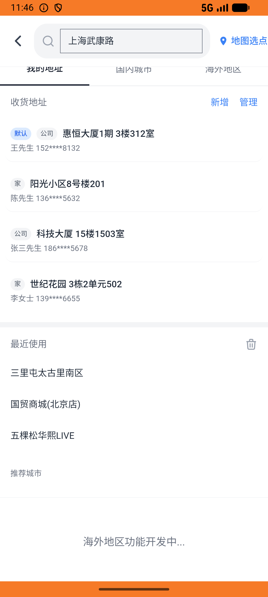
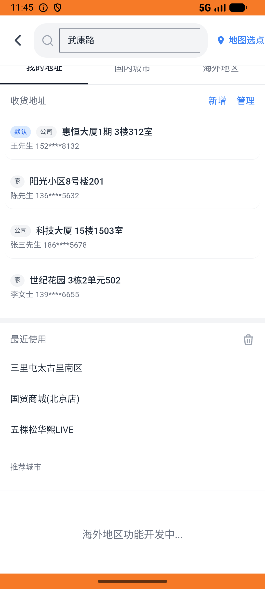

# group_deal_v005_place_order_manner  ⚠️

- **Brand**: `daishushenghuo`
- **Class**: `DaishushenghuoGroupDealV005PlaceOrderMannerTask`
- **Pass@3**: **1/3**  (score = 1.00)
- **Elapsed**: 709s (~11.8 min)
- **Model**: `doubao-seed-2-0-lite-260428`
- **Raw log**: [./raw_logs/DaishushenghuoGroupDealV005PlaceOrderMannerTask.log](./raw_logs/DaishushenghuoGroupDealV005PlaceOrderMannerTask.log)
- **Generated**: 2026-05-25T21:32:18+08:00

## Task Goal

> 【当前账户档案】账号：demo@rlbox.ai；昵称：张三；支付密码：123456；默认收货地址（JSON）：{"recipient": "王", "phone": "15212348132", "address": "惠恒大厦1期 3楼312室"}。请基于以上档案打开 com.daishushenghuo 并完成以下任务：在Manner武康路店下单手冲咖啡团购券并完成支付（3份精品手冲¥57，到店消费，已支付）

## Attempts

| # | Outcome | Steps | Terminated | Reason | Start → End |
|---|---------|-------|------------|--------|-------------|
| 1 | ✅ passed | 26 | answer | – | 2026-05-25 21:20:29 → 2026-05-25 21:24:26 |
| 2 | ❌ failed | 27 | answer | – | 2026-05-25 21:24:57 → 2026-05-25 21:28:42 |
| 3 | ❌ failed | 22 | answer | – | 2026-05-25 21:29:13 → 2026-05-25 21:32:18 |

## Failure Details

### Episode 2 — ❌ failed

- steps_used: `27`
- terminated_reason: `answer`
- death shot: 
  - state: [`./death_shots/DaishushenghuoGroupDealV005PlaceOrderMannerTask/episode_002/step_027.json`](./death_shots/DaishushenghuoGroupDealV005PlaceOrderMannerTask/episode_002/step_027.json)
  - digest: [`episode_digest.md`](./death_shots/DaishushenghuoGroupDealV005PlaceOrderMannerTask/episode_002/episode_digest.md)

### Episode 3 — ❌ failed

- steps_used: `22`
- terminated_reason: `answer`
- death shot: 
  - state: [`./death_shots/DaishushenghuoGroupDealV005PlaceOrderMannerTask/episode_003/step_022.json`](./death_shots/DaishushenghuoGroupDealV005PlaceOrderMannerTask/episode_003/step_022.json)
  - digest: [`episode_digest.md`](./death_shots/DaishushenghuoGroupDealV005PlaceOrderMannerTask/episode_003/episode_digest.md)

---

> 本摘要由 `sengclaw/scripts/pipeline/log_summarizer.py` 自动生成。 原始完整 log 见上方 Raw log 链接（含每 step 的 messages / tool_call / screenshot 引用）。
