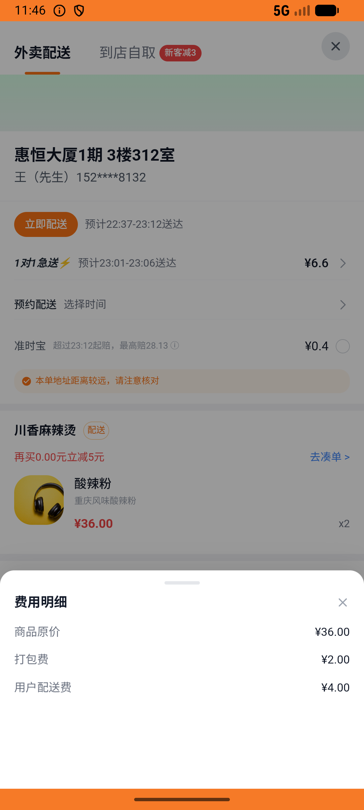

# order_v008_place_order_malatang  ❌

- **Brand**: `daishushenghuo`
- **Class**: `DaishushenghuoOrderV008PlaceOrderMalatangTask`
- **Pass@3**: **0/3**  (score = 0.00)
- **Elapsed**: 665s (~11.1 min)
- **Model**: `doubao-seed-2-0-lite-260428`
- **Raw log**: [./raw_logs/DaishushenghuoOrderV008PlaceOrderMalatangTask.log](./raw_logs/DaishushenghuoOrderV008PlaceOrderMalatangTask.log)
- **Generated**: 2026-05-25T22:38:26+08:00

## Task Goal

> 【当前账户档案】账号：demo@rlbox.ai；昵称：张三；支付密码：123456；默认收货地址（JSON）：{"recipient": "王", "phone": "15212348132", "address": "惠恒大厦1期 3楼312室"}。请基于以上档案打开 com.daishushenghuo 并完成以下任务：在川香麻辣烫成功下单（2份酸辣粉¥36，配送费¥4，总计¥40）

## Attempts

| # | Outcome | Steps | Terminated | Reason | Start → End |
|---|---------|-------|------------|--------|-------------|
| 1 | ❌ failed | 18 | answer | – | 2026-05-25 22:27:22 → 2026-05-25 22:30:43 |
| 2 | ❌ failed | 16 | answer | – | 2026-05-25 22:31:14 → 2026-05-25 22:34:08 |
| 3 | ❌ failed | 18 | answer | – | 2026-05-25 22:34:39 → 2026-05-25 22:38:26 |

## Failure Details

### Episode 1 — ❌ failed

- steps_used: `18`
- terminated_reason: `answer`
- death shot: 
  - state: [`./death_shots/DaishushenghuoOrderV008PlaceOrderMalatangTask/episode_001/step_018.json`](./death_shots/DaishushenghuoOrderV008PlaceOrderMalatangTask/episode_001/step_018.json)
  - digest: [`episode_digest.md`](./death_shots/DaishushenghuoOrderV008PlaceOrderMalatangTask/episode_001/episode_digest.md)

### Episode 2 — ❌ failed

- steps_used: `16`
- terminated_reason: `answer`
- death shot: 
  - state: [`./death_shots/DaishushenghuoOrderV008PlaceOrderMalatangTask/episode_002/step_016.json`](./death_shots/DaishushenghuoOrderV008PlaceOrderMalatangTask/episode_002/step_016.json)
  - digest: [`episode_digest.md`](./death_shots/DaishushenghuoOrderV008PlaceOrderMalatangTask/episode_002/episode_digest.md)

### Episode 3 — ❌ failed

- steps_used: `18`
- terminated_reason: `answer`
- death shot: 
  - state: [`./death_shots/DaishushenghuoOrderV008PlaceOrderMalatangTask/episode_003/step_018.json`](./death_shots/DaishushenghuoOrderV008PlaceOrderMalatangTask/episode_003/step_018.json)
  - digest: [`episode_digest.md`](./death_shots/DaishushenghuoOrderV008PlaceOrderMalatangTask/episode_003/episode_digest.md)

---

> 本摘要由 `sengclaw/scripts/pipeline/log_summarizer.py` 自动生成。 原始完整 log 见上方 Raw log 链接（含每 step 的 messages / tool_call / screenshot 引用）。
