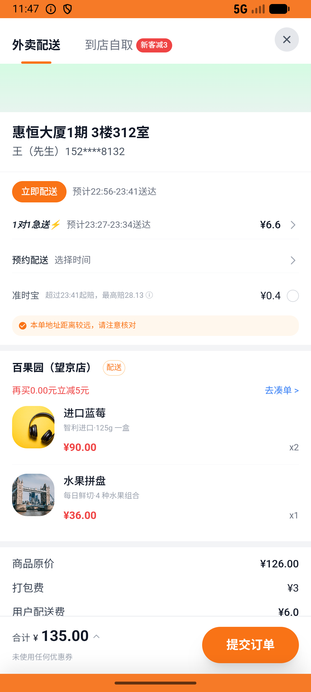
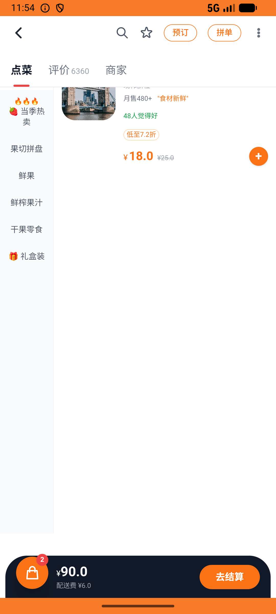

# order_v010_place_order_baiguoyuan_combo  ❌

- **Brand**: `daishushenghuo`
- **Class**: `DaishushenghuoOrderV010PlaceOrderBaiguoyuanComboTask`
- **Pass@3**: **0/3**  (score = 0.00)
- **Elapsed**: 1999s (~33.3 min)
- **Model**: `doubao-seed-2-0-lite-260428`
- **Raw log**: [./raw_logs/DaishushenghuoOrderV010PlaceOrderBaiguoyuanComboTask.log](./raw_logs/DaishushenghuoOrderV010PlaceOrderBaiguoyuanComboTask.log)
- **Generated**: 2026-05-25T23:24:58+08:00

## Task Goal

> 【当前账户档案】账号：demo@rlbox.ai；昵称：张三；支付密码：123456；默认收货地址（JSON）：{"recipient": "王", "phone": "15212348132", "address": "惠恒大厦1期 3楼312室"}。请基于以上档案打开 com.daishushenghuo 并完成以下任务：在百果园成功下单（2份进口蓝莓¥90 + 1份水果拼盘¥36，配送费¥6，总计¥132）

## Attempts

| # | Outcome | Steps | Terminated | Reason | Start → End |
|---|---------|-------|------------|--------|-------------|
| 1 | ❌ failed | 33 | answer | – | 2026-05-25 22:51:39 → 2026-05-25 22:56:46 |
| 2 | ⏰ timeout | 50 | max_steps | – | 2026-05-25 22:57:17 → 2026-05-25 23:12:09 |
| 3 | ⏰ timeout | 50 | max_steps | – | 2026-05-25 23:12:39 → 2026-05-25 23:24:58 |

## Failure Details

### Episode 1 — ❌ failed

- steps_used: `33`
- terminated_reason: `answer`
- death shot: 
  - state: [`./death_shots/DaishushenghuoOrderV010PlaceOrderBaiguoyuanComboTask/episode_001/step_033.json`](./death_shots/DaishushenghuoOrderV010PlaceOrderBaiguoyuanComboTask/episode_001/step_033.json)
  - digest: [`episode_digest.md`](./death_shots/DaishushenghuoOrderV010PlaceOrderBaiguoyuanComboTask/episode_001/episode_digest.md)

### Episode 2 — ⏰ timeout

- steps_used: `50`
- terminated_reason: `max_steps`
- death shot: 
  - state: [`./death_shots/DaishushenghuoOrderV010PlaceOrderBaiguoyuanComboTask/episode_002/step_050.json`](./death_shots/DaishushenghuoOrderV010PlaceOrderBaiguoyuanComboTask/episode_002/step_050.json)
  - digest: [`episode_digest.md`](./death_shots/DaishushenghuoOrderV010PlaceOrderBaiguoyuanComboTask/episode_002/episode_digest.md)

### Episode 3 — ⏰ timeout

- steps_used: `50`
- terminated_reason: `max_steps`
- death shot: 
  - state: [`./death_shots/DaishushenghuoOrderV010PlaceOrderBaiguoyuanComboTask/episode_003/step_050.json`](./death_shots/DaishushenghuoOrderV010PlaceOrderBaiguoyuanComboTask/episode_003/step_050.json)
  - digest: [`episode_digest.md`](./death_shots/DaishushenghuoOrderV010PlaceOrderBaiguoyuanComboTask/episode_003/episode_digest.md)

---

> 本摘要由 `sengclaw/scripts/pipeline/log_summarizer.py` 自动生成。 原始完整 log 见上方 Raw log 链接（含每 step 的 messages / tool_call / screenshot 引用）。
