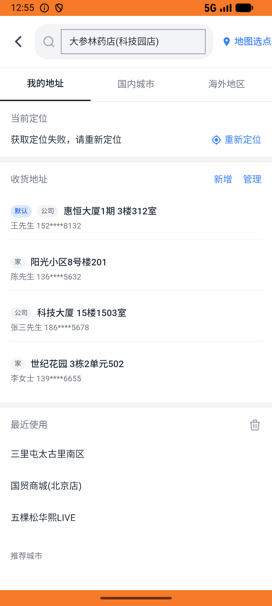

# kanbing_v010_place_order_dashenlin  ⚠️

- **Brand**: `daishushenghuo`
- **Class**: `DaishushenghuoKanbingV010PlaceOrderDashenlinTask`
- **Pass@3**: **2/3**  (score = 1.00)
- **Elapsed**: 1146s (~19.1 min)
- **Model**: `doubao-seed-2-0-lite-260428`
- **Raw log**: [./raw_logs/DaishushenghuoKanbingV010PlaceOrderDashenlinTask.log](./raw_logs/DaishushenghuoKanbingV010PlaceOrderDashenlinTask.log)
- **Generated**: 2026-05-26T13:08:51+08:00

## Task Goal

> 【当前账户档案】账号：demo@rlbox.ai；昵称：张三；支付密码：123456；默认收货地址（JSON）：{"recipient": "王", "phone": "15212348132", "address": "惠恒大厦1期 3楼312室"}。请基于以上档案打开 com.daishushenghuo 并完成以下任务：在大参林药店(科技园店)下单 1 盒[百灵鸟]维C银翘片12片*2板/盒（凑过起送，使用默认地址，订单待支付）

## Attempts

| # | Outcome | Steps | Terminated | Reason | Start → End |
|---|---------|-------|------------|--------|-------------|
| 1 | ❌ failed | 35 | answer | – | 2026-05-26 12:49:45 → 2026-05-26 12:55:40 |
| 2 | ✅ passed | 40 | answer | – | 2026-05-26 12:55:40 → 2026-05-26 13:02:20 |
| 3 | ✅ passed | 35 | answer | – | 2026-05-26 13:02:20 → 2026-05-26 13:08:50 |

## Failure Details

### Episode 1 — ❌ failed

- steps_used: `35`
- terminated_reason: `answer`
- death shot: 
  - state: [`./death_shots/DaishushenghuoKanbingV010PlaceOrderDashenlinTask/episode_001/step_035.json`](./death_shots/DaishushenghuoKanbingV010PlaceOrderDashenlinTask/episode_001/step_035.json)
  - digest: [`episode_digest.md`](./death_shots/DaishushenghuoKanbingV010PlaceOrderDashenlinTask/episode_001/episode_digest.md)

---

> 本摘要由 `sengclaw/scripts/pipeline/log_summarizer.py` 自动生成。 原始完整 log 见上方 Raw log 链接（含每 step 的 messages / tool_call / screenshot 引用）。
