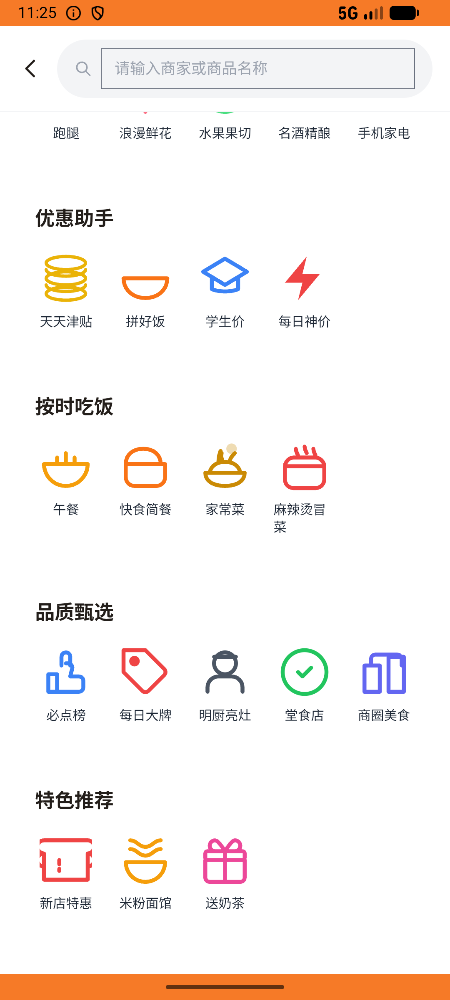
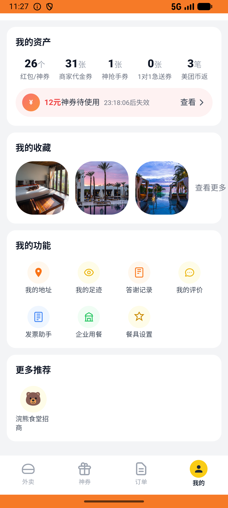

# coupon_v001_claim_fan_group_coupon  ⚠️

- **Brand**: `daishushenghuo`
- **Class**: `DaishushenghuoCouponV001ClaimFanGroupCouponTask`
- **Pass@3**: **1/3**  (score = 1.00)
- **Elapsed**: 336s (~5.6 min)
- **Model**: `doubao-seed-2-0-lite-260428`
- **Raw log**: [./raw_logs/DaishushenghuoCouponV001ClaimFanGroupCouponTask.log](./raw_logs/DaishushenghuoCouponV001ClaimFanGroupCouponTask.log)
- **Generated**: 2026-05-26T23:59:28+08:00

## Task Goal

> 【当前账户档案】账号：demo@rlbox.ai；昵称：张三；支付密码：123456；默认收货地址（JSON）：{"recipient": "王", "phone": "15212348132", "address": "惠恒大厦1期 3楼312室"}。请基于以上档案打开 com.daishushenghuo 并完成以下任务：去老王牛肉面馆的粉丝群领取新人入群红包

## Attempts

| # | Outcome | Steps | Terminated | Reason | Start → End |
|---|---------|-------|------------|--------|-------------|
| 1 | ✅ passed | 6 | answer | – | 2026-05-26 23:21:42 → 2026-05-26 23:22:19 |
| 2 | ❌ failed | 23 | answer | – | 2026-05-26 23:22:19 → 2026-05-26 23:25:12 |
| 3 | ❌ failed | 17 | answer | – | 2026-05-26 23:25:12 → 2026-05-26 23:27:18 |

## Failure Details

### Episode 2 — ❌ failed

- steps_used: `23`
- terminated_reason: `answer`
- death shot: 
  - state: [`./death_shots/DaishushenghuoCouponV001ClaimFanGroupCouponTask/episode_002/step_023.json`](./death_shots/DaishushenghuoCouponV001ClaimFanGroupCouponTask/episode_002/step_023.json)
  - digest: [`episode_digest.md`](./death_shots/DaishushenghuoCouponV001ClaimFanGroupCouponTask/episode_002/episode_digest.md)

### Episode 3 — ❌ failed

- steps_used: `17`
- terminated_reason: `answer`
- death shot: 
  - state: [`./death_shots/DaishushenghuoCouponV001ClaimFanGroupCouponTask/episode_003/step_017.json`](./death_shots/DaishushenghuoCouponV001ClaimFanGroupCouponTask/episode_003/step_017.json)
  - digest: [`episode_digest.md`](./death_shots/DaishushenghuoCouponV001ClaimFanGroupCouponTask/episode_003/episode_digest.md)

---

> 本摘要由 `sengclaw/scripts/pipeline/log_summarizer.py` 自动生成。 原始完整 log 见上方 Raw log 链接（含每 step 的 messages / tool_call / screenshot 引用）。
