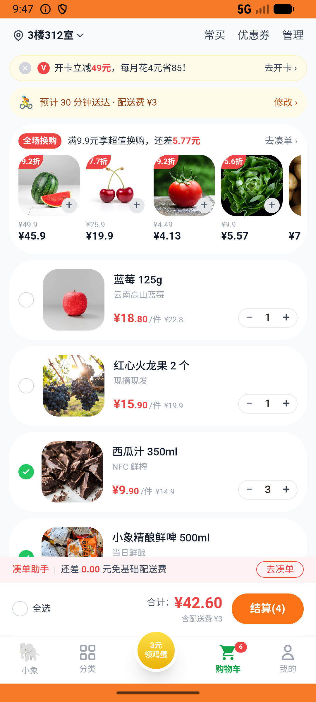

# xxsm_v030_cart_compound_operations  ⚠️

- **Brand**: `daishushenghuo`
- **Class**: `DaishushenghuoXxsmV030CartCompoundOperationsTask`
- **Pass@3**: **1/3**  (score = 1.00)
- **Elapsed**: 617s (~10.3 min)
- **Model**: `doubao-seed-2-0-lite-260428`
- **Raw log**: [./raw_logs/DaishushenghuoXxsmV030CartCompoundOperationsTask.log](./raw_logs/DaishushenghuoXxsmV030CartCompoundOperationsTask.log)
- **Generated**: 2026-05-27T09:53:07+08:00

## Task Goal

> 【当前账户档案】账号：demo@rlbox.ai；昵称：张三；支付密码：123456；默认收货地址（JSON）：{"recipient": "王", "phone": "15212348132", "address": "惠恒大厦1期 3楼312室"}。请基于以上档案打开 com.daishushenghuo 并完成以下任务：在小象超市购物车加购 4 个商品后删除 2 个并修改西瓜汁数量为 3

## Attempts

| # | Outcome | Steps | Terminated | Reason | Start → End |
|---|---------|-------|------------|--------|-------------|
| 1 | ❌ failed | 32 | answer | – | 2026-05-27 09:42:51 → 2026-05-27 09:47:40 |
| 2 | ❌ failed | 21 | answer | – | 2026-05-27 09:47:40 → 2026-05-27 09:50:20 |
| 3 | ✅ passed | 22 | answer | – | 2026-05-27 09:50:20 → 2026-05-27 09:53:07 |

## Failure Details

### Episode 1 — ❌ failed

- steps_used: `32`
- terminated_reason: `answer`
- death shot: 
  - state: [`./death_shots/DaishushenghuoXxsmV030CartCompoundOperationsTask/episode_001/step_032.json`](./death_shots/DaishushenghuoXxsmV030CartCompoundOperationsTask/episode_001/step_032.json)
  - digest: [`episode_digest.md`](./death_shots/DaishushenghuoXxsmV030CartCompoundOperationsTask/episode_001/episode_digest.md)

### Episode 2 — ❌ failed

- steps_used: `21`
- terminated_reason: `answer`
- death shot: 
  - state: [`./death_shots/DaishushenghuoXxsmV030CartCompoundOperationsTask/episode_002/step_021.json`](./death_shots/DaishushenghuoXxsmV030CartCompoundOperationsTask/episode_002/step_021.json)
  - digest: [`episode_digest.md`](./death_shots/DaishushenghuoXxsmV030CartCompoundOperationsTask/episode_002/episode_digest.md)

---

> 本摘要由 `sengclaw/scripts/pipeline/log_summarizer.py` 自动生成。 原始完整 log 见上方 Raw log 链接（含每 step 的 messages / tool_call / screenshot 引用）。
