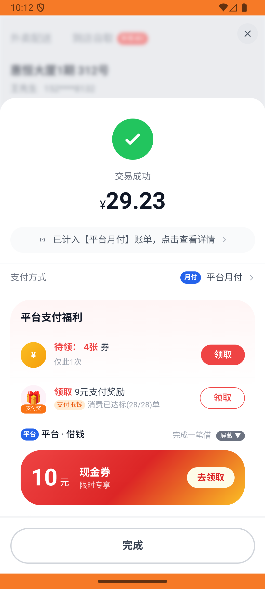

# kanbing_v030_buy_dashenlin_three  ⚠️

- **Brand**: `daishushenghuo`
- **Class**: `DaishushenghuoKanbingV030BuyDashenlinThreeTask`
- **Pass@3**: **2/3**  (score = 1.00)
- **Elapsed**: 938s (~15.6 min)
- **Model**: `doubao-seed-2-0-lite-260428`
- **Raw log**: [./raw_logs/DaishushenghuoKanbingV030BuyDashenlinThreeTask.log](./raw_logs/DaishushenghuoKanbingV030BuyDashenlinThreeTask.log)
- **Generated**: 2026-05-27T10:23:32+08:00

## Task Goal

> 【当前账户档案】账号：demo@rlbox.ai；昵称：张三；支付密码：123456；默认收货地址（JSON）：{"recipient": "王", "phone": "15212348132", "address": "惠恒大厦1期 3楼312室"}。请基于以上档案打开 com.daishushenghuo 并完成以下任务：在大参林药店买999感冒灵、小柴胡颗粒和维C银翘片各 1 盒并完成支付

## Attempts

| # | Outcome | Steps | Terminated | Reason | Start → End |
|---|---------|-------|------------|--------|-------------|
| 1 | ❌ failed | 38 | answer | – | 2026-05-27 10:07:54 → 2026-05-27 10:12:39 |
| 2 | ✅ passed | 41 | answer | – | 2026-05-27 10:12:39 → 2026-05-27 10:18:12 |
| 3 | ✅ passed | 37 | answer | – | 2026-05-27 10:18:12 → 2026-05-27 10:23:32 |

## Failure Details

### Episode 1 — ❌ failed

- steps_used: `38`
- terminated_reason: `answer`
- death shot: 
  - state: [`./death_shots/DaishushenghuoKanbingV030BuyDashenlinThreeTask/episode_001/step_038.json`](./death_shots/DaishushenghuoKanbingV030BuyDashenlinThreeTask/episode_001/step_038.json)
  - digest: [`episode_digest.md`](./death_shots/DaishushenghuoKanbingV030BuyDashenlinThreeTask/episode_001/episode_digest.md)

---

> 本摘要由 `sengclaw/scripts/pipeline/log_summarizer.py` 自动生成。 原始完整 log 见上方 Raw log 链接（含每 step 的 messages / tool_call / screenshot 引用）。
