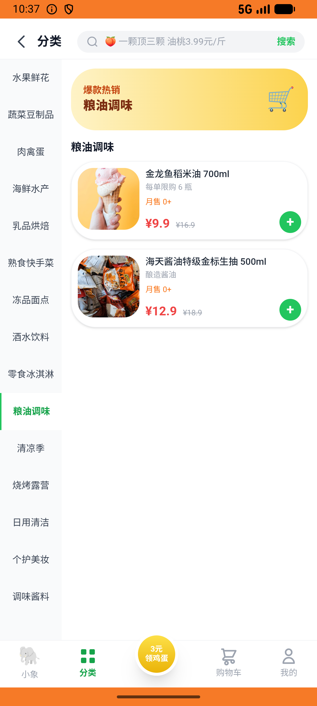
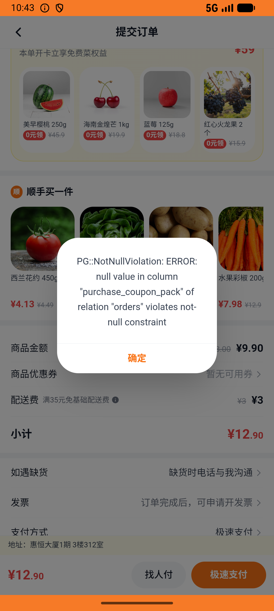

# xxsm_v035_two_orders_same_shop  ❌

- **Brand**: `daishushenghuo`
- **Class**: `DaishushenghuoXxsmV035TwoOrdersSameShopTask`
- **Pass@3**: **0/3**  (score = 0.00)
- **Elapsed**: 789s (~13.2 min)
- **Model**: `doubao-seed-2-0-lite-260428`
- **Raw log**: [./raw_logs/DaishushenghuoXxsmV035TwoOrdersSameShopTask.log](./raw_logs/DaishushenghuoXxsmV035TwoOrdersSameShopTask.log)
- **Generated**: 2026-05-27T10:44:52+08:00

## Task Goal

> 【当前账户档案】账号：demo@rlbox.ai；昵称：张三；支付密码：123456；默认收货地址（JSON）：{"recipient": "王", "phone": "15212348132", "address": "惠恒大厦1期 3楼312室"}。请基于以上档案打开 com.daishushenghuo 并完成以下任务：在小象超市先下 1 笔西兰花订单，再下 1 笔金龙鱼稻米油订单

## Attempts

| # | Outcome | Steps | Terminated | Reason | Start → End |
|---|---------|-------|------------|--------|-------------|
| 1 | ❌ failed | 36 | answer | – | 2026-05-27 10:31:42 → 2026-05-27 10:37:39 |
| 2 | ❌ failed | 38 | answer | – | 2026-05-27 10:37:39 → 2026-05-27 10:43:31 |
| 3 | ❌ failed | 11 | answer | – | 2026-05-27 10:43:31 → 2026-05-27 10:44:51 |

## Failure Details

### Episode 1 — ❌ failed

- steps_used: `36`
- terminated_reason: `answer`
- death shot: 
  - state: [`./death_shots/DaishushenghuoXxsmV035TwoOrdersSameShopTask/episode_001/step_036.json`](./death_shots/DaishushenghuoXxsmV035TwoOrdersSameShopTask/episode_001/step_036.json)
  - digest: [`episode_digest.md`](./death_shots/DaishushenghuoXxsmV035TwoOrdersSameShopTask/episode_001/episode_digest.md)

### Episode 2 — ❌ failed

- steps_used: `38`
- terminated_reason: `answer`
- death shot: 
  - state: [`./death_shots/DaishushenghuoXxsmV035TwoOrdersSameShopTask/episode_002/step_038.json`](./death_shots/DaishushenghuoXxsmV035TwoOrdersSameShopTask/episode_002/step_038.json)
  - digest: [`episode_digest.md`](./death_shots/DaishushenghuoXxsmV035TwoOrdersSameShopTask/episode_002/episode_digest.md)

### Episode 3 — ❌ failed

- steps_used: `11`
- terminated_reason: `answer`
- death shot: 
  - state: [`./death_shots/DaishushenghuoXxsmV035TwoOrdersSameShopTask/episode_003/step_011.json`](./death_shots/DaishushenghuoXxsmV035TwoOrdersSameShopTask/episode_003/step_011.json)
  - digest: [`episode_digest.md`](./death_shots/DaishushenghuoXxsmV035TwoOrdersSameShopTask/episode_003/episode_digest.md)

---

> 本摘要由 `sengclaw/scripts/pipeline/log_summarizer.py` 自动生成。 原始完整 log 见上方 Raw log 链接（含每 step 的 messages / tool_call / screenshot 引用）。
