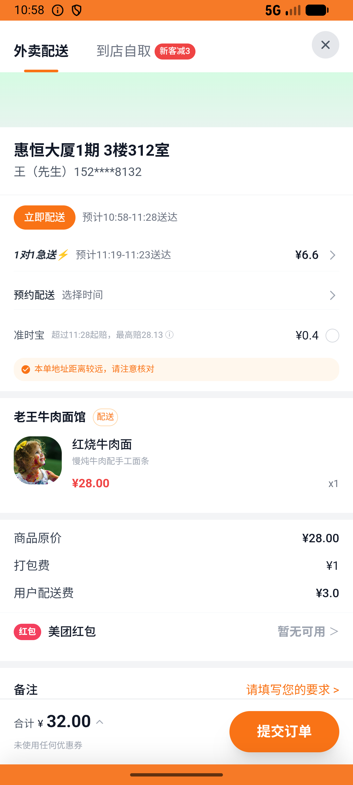

# xxsm_v037_cross_shop_orders_independent  ❌

- **Brand**: `daishushenghuo`
- **Class**: `DaishushenghuoXxsmV037CrossShopOrdersIndependentTask`
- **Pass@3**: **0/3**  (score = 0.00)
- **Elapsed**: 590s (~9.8 min)
- **Model**: `doubao-seed-2-0-lite-260428`
- **Raw log**: [./raw_logs/DaishushenghuoXxsmV037CrossShopOrdersIndependentTask.log](./raw_logs/DaishushenghuoXxsmV037CrossShopOrdersIndependentTask.log)
- **Generated**: 2026-05-27T11:03:56+08:00

## Task Goal

> 【当前账户档案】账号：demo@rlbox.ai；昵称：张三；支付密码：123456；默认收货地址（JSON）：{"recipient": "王", "phone": "15212348132", "address": "惠恒大厦1期 3楼312室"}。请基于以上档案打开 com.daishushenghuo 并完成以下任务：在小象超市下单西兰花，在老王牛肉面馆下单红烧牛肉面，两笔订单分别属于各自店铺

## Attempts

| # | Outcome | Steps | Terminated | Reason | Start → End |
|---|---------|-------|------------|--------|-------------|
| 1 | ❌ failed | 27 | answer | – | 2026-05-27 10:54:06 → 2026-05-27 10:58:12 |
| 2 | ❌ failed | 11 | answer | – | 2026-05-27 10:58:12 → 2026-05-27 10:59:37 |
| 3 | ❌ failed | 28 | answer | – | 2026-05-27 10:59:38 → 2026-05-27 11:03:56 |

## Failure Details

### Episode 1 — ❌ failed

- steps_used: `27`
- terminated_reason: `answer`
- death shot: 
  - state: [`./death_shots/DaishushenghuoXxsmV037CrossShopOrdersIndependentTask/episode_001/step_027.json`](./death_shots/DaishushenghuoXxsmV037CrossShopOrdersIndependentTask/episode_001/step_027.json)
  - digest: [`episode_digest.md`](./death_shots/DaishushenghuoXxsmV037CrossShopOrdersIndependentTask/episode_001/episode_digest.md)

### Episode 2 — ❌ failed

- steps_used: `11`
- terminated_reason: `answer`
- death shot: 
  - state: [`./death_shots/DaishushenghuoXxsmV037CrossShopOrdersIndependentTask/episode_002/step_011.json`](./death_shots/DaishushenghuoXxsmV037CrossShopOrdersIndependentTask/episode_002/step_011.json)
  - digest: [`episode_digest.md`](./death_shots/DaishushenghuoXxsmV037CrossShopOrdersIndependentTask/episode_002/episode_digest.md)

### Episode 3 — ❌ failed

- steps_used: `28`
- terminated_reason: `answer`
- death shot: 
  - state: [`./death_shots/DaishushenghuoXxsmV037CrossShopOrdersIndependentTask/episode_003/step_028.json`](./death_shots/DaishushenghuoXxsmV037CrossShopOrdersIndependentTask/episode_003/step_028.json)
  - digest: [`episode_digest.md`](./death_shots/DaishushenghuoXxsmV037CrossShopOrdersIndependentTask/episode_003/episode_digest.md)

---

> 本摘要由 `sengclaw/scripts/pipeline/log_summarizer.py` 自动生成。 原始完整 log 见上方 Raw log 链接（含每 step 的 messages / tool_call / screenshot 引用）。
