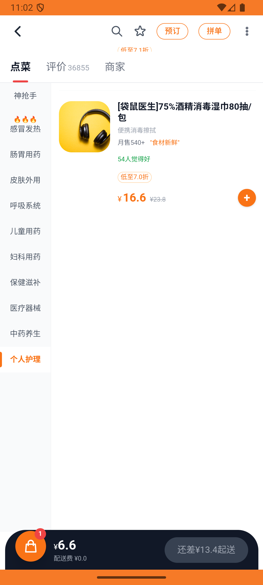

# kanbing_v035_add_via_chuncung_ganmaoling  ⚠️

- **Brand**: `daishushenghuo`
- **Class**: `DaishushenghuoKanbingV035AddViaChuncungGanmaolingTask`
- **Pass@3**: **2/3**  (score = 1.00)
- **Elapsed**: 733s (~12.2 min)
- **Model**: `doubao-seed-2-0-lite-260428`
- **Raw log**: [./raw_logs/DaishushenghuoKanbingV035AddViaChuncungGanmaolingTask.log](./raw_logs/DaishushenghuoKanbingV035AddViaChuncungGanmaolingTask.log)
- **Generated**: 2026-05-27T11:07:08+08:00

## Task Goal

> 【当前账户档案】账号：demo@rlbox.ai；昵称：张三；支付密码：123456；默认收货地址（JSON）：{"recipient": "王", "phone": "15212348132", "address": "惠恒大厦1期 3楼312室"}。请基于以上档案打开 com.daishushenghuo 并完成以下任务：在明华大药房通过春诵推荐加购999感冒灵颗粒到购物车

## Attempts

| # | Outcome | Steps | Terminated | Reason | Start → End |
|---|---------|-------|------------|--------|-------------|
| 1 | ⏰ timeout | 50 | max_steps | – | 2026-05-27 10:54:56 → 2026-05-27 11:02:15 |
| 2 | ✅ passed | 19 | answer | – | 2026-05-27 11:02:15 → 2026-05-27 11:04:39 |
| 3 | ✅ passed | 18 | answer | – | 2026-05-27 11:04:39 → 2026-05-27 11:07:08 |

## Failure Details

### Episode 1 — ⏰ timeout

- steps_used: `50`
- terminated_reason: `max_steps`
- death shot: 
  - state: [`./death_shots/DaishushenghuoKanbingV035AddViaChuncungGanmaolingTask/episode_001/step_050.json`](./death_shots/DaishushenghuoKanbingV035AddViaChuncungGanmaolingTask/episode_001/step_050.json)
  - digest: [`episode_digest.md`](./death_shots/DaishushenghuoKanbingV035AddViaChuncungGanmaolingTask/episode_001/episode_digest.md)

---

> 本摘要由 `sengclaw/scripts/pipeline/log_summarizer.py` 自动生成。 原始完整 log 见上方 Raw log 链接（含每 step 的 messages / tool_call / screenshot 引用）。
