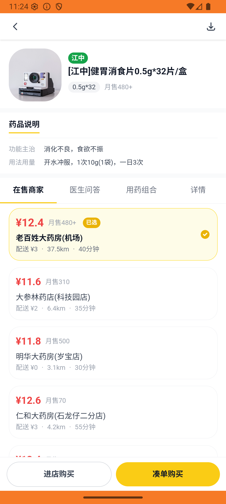

# kanbing_v036_carts_across_renhe_laobaixing  ⚠️

- **Brand**: `daishushenghuo`
- **Class**: `DaishushenghuoKanbingV036CartsAcrossRenheLaobaixingTask`
- **Pass@3**: **2/3**  (score = 1.00)
- **Elapsed**: 968s (~16.1 min)
- **Model**: `doubao-seed-2-0-lite-260428`
- **Raw log**: [./raw_logs/DaishushenghuoKanbingV036CartsAcrossRenheLaobaixingTask.log](./raw_logs/DaishushenghuoKanbingV036CartsAcrossRenheLaobaixingTask.log)
- **Generated**: 2026-05-27T11:24:20+08:00

## Task Goal

> 【当前账户档案】账号：demo@rlbox.ai；昵称：张三；支付密码：123456；默认收货地址（JSON）：{"recipient": "王", "phone": "15212348132", "address": "惠恒大厦1期 3楼312室"}。请基于以上档案打开 com.daishushenghuo 并完成以下任务：在仁和大药房加购泰诺林对乙酰氨基酚缓释片，在老百姓大药房加购健胃消食片，两家购物车并存

## Attempts

| # | Outcome | Steps | Terminated | Reason | Start → End |
|---|---------|-------|------------|--------|-------------|
| 1 | ✅ passed | 40 | answer | – | 2026-05-27 11:08:12 → 2026-05-27 11:13:38 |
| 2 | ✅ passed | 34 | answer | – | 2026-05-27 11:13:38 → 2026-05-27 11:17:45 |
| 3 | ⏰ timeout | 50 | max_steps | – | 2026-05-27 11:17:45 → 2026-05-27 11:24:20 |

## Failure Details

### Episode 3 — ⏰ timeout

- steps_used: `50`
- terminated_reason: `max_steps`
- death shot: 
  - state: [`./death_shots/DaishushenghuoKanbingV036CartsAcrossRenheLaobaixingTask/episode_003/step_050.json`](./death_shots/DaishushenghuoKanbingV036CartsAcrossRenheLaobaixingTask/episode_003/step_050.json)
  - digest: [`episode_digest.md`](./death_shots/DaishushenghuoKanbingV036CartsAcrossRenheLaobaixingTask/episode_003/episode_digest.md)

---

> 本摘要由 `sengclaw/scripts/pipeline/log_summarizer.py` 自动生成。 原始完整 log 见上方 Raw log 链接（含每 step 的 messages / tool_call / screenshot 引用）。
