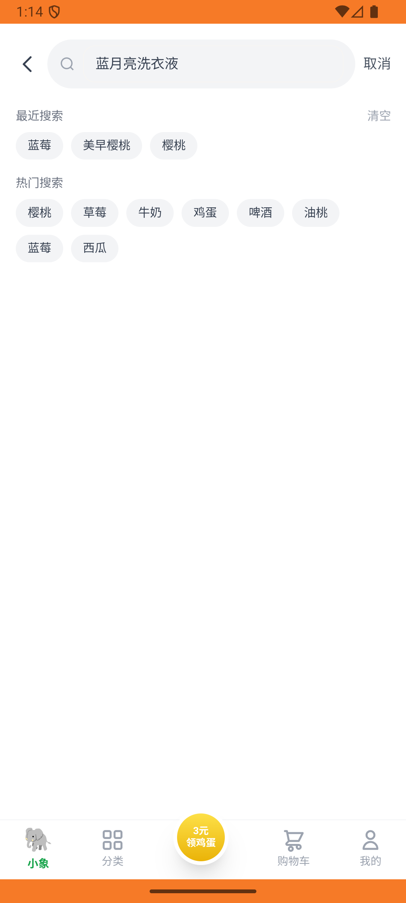

# xxsm_v016_place_order_above35_full_amount  ❌

- **Brand**: `daishushenghuo`
- **Class**: `DaishushenghuoXxsmV016PlaceOrderAbove35FullAmountTask`
- **Pass@3**: **0/3**  (score = 0.00)
- **Elapsed**: 353s (~5.9 min)
- **Model**: `doubao-seed-2-0-lite-260428`
- **Raw log**: [./raw_logs/DaishushenghuoXxsmV016PlaceOrderAbove35FullAmountTask.log](./raw_logs/DaishushenghuoXxsmV016PlaceOrderAbove35FullAmountTask.log)
- **Generated**: 2026-05-28T01:18:48+08:00

## Task Goal

> 【当前账户档案】账号：demo@rlbox.ai；昵称：张三；支付密码：123456；默认收货地址（JSON）：{"recipient": "王", "phone": "15212348132", "address": "惠恒大厦1期 3楼312室"}。请基于以上档案打开 com.daishushenghuo 并完成以下任务：在小象超市下单 2 份蓝月亮洗衣液，使用默认地址

## Attempts

| # | Outcome | Steps | Terminated | Reason | Start → End |
|---|---------|-------|------------|--------|-------------|
| 1 | ❌ failed | 13 | answer | – | 2026-05-28 01:12:55 → 2026-05-28 01:14:28 |
| 2 | ❌ failed | 19 | answer | – | 2026-05-28 01:14:28 → 2026-05-28 01:16:57 |
| 3 | ❌ failed | 15 | answer | – | 2026-05-28 01:16:57 → 2026-05-28 01:18:48 |

## Failure Details

### Episode 1 — ❌ failed

- steps_used: `13`
- terminated_reason: `answer`
- death shot: 
  - state: [`./death_shots/DaishushenghuoXxsmV016PlaceOrderAbove35FullAmountTask/episode_001/step_013.json`](./death_shots/DaishushenghuoXxsmV016PlaceOrderAbove35FullAmountTask/episode_001/step_013.json)
  - digest: [`episode_digest.md`](./death_shots/DaishushenghuoXxsmV016PlaceOrderAbove35FullAmountTask/episode_001/episode_digest.md)

### Episode 2 — ❌ failed

- steps_used: `19`
- terminated_reason: `answer`
- death shot: 
  - state: [`./death_shots/DaishushenghuoXxsmV016PlaceOrderAbove35FullAmountTask/episode_002/step_019.json`](./death_shots/DaishushenghuoXxsmV016PlaceOrderAbove35FullAmountTask/episode_002/step_019.json)
  - digest: [`episode_digest.md`](./death_shots/DaishushenghuoXxsmV016PlaceOrderAbove35FullAmountTask/episode_002/episode_digest.md)

### Episode 3 — ❌ failed

- steps_used: `15`
- terminated_reason: `answer`
- death shot: 
  - state: [`./death_shots/DaishushenghuoXxsmV016PlaceOrderAbove35FullAmountTask/episode_003/step_015.json`](./death_shots/DaishushenghuoXxsmV016PlaceOrderAbove35FullAmountTask/episode_003/step_015.json)
  - digest: [`episode_digest.md`](./death_shots/DaishushenghuoXxsmV016PlaceOrderAbove35FullAmountTask/episode_003/episode_digest.md)

---

> 本摘要由 `sengclaw/scripts/pipeline/log_summarizer.py` 自动生成。 原始完整 log 见上方 Raw log 链接（含每 step 的 messages / tool_call / screenshot 引用）。
