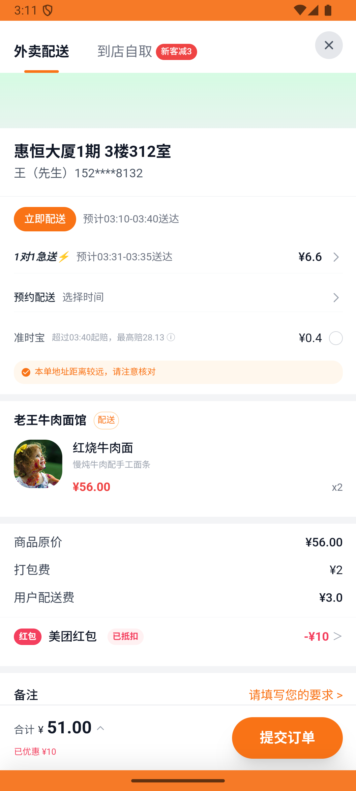

# coupon_v002_expire_unused_coupon  ⚠️

- **Brand**: `daishushenghuo`
- **Class**: `DaishushenghuoCouponV002ExpireUnusedCouponTask`
- **Pass@3**: **2/3**  (score = 1.00)
- **Elapsed**: 520s (~8.7 min)
- **Model**: `doubao-seed-2-0-lite-260428`
- **Raw log**: [./raw_logs/DaishushenghuoCouponV002ExpireUnusedCouponTask.log](./raw_logs/DaishushenghuoCouponV002ExpireUnusedCouponTask.log)
- **Generated**: 2026-05-28T03:11:30+08:00

## Task Goal

> 【当前账户档案】账号：demo@rlbox.ai；昵称：张三；支付密码：123456；默认收货地址（JSON）：{"recipient": "王", "phone": "15212348132", "address": "惠恒大厦1期 3楼312室"}。请基于以上档案打开 com.daishushenghuo 并完成以下任务：老王牛肉面馆点 2 份红烧牛肉面，手头有两张券选面额大的那张下单付款

## Attempts

| # | Outcome | Steps | Terminated | Reason | Start → End |
|---|---------|-------|------------|--------|-------------|
| 1 | ✅ passed | 25 | answer | – | 2026-05-28 03:02:50 → 2026-05-28 03:06:12 |
| 2 | ✅ passed | 25 | answer | – | 2026-05-28 03:06:12 → 2026-05-28 03:09:14 |
| 3 | ❌ failed | 18 | answer | – | 2026-05-28 03:09:14 → 2026-05-28 03:11:30 |

## Failure Details

### Episode 3 — ❌ failed

- steps_used: `18`
- terminated_reason: `answer`
- death shot: 
  - state: [`./death_shots/DaishushenghuoCouponV002ExpireUnusedCouponTask/episode_003/step_018.json`](./death_shots/DaishushenghuoCouponV002ExpireUnusedCouponTask/episode_003/step_018.json)
  - digest: [`episode_digest.md`](./death_shots/DaishushenghuoCouponV002ExpireUnusedCouponTask/episode_003/episode_digest.md)

---

> 本摘要由 `sengclaw/scripts/pipeline/log_summarizer.py` 自动生成。 原始完整 log 见上方 Raw log 链接（含每 step 的 messages / tool_call / screenshot 引用）。
