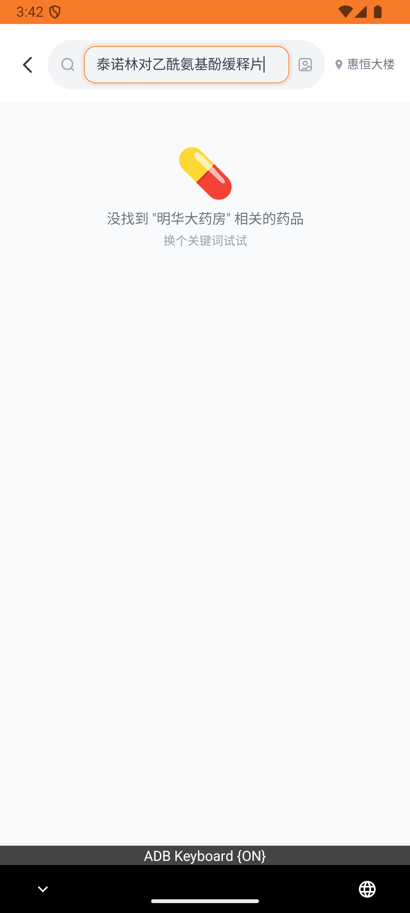

# kanbing_v029_buy_minghua_taino  ⚠️

- **Brand**: `daishushenghuo`
- **Class**: `DaishushenghuoKanbingV029BuyMinghuaTainoTask`
- **Pass@3**: **2/3**  (score = 1.00)
- **Elapsed**: 589s (~9.8 min)
- **Model**: `doubao-seed-2-0-lite-260428`
- **Raw log**: [./raw_logs/DaishushenghuoKanbingV029BuyMinghuaTainoTask.log](./raw_logs/DaishushenghuoKanbingV029BuyMinghuaTainoTask.log)
- **Generated**: 2026-05-28T03:46:30+08:00

## Task Goal

> 【当前账户档案】账号：demo@rlbox.ai；昵称：张三；支付密码：123456；默认收货地址（JSON）：{"recipient": "王", "phone": "15212348132", "address": "惠恒大厦1期 3楼312室"}。请基于以上档案打开 com.daishushenghuo 并完成以下任务：在明华大药房买 1 盒泰诺林对乙酰氨基酚缓释片并完成支付

## Attempts

| # | Outcome | Steps | Terminated | Reason | Start → End |
|---|---------|-------|------------|--------|-------------|
| 1 | ✅ passed | 31 | answer | – | 2026-05-28 03:36:41 → 2026-05-28 03:40:27 |
| 2 | ❌ failed | 16 | answer | – | 2026-05-28 03:40:27 → 2026-05-28 03:42:27 |
| 3 | ✅ passed | 32 | answer | – | 2026-05-28 03:42:27 → 2026-05-28 03:46:29 |

## Failure Details

### Episode 2 — ❌ failed

- steps_used: `16`
- terminated_reason: `answer`
- death shot: 
  - state: [`./death_shots/DaishushenghuoKanbingV029BuyMinghuaTainoTask/episode_002/step_016.json`](./death_shots/DaishushenghuoKanbingV029BuyMinghuaTainoTask/episode_002/step_016.json)
  - digest: [`episode_digest.md`](./death_shots/DaishushenghuoKanbingV029BuyMinghuaTainoTask/episode_002/episode_digest.md)

---

> 本摘要由 `sengclaw/scripts/pipeline/log_summarizer.py` 自动生成。 原始完整 log 见上方 Raw log 链接（含每 step 的 messages / tool_call / screenshot 引用）。
