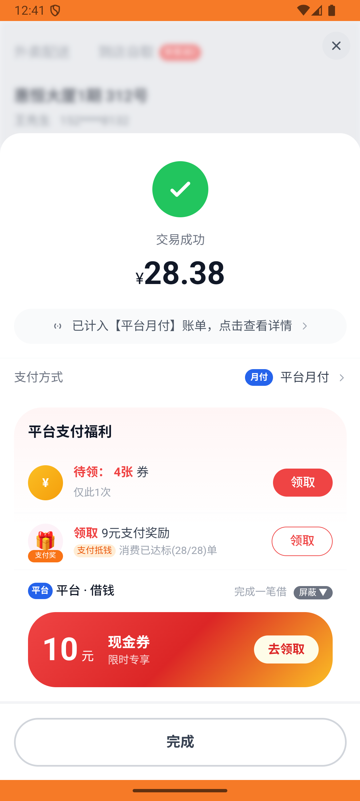

# kanbing_v037_place_order_xiaochaihu  ❌

- **Brand**: `daishushenghuo`
- **Class**: `DaishushenghuoKanbingV037PlaceOrderXiaochaihuTask`
- **Pass@3**: **0/3**  (score = 0.00)
- **Elapsed**: 737s (~12.3 min)
- **Model**: `doubao-seed-2-0-lite-260428`
- **Raw log**: [./raw_logs/DaishushenghuoKanbingV037PlaceOrderXiaochaihuTask.log](./raw_logs/DaishushenghuoKanbingV037PlaceOrderXiaochaihuTask.log)
- **Generated**: 2026-05-29T03:21:41+08:00

## Task Goal

> 【当前账户档案】账号：demo@rlbox.ai；昵称：张三；支付密码：123456，请直接完成支付；默认收货地址（JSON）：{"recipient": "王", "phone": "15212348132", "address": "惠恒大厦1期 3楼312室"}。请基于以上档案打开 com.daishushenghuo 并完成以下任务：在大参林药店下单 1 盒小柴胡颗粒，不够起送就凑单，使用默认地址

## Attempts

| # | Outcome | Steps | Terminated | Reason | Start → End |
|---|---------|-------|------------|--------|-------------|
| 1 | ❌ failed | 39 | answer | 订单包含「[白云山]小柴胡颗粒10g*6袋/盒」（数量 ≥ 1）: 订单未包含 [白云山]小柴胡颗粒10g*6袋/盒; 订单状态 = 「待支付」: 预期 "pending"，实际 "paid" | 2026-05-29 00:29:05 → 2026-05-29 00:34:00 |
| 2 | ❌ failed | 24 | answer | 订单包含「[白云山]小柴胡颗粒10g*6袋/盒」（数量 ≥ 1）: 订单未包含 [白云山]小柴胡颗粒10g*6袋/盒; 订单状态 = 「待支付」: 预期 "pending"，实际 "paid" | 2026-05-29 00:34:00 → 2026-05-29 00:37:18 |
| 3 | ❌ failed | 28 | answer | 订单包含「[白云山]小柴胡颗粒10g*6袋/盒」（数量 ≥ 1）: 订单未包含 [白云山]小柴胡颗粒10g*6袋/盒; 订单状态 = 「待支付」: 预期 "pending"，实际 "paid" | 2026-05-29 00:37:18 → 2026-05-29 00:41:23 |

## Failure Details

### Episode 1 — ❌ failed

- steps_used: `39`
- terminated_reason: `answer`
- reason:

  ```
  订单包含「[白云山]小柴胡颗粒10g*6袋/盒」（数量 ≥ 1）: 订单未包含 [白云山]小柴胡颗粒10g*6袋/盒; 订单状态 = 「待支付」: 预期 "pending"，实际 "paid"
  ```
- death shot: 
  - state: [`./death_shots/DaishushenghuoKanbingV037PlaceOrderXiaochaihuTask/episode_001/step_039.json`](./death_shots/DaishushenghuoKanbingV037PlaceOrderXiaochaihuTask/episode_001/step_039.json)
  - digest: [`episode_digest.md`](./death_shots/DaishushenghuoKanbingV037PlaceOrderXiaochaihuTask/episode_001/episode_digest.md)

### Episode 2 — ❌ failed

- steps_used: `24`
- terminated_reason: `answer`
- reason:

  ```
  订单包含「[白云山]小柴胡颗粒10g*6袋/盒」（数量 ≥ 1）: 订单未包含 [白云山]小柴胡颗粒10g*6袋/盒; 订单状态 = 「待支付」: 预期 "pending"，实际 "paid"
  ```
- death shot: 
  - state: [`./death_shots/DaishushenghuoKanbingV037PlaceOrderXiaochaihuTask/episode_002/step_024.json`](./death_shots/DaishushenghuoKanbingV037PlaceOrderXiaochaihuTask/episode_002/step_024.json)
  - digest: [`episode_digest.md`](./death_shots/DaishushenghuoKanbingV037PlaceOrderXiaochaihuTask/episode_002/episode_digest.md)

### Episode 3 — ❌ failed

- steps_used: `28`
- terminated_reason: `answer`
- reason:

  ```
  订单包含「[白云山]小柴胡颗粒10g*6袋/盒」（数量 ≥ 1）: 订单未包含 [白云山]小柴胡颗粒10g*6袋/盒; 订单状态 = 「待支付」: 预期 "pending"，实际 "paid"
  ```
- death shot: 
  - state: [`./death_shots/DaishushenghuoKanbingV037PlaceOrderXiaochaihuTask/episode_003/step_028.json`](./death_shots/DaishushenghuoKanbingV037PlaceOrderXiaochaihuTask/episode_003/step_028.json)
  - digest: [`episode_digest.md`](./death_shots/DaishushenghuoKanbingV037PlaceOrderXiaochaihuTask/episode_003/episode_digest.md)

---

> 本摘要由 `sengclaw/scripts/pipeline/log_summarizer.py` 自动生成。 原始完整 log 见上方 Raw log 链接（含每 step 的 messages / tool_call / screenshot 引用）。
