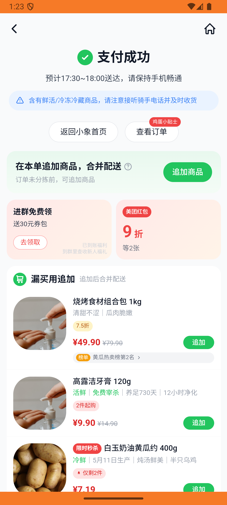
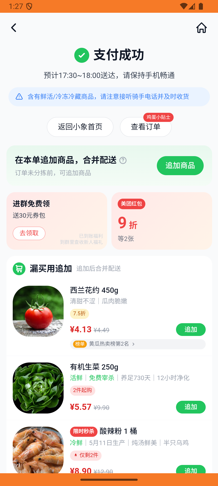

# xxsm_v010_place_order_pay_multi  ❌

- **Brand**: `daishushenghuo`
- **Class**: `DaishushenghuoXxsmV010PlaceOrderPayMultiTask`
- **Pass@3**: **0/3**  (score = 0.00)
- **Elapsed**: 534s (~8.9 min)
- **Model**: `doubao-seed-2-0-lite-260428`
- **Raw log**: [./raw_logs/DaishushenghuoXxsmV010PlaceOrderPayMultiTask.log](./raw_logs/DaishushenghuoXxsmV010PlaceOrderPayMultiTask.log)
- **Generated**: 2026-05-29T03:21:41+08:00

## Task Goal

> 【当前账户档案】账号：demo@rlbox.ai；昵称：张三；支付密码：123456，请直接完成支付；默认收货地址（JSON）：{"recipient": "王", "phone": "15212348132", "address": "惠恒大厦1期 3楼312室"}。请基于以上档案打开 com.daishushenghuo 并完成以下任务：在小象超市下单 3 份西兰花和 2 份美早樱桃并完成支付

## Attempts

| # | Outcome | Steps | Terminated | Reason | Start → End |
|---|---------|-------|------------|--------|-------------|
| 1 | ❌ failed | 25 | answer | 订单金额正确（实付金额 = ¥107.19）: 预期订单总额 ¥107.19，实际为 ¥112.19 | 2026-05-29 01:20:53 → 2026-05-29 01:23:57 |
| 2 | ❌ failed | 27 | answer | 订单金额正确（实付金额 = ¥107.19）: 预期订单总额 ¥107.19，实际为 ¥112.19 | 2026-05-29 01:23:57 → 2026-05-29 01:27:15 |
| 3 | ❌ failed | 20 | answer | 订单金额正确（实付金额 = ¥107.19）: 预期订单总额 ¥107.19，实际为 ¥112.19 | 2026-05-29 01:27:15 → 2026-05-29 01:29:47 |

## Failure Details

### Episode 1 — ❌ failed

- steps_used: `25`
- terminated_reason: `answer`
- reason:

  ```
  订单金额正确（实付金额 = ¥107.19）: 预期订单总额 ¥107.19，实际为 ¥112.19
  ```
- death shot: 
  - state: [`./death_shots/DaishushenghuoXxsmV010PlaceOrderPayMultiTask/episode_001/step_025.json`](./death_shots/DaishushenghuoXxsmV010PlaceOrderPayMultiTask/episode_001/step_025.json)
  - digest: [`episode_digest.md`](./death_shots/DaishushenghuoXxsmV010PlaceOrderPayMultiTask/episode_001/episode_digest.md)

### Episode 2 — ❌ failed

- steps_used: `27`
- terminated_reason: `answer`
- reason:

  ```
  订单金额正确（实付金额 = ¥107.19）: 预期订单总额 ¥107.19，实际为 ¥112.19
  ```
- death shot: 
  - state: [`./death_shots/DaishushenghuoXxsmV010PlaceOrderPayMultiTask/episode_002/step_027.json`](./death_shots/DaishushenghuoXxsmV010PlaceOrderPayMultiTask/episode_002/step_027.json)
  - digest: [`episode_digest.md`](./death_shots/DaishushenghuoXxsmV010PlaceOrderPayMultiTask/episode_002/episode_digest.md)

### Episode 3 — ❌ failed

- steps_used: `20`
- terminated_reason: `answer`
- reason:

  ```
  订单金额正确（实付金额 = ¥107.19）: 预期订单总额 ¥107.19，实际为 ¥112.19
  ```
- death shot: 
  - state: [`./death_shots/DaishushenghuoXxsmV010PlaceOrderPayMultiTask/episode_003/step_020.json`](./death_shots/DaishushenghuoXxsmV010PlaceOrderPayMultiTask/episode_003/step_020.json)
  - digest: [`episode_digest.md`](./death_shots/DaishushenghuoXxsmV010PlaceOrderPayMultiTask/episode_003/episode_digest.md)

---

> 本摘要由 `sengclaw/scripts/pipeline/log_summarizer.py` 自动生成。 原始完整 log 见上方 Raw log 链接（含每 step 的 messages / tool_call / screenshot 引用）。
