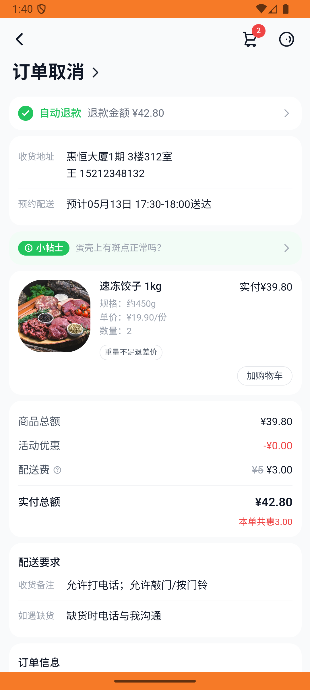
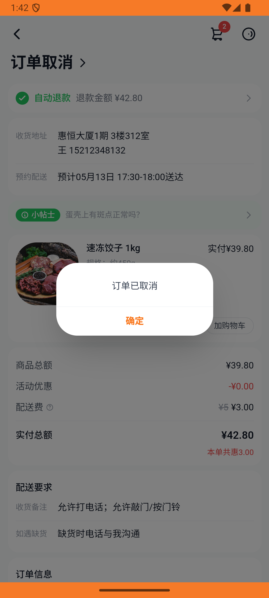

# xxsm_v018_cancel_paid_order_restock  ❌

- **Brand**: `daishushenghuo`
- **Class**: `DaishushenghuoXxsmV018CancelPaidOrderRestockTask`
- **Pass@3**: **0/3**  (score = 0.00)
- **Elapsed**: 170s (~2.8 min)
- **Model**: `doubao-seed-2-0-lite-260428`
- **Raw log**: [./raw_logs/DaishushenghuoXxsmV018CancelPaidOrderRestockTask.log](./raw_logs/DaishushenghuoXxsmV018CancelPaidOrderRestockTask.log)
- **Generated**: 2026-05-29T03:21:41+08:00

## Task Goal

> 【当前账户档案】账号：demo@rlbox.ai；昵称：张三；支付密码：123456，请直接完成支付；默认收货地址（JSON）：{"recipient": "王", "phone": "15212348132", "address": "惠恒大厦1期 3楼312室"}。请基于以上档案打开 com.daishushenghuo 并完成以下任务：取消小象超市的速冻饺子已支付订单

## Attempts

| # | Outcome | Steps | Terminated | Reason | Start → End |
|---|---------|-------|------------|--------|-------------|
| 1 | ❌ failed | 8 | answer | 商品「速冻饺子 1kg」库存已回滚到预制基线值（=80）: 预期库存回滚到 80，实际为 82（cancel! 应执行 stock_delta=+2） | 2026-05-29 01:39:49 → 2026-05-29 01:40:50 |
| 2 | ❌ failed | 8 | answer | 商品「速冻饺子 1kg」库存已回滚到预制基线值（=80）: 预期库存回滚到 80，实际为 82（cancel! 应执行 stock_delta=+2） | 2026-05-29 01:40:50 → 2026-05-29 01:41:50 |
| 3 | ❌ failed | 7 | answer | 商品「速冻饺子 1kg」库存已回滚到预制基线值（=80）: 预期库存回滚到 80，实际为 82（cancel! 应执行 stock_delta=+2） | 2026-05-29 01:41:50 → 2026-05-29 01:42:38 |

## Failure Details

### Episode 1 — ❌ failed

- steps_used: `8`
- terminated_reason: `answer`
- reason:

  ```
  商品「速冻饺子 1kg」库存已回滚到预制基线值（=80）: 预期库存回滚到 80，实际为 82（cancel! 应执行 stock_delta=+2）
  ```
- death shot: 
  - state: [`./death_shots/DaishushenghuoXxsmV018CancelPaidOrderRestockTask/episode_001/step_008.json`](./death_shots/DaishushenghuoXxsmV018CancelPaidOrderRestockTask/episode_001/step_008.json)
  - digest: [`episode_digest.md`](./death_shots/DaishushenghuoXxsmV018CancelPaidOrderRestockTask/episode_001/episode_digest.md)

### Episode 2 — ❌ failed

- steps_used: `8`
- terminated_reason: `answer`
- reason:

  ```
  商品「速冻饺子 1kg」库存已回滚到预制基线值（=80）: 预期库存回滚到 80，实际为 82（cancel! 应执行 stock_delta=+2）
  ```
- death shot: 
  - state: [`./death_shots/DaishushenghuoXxsmV018CancelPaidOrderRestockTask/episode_002/step_008.json`](./death_shots/DaishushenghuoXxsmV018CancelPaidOrderRestockTask/episode_002/step_008.json)
  - digest: [`episode_digest.md`](./death_shots/DaishushenghuoXxsmV018CancelPaidOrderRestockTask/episode_002/episode_digest.md)

### Episode 3 — ❌ failed

- steps_used: `7`
- terminated_reason: `answer`
- reason:

  ```
  商品「速冻饺子 1kg」库存已回滚到预制基线值（=80）: 预期库存回滚到 80，实际为 82（cancel! 应执行 stock_delta=+2）
  ```
- death shot: 
  - state: [`./death_shots/DaishushenghuoXxsmV018CancelPaidOrderRestockTask/episode_003/step_007.json`](./death_shots/DaishushenghuoXxsmV018CancelPaidOrderRestockTask/episode_003/step_007.json)
  - digest: [`episode_digest.md`](./death_shots/DaishushenghuoXxsmV018CancelPaidOrderRestockTask/episode_003/episode_digest.md)

---

> 本摘要由 `sengclaw/scripts/pipeline/log_summarizer.py` 自动生成。 原始完整 log 见上方 Raw log 链接（含每 step 的 messages / tool_call / screenshot 引用）。
