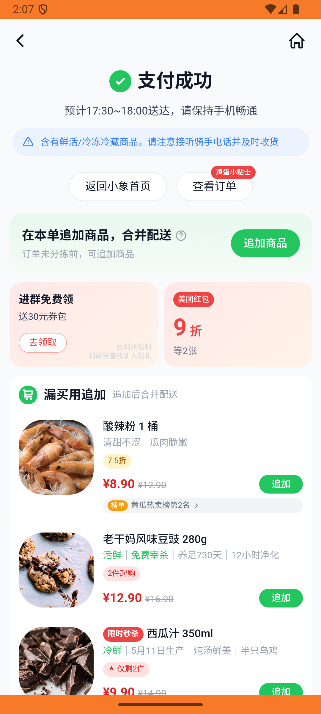
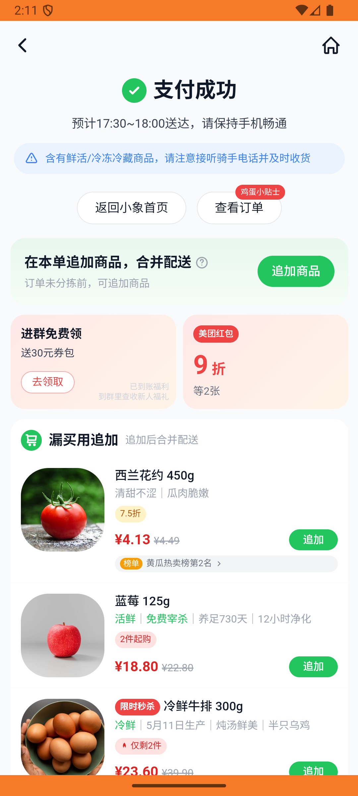
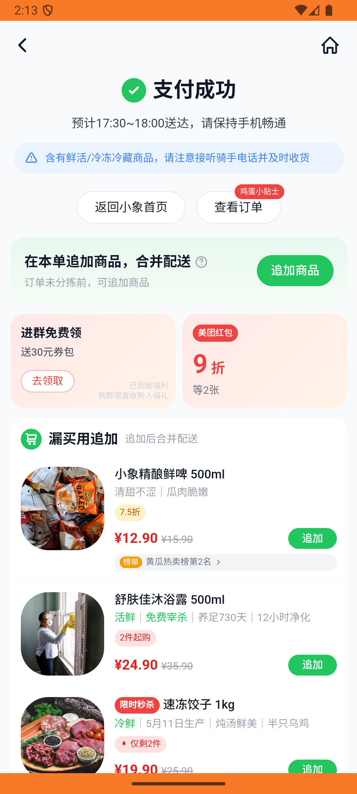

# xxsm_v023_place_order_with_non_default_address  ❌

- **Brand**: `daishushenghuo`
- **Class**: `DaishushenghuoXxsmV023PlaceOrderWithNonDefaultAddressTask`
- **Pass@3**: **0/3**  (score = 0.00)
- **Elapsed**: 585s (~9.8 min)
- **Model**: `doubao-seed-2-0-lite-260428`
- **Raw log**: [./raw_logs/DaishushenghuoXxsmV023PlaceOrderWithNonDefaultAddressTask.log](./raw_logs/DaishushenghuoXxsmV023PlaceOrderWithNonDefaultAddressTask.log)
- **Generated**: 2026-05-29T03:21:41+08:00

## Task Goal

> 【当前账户档案】账号：demo@rlbox.ai；昵称：张三；支付密码：123456，请直接完成支付；默认收货地址（JSON）：{"recipient": "王", "phone": "15212348132", "address": "惠恒大厦1期 3楼312室"}。请基于以上档案打开 com.daishushenghuo 并完成以下任务：在小象超市下单 1 份冰鲜罐装海蛎肉，使用非默认地址

## Attempts

| # | Outcome | Steps | Terminated | Reason | Start → End |
|---|---------|-------|------------|--------|-------------|
| 1 | ❌ failed | 23 | answer | 收货人姓名应为「张三」（非默认地址持有者）: 预期 delivery_name = '张三'，实际为 "陈"（说明 agent 没切到指定地址）; 收货地址包含「科技大厦」（非默认地址特征）: 预期 delivery_address 包含「科技大厦」，实际为 "阳光小区8号... | 2026-05-29 02:04:11 → 2026-05-29 02:07:46 |
| 2 | ❌ failed | 23 | answer | 收货人姓名应为「张三」（非默认地址持有者）: 预期 delivery_name = '张三'，实际为 "陈"（说明 agent 没切到指定地址）; 收货地址包含「科技大厦」（非默认地址特征）: 预期 delivery_address 包含「科技大厦」，实际为 "阳光小区8号... | 2026-05-29 02:07:46 → 2026-05-29 02:11:12 |
| 3 | ❌ failed | 21 | answer | 收货人姓名应为「张三」（非默认地址持有者）: 预期 delivery_name = '张三'，实际为 "陈"（说明 agent 没切到指定地址）; 收货地址包含「科技大厦」（非默认地址特征）: 预期 delivery_address 包含「科技大厦」，实际为 "阳光小区8号... | 2026-05-29 02:11:12 → 2026-05-29 02:13:56 |

## Failure Details

### Episode 1 — ❌ failed

- steps_used: `23`
- terminated_reason: `answer`
- reason:

  ```
  收货人姓名应为「张三」（非默认地址持有者）: 预期 delivery_name = '张三'，实际为 "陈"（说明 agent 没切到指定地址）; 收货地址包含「科技大厦」（非默认地址特征）: 预期 delivery_address 包含「科技大厦」，实际为 "阳光小区8号楼201"; 订单 状态为「待支付」（已成功提交，未支付）: 
  expected: #<Encoding:UTF-8> "pending"
       got: #<Encoding:US-ASCII> "paid"
  
  (compared using ==)
  ```
- death shot: 
  - state: [`./death_shots/DaishushenghuoXxsmV023PlaceOrderWithNonDefaultAddressTask/episode_001/step_023.json`](./death_shots/DaishushenghuoXxsmV023PlaceOrderWithNonDefaultAddressTask/episode_001/step_023.json)
  - digest: [`episode_digest.md`](./death_shots/DaishushenghuoXxsmV023PlaceOrderWithNonDefaultAddressTask/episode_001/episode_digest.md)

### Episode 2 — ❌ failed

- steps_used: `23`
- terminated_reason: `answer`
- reason:

  ```
  收货人姓名应为「张三」（非默认地址持有者）: 预期 delivery_name = '张三'，实际为 "陈"（说明 agent 没切到指定地址）; 收货地址包含「科技大厦」（非默认地址特征）: 预期 delivery_address 包含「科技大厦」，实际为 "阳光小区8号楼201"; 订单 状态为「待支付」（已成功提交，未支付）: 
  expected: #<Encoding:UTF-8> "pending"
       got: #<Encoding:US-ASCII> "paid"
  
  (compared using ==)
  ```
- death shot: 
  - state: [`./death_shots/DaishushenghuoXxsmV023PlaceOrderWithNonDefaultAddressTask/episode_002/step_023.json`](./death_shots/DaishushenghuoXxsmV023PlaceOrderWithNonDefaultAddressTask/episode_002/step_023.json)
  - digest: [`episode_digest.md`](./death_shots/DaishushenghuoXxsmV023PlaceOrderWithNonDefaultAddressTask/episode_002/episode_digest.md)

### Episode 3 — ❌ failed

- steps_used: `21`
- terminated_reason: `answer`
- reason:

  ```
  收货人姓名应为「张三」（非默认地址持有者）: 预期 delivery_name = '张三'，实际为 "陈"（说明 agent 没切到指定地址）; 收货地址包含「科技大厦」（非默认地址特征）: 预期 delivery_address 包含「科技大厦」，实际为 "阳光小区8号楼201"; 订单 状态为「待支付」（已成功提交，未支付）: 
  expected: #<Encoding:UTF-8> "pending"
       got: #<Encoding:US-ASCII> "paid"
  
  (compared using ==)
  ```
- death shot: 
  - state: [`./death_shots/DaishushenghuoXxsmV023PlaceOrderWithNonDefaultAddressTask/episode_003/step_021.json`](./death_shots/DaishushenghuoXxsmV023PlaceOrderWithNonDefaultAddressTask/episode_003/step_021.json)
  - digest: [`episode_digest.md`](./death_shots/DaishushenghuoXxsmV023PlaceOrderWithNonDefaultAddressTask/episode_003/episode_digest.md)

---

> 本摘要由 `sengclaw/scripts/pipeline/log_summarizer.py` 自动生成。 原始完整 log 见上方 Raw log 链接（含每 step 的 messages / tool_call / screenshot 引用）。
