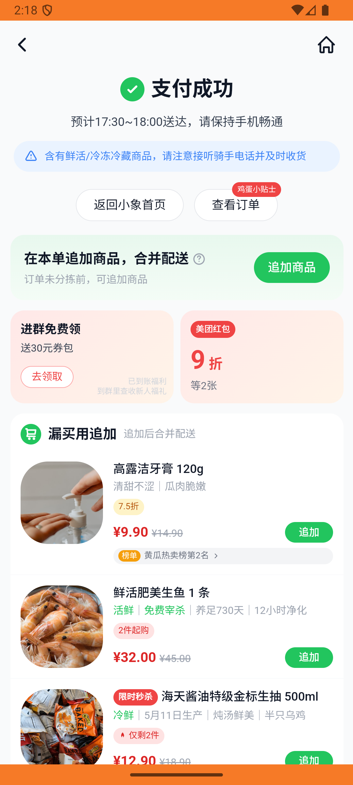
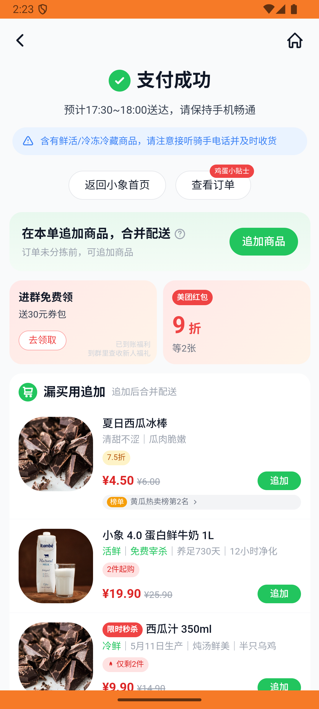
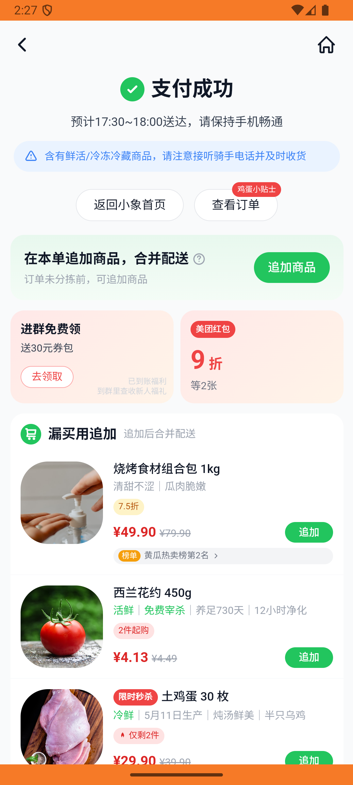

# xxsm_v024_place_order_three_items_line_count  ❌

- **Brand**: `daishushenghuo`
- **Class**: `DaishushenghuoXxsmV024PlaceOrderThreeItemsLineCountTask`
- **Pass@3**: **0/3**  (score = 0.00)
- **Elapsed**: 759s (~12.7 min)
- **Model**: `doubao-seed-2-0-lite-260428`
- **Raw log**: [./raw_logs/DaishushenghuoXxsmV024PlaceOrderThreeItemsLineCountTask.log](./raw_logs/DaishushenghuoXxsmV024PlaceOrderThreeItemsLineCountTask.log)
- **Generated**: 2026-05-29T03:21:41+08:00

## Task Goal

> 【当前账户档案】账号：demo@rlbox.ai；昵称：张三；支付密码：123456，请直接完成支付；默认收货地址（JSON）：{"recipient": "王", "phone": "15212348132", "address": "惠恒大厦1期 3楼312室"}。请基于以上档案打开 com.daishushenghuo 并完成以下任务：在小象超市下单北极虾、稻米油和生抽各 1 份

## Attempts

| # | Outcome | Steps | Terminated | Reason | Start → End |
|---|---------|-------|------------|--------|-------------|
| 1 | ❌ failed | 26 | answer | 订单金额正确（实付金额 = ¥52.7）: 预期总额 ¥52.7，实际为 ¥55.7 | 2026-05-29 02:14:43 → 2026-05-29 02:18:38 |
| 2 | ❌ failed | 36 | answer | 订单金额正确（实付金额 = ¥52.7）: 预期总额 ¥52.7，实际为 ¥55.7 | 2026-05-29 02:18:38 → 2026-05-29 02:23:36 |
| 3 | ❌ failed | 30 | answer | 订单金额正确（实付金额 = ¥52.7）: 预期总额 ¥52.7，实际为 ¥55.7 | 2026-05-29 02:23:36 → 2026-05-29 02:27:22 |

## Failure Details

### Episode 1 — ❌ failed

- steps_used: `26`
- terminated_reason: `answer`
- reason:

  ```
  订单金额正确（实付金额 = ¥52.7）: 预期总额 ¥52.7，实际为 ¥55.7
  ```
- death shot: 
  - state: [`./death_shots/DaishushenghuoXxsmV024PlaceOrderThreeItemsLineCountTask/episode_001/step_026.json`](./death_shots/DaishushenghuoXxsmV024PlaceOrderThreeItemsLineCountTask/episode_001/step_026.json)
  - digest: [`episode_digest.md`](./death_shots/DaishushenghuoXxsmV024PlaceOrderThreeItemsLineCountTask/episode_001/episode_digest.md)

### Episode 2 — ❌ failed

- steps_used: `36`
- terminated_reason: `answer`
- reason:

  ```
  订单金额正确（实付金额 = ¥52.7）: 预期总额 ¥52.7，实际为 ¥55.7
  ```
- death shot: 
  - state: [`./death_shots/DaishushenghuoXxsmV024PlaceOrderThreeItemsLineCountTask/episode_002/step_036.json`](./death_shots/DaishushenghuoXxsmV024PlaceOrderThreeItemsLineCountTask/episode_002/step_036.json)
  - digest: [`episode_digest.md`](./death_shots/DaishushenghuoXxsmV024PlaceOrderThreeItemsLineCountTask/episode_002/episode_digest.md)

### Episode 3 — ❌ failed

- steps_used: `30`
- terminated_reason: `answer`
- reason:

  ```
  订单金额正确（实付金额 = ¥52.7）: 预期总额 ¥52.7，实际为 ¥55.7
  ```
- death shot: 
  - state: [`./death_shots/DaishushenghuoXxsmV024PlaceOrderThreeItemsLineCountTask/episode_003/step_030.json`](./death_shots/DaishushenghuoXxsmV024PlaceOrderThreeItemsLineCountTask/episode_003/step_030.json)
  - digest: [`episode_digest.md`](./death_shots/DaishushenghuoXxsmV024PlaceOrderThreeItemsLineCountTask/episode_003/episode_digest.md)

---

> 本摘要由 `sengclaw/scripts/pipeline/log_summarizer.py` 自动生成。 原始完整 log 见上方 Raw log 链接（含每 step 的 messages / tool_call / screenshot 引用）。
