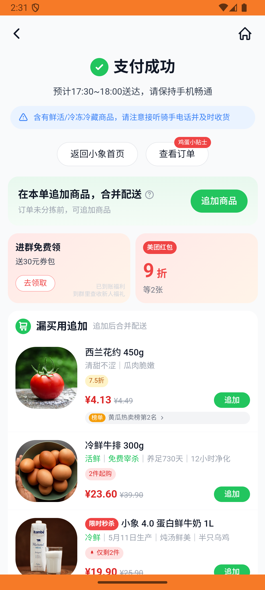
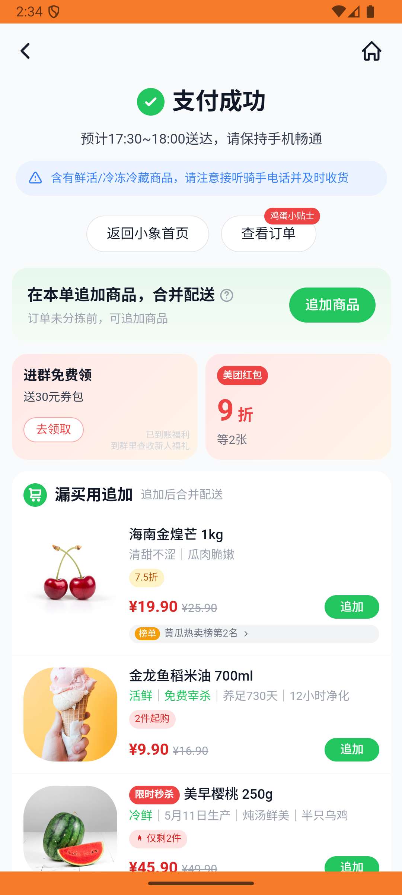
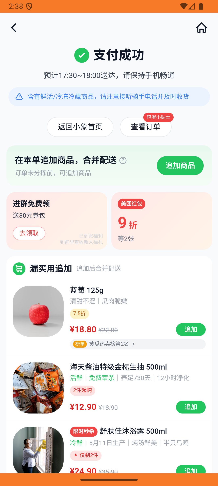

# xxsm_v025_cancel_then_place_new_order  ❌

- **Brand**: `daishushenghuo`
- **Class**: `DaishushenghuoXxsmV025CancelThenPlaceNewOrderTask`
- **Pass@3**: **0/3**  (score = 0.00)
- **Elapsed**: 628s (~10.5 min)
- **Model**: `doubao-seed-2-0-lite-260428`
- **Raw log**: [./raw_logs/DaishushenghuoXxsmV025CancelThenPlaceNewOrderTask.log](./raw_logs/DaishushenghuoXxsmV025CancelThenPlaceNewOrderTask.log)
- **Generated**: 2026-05-29T03:21:41+08:00

## Task Goal

> 【当前账户档案】账号：demo@rlbox.ai；昵称：张三；支付密码：123456，请直接完成支付；默认收货地址（JSON）：{"recipient": "王", "phone": "15212348132", "address": "惠恒大厦1期 3楼312室"}。请基于以上档案打开 com.daishushenghuo 并完成以下任务：取消小象超市薯片待支付订单后再下一笔巧克力冰淇淋甜筒新订单

## Attempts

| # | Outcome | Steps | Terminated | Reason | Start → End |
|---|---------|-------|------------|--------|-------------|
| 1 | ❌ failed | 24 | answer | 新订单（巧克力冰淇淋甜筒）应已创建且状态为「待支付」: 预期新订单状态 'pending'，实际 "paid" | 2026-05-29 02:28:09 → 2026-05-29 02:31:14 |
| 2 | ❌ failed | 28 | answer | 新订单（巧克力冰淇淋甜筒）应已创建且状态为「待支付」: 预期新订单状态 'pending'，实际 "paid" | 2026-05-29 02:31:14 → 2026-05-29 02:34:50 |
| 3 | ❌ failed | 26 | answer | 新订单（巧克力冰淇淋甜筒）应已创建且状态为「待支付」: 预期新订单状态 'pending'，实际 "paid" | 2026-05-29 02:34:50 → 2026-05-29 02:38:37 |

## Failure Details

### Episode 1 — ❌ failed

- steps_used: `24`
- terminated_reason: `answer`
- reason:

  ```
  新订单（巧克力冰淇淋甜筒）应已创建且状态为「待支付」: 预期新订单状态 'pending'，实际 "paid"
  ```
- death shot: 
  - state: [`./death_shots/DaishushenghuoXxsmV025CancelThenPlaceNewOrderTask/episode_001/step_024.json`](./death_shots/DaishushenghuoXxsmV025CancelThenPlaceNewOrderTask/episode_001/step_024.json)
  - digest: [`episode_digest.md`](./death_shots/DaishushenghuoXxsmV025CancelThenPlaceNewOrderTask/episode_001/episode_digest.md)

### Episode 2 — ❌ failed

- steps_used: `28`
- terminated_reason: `answer`
- reason:

  ```
  新订单（巧克力冰淇淋甜筒）应已创建且状态为「待支付」: 预期新订单状态 'pending'，实际 "paid"
  ```
- death shot: 
  - state: [`./death_shots/DaishushenghuoXxsmV025CancelThenPlaceNewOrderTask/episode_002/step_028.json`](./death_shots/DaishushenghuoXxsmV025CancelThenPlaceNewOrderTask/episode_002/step_028.json)
  - digest: [`episode_digest.md`](./death_shots/DaishushenghuoXxsmV025CancelThenPlaceNewOrderTask/episode_002/episode_digest.md)

### Episode 3 — ❌ failed

- steps_used: `26`
- terminated_reason: `answer`
- reason:

  ```
  新订单（巧克力冰淇淋甜筒）应已创建且状态为「待支付」: 预期新订单状态 'pending'，实际 "paid"
  ```
- death shot: 
  - state: [`./death_shots/DaishushenghuoXxsmV025CancelThenPlaceNewOrderTask/episode_003/step_026.json`](./death_shots/DaishushenghuoXxsmV025CancelThenPlaceNewOrderTask/episode_003/step_026.json)
  - digest: [`episode_digest.md`](./death_shots/DaishushenghuoXxsmV025CancelThenPlaceNewOrderTask/episode_003/episode_digest.md)

---

> 本摘要由 `sengclaw/scripts/pipeline/log_summarizer.py` 自动生成。 原始完整 log 见上方 Raw log 链接（含每 step 的 messages / tool_call / screenshot 引用）。
