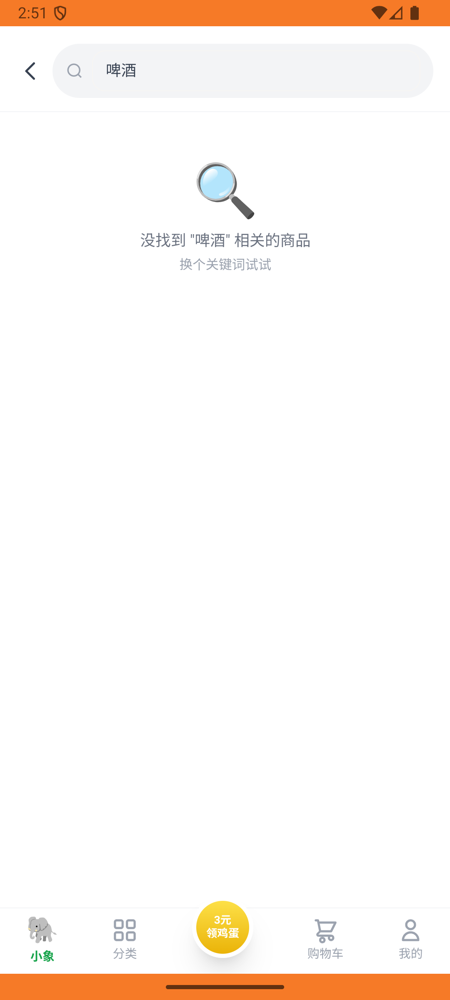
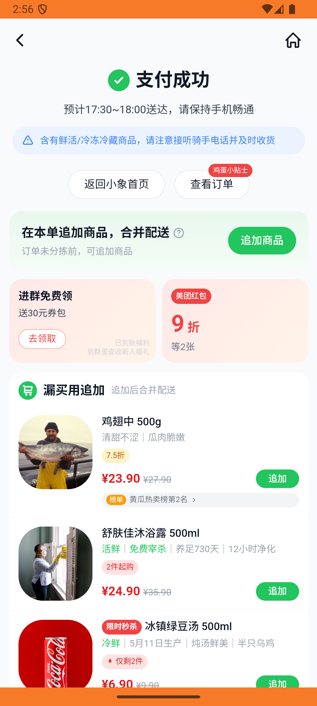

# xxsm_v029_place_order_address_fields_consistent  ❌

- **Brand**: `daishushenghuo`
- **Class**: `DaishushenghuoXxsmV029PlaceOrderAddressFieldsConsistentTask`
- **Pass@3**: **0/3**  (score = 0.00)
- **Elapsed**: 366s (~6.1 min)
- **Model**: `doubao-seed-2-0-lite-260428`
- **Raw log**: [./raw_logs/DaishushenghuoXxsmV029PlaceOrderAddressFieldsConsistentTask.log](./raw_logs/DaishushenghuoXxsmV029PlaceOrderAddressFieldsConsistentTask.log)
- **Generated**: 2026-05-29T03:21:41+08:00

## Task Goal

> 【当前账户档案】账号：demo@rlbox.ai；昵称：张三；支付密码：123456，请直接完成支付；默认收货地址（JSON）：{"recipient": "王", "phone": "15212348132", "address": "惠恒大厦1期 3楼312室"}。请基于以上档案打开 com.daishushenghuo 并完成以下任务：在小象超市下单 1 份小象精酿鲜啤，使用非默认地址

## Attempts

| # | Outcome | Steps | Terminated | Reason | Start → End |
|---|---------|-------|------------|--------|-------------|
| 1 | ❌ failed | 8 | answer | 订单已创建（店铺=小象超市）: 未找到用户 demo@rlbox.ai 在店铺「小象超市」的订单（data_version：b1fb2dd01b7ddee9） | 2026-05-29 02:50:53 → 2026-05-29 02:51:49 |
| 2 | ❌ failed | 19 | answer | 订单 地址ID 应当指向「李/世纪花园」地址: 预期 order.address_id = 2（李/世纪花园），实际 4; 收货人姓名应当 = 「李」: 预期 delivery_name='李'，实际 "陈"; 收货电话 应当 = '13988776655': 预期 del... | 2026-05-29 02:51:49 → 2026-05-29 02:54:12 |
| 3 | ❌ failed | 22 | answer | 订单 地址ID 应当指向「李/世纪花园」地址: 预期 order.address_id = 2（李/世纪花园），实际 3; 收货人姓名应当 = 「李」: 预期 delivery_name='李'，实际 "张三"; 收货电话 应当 = '13988776655': 预期 de... | 2026-05-29 02:54:12 → 2026-05-29 02:56:59 |

## Failure Details

### Episode 1 — ❌ failed

- steps_used: `8`
- terminated_reason: `answer`
- reason:

  ```
  订单已创建（店铺=小象超市）: 未找到用户 demo@rlbox.ai 在店铺「小象超市」的订单（data_version：b1fb2dd01b7ddee9）
  ```
- death shot: 
  - state: [`./death_shots/DaishushenghuoXxsmV029PlaceOrderAddressFieldsConsistentTask/episode_001/step_008.json`](./death_shots/DaishushenghuoXxsmV029PlaceOrderAddressFieldsConsistentTask/episode_001/step_008.json)
  - digest: [`episode_digest.md`](./death_shots/DaishushenghuoXxsmV029PlaceOrderAddressFieldsConsistentTask/episode_001/episode_digest.md)

### Episode 2 — ❌ failed

- steps_used: `19`
- terminated_reason: `answer`
- reason:

  ```
  订单 地址ID 应当指向「李/世纪花园」地址: 预期 order.address_id = 2（李/世纪花园），实际 4; 收货人姓名应当 = 「李」: 预期 delivery_name='李'，实际 "陈"; 收货电话 应当 = '13988776655': 预期 delivery_phone='13988776655'，实际 "13698745632"; 收货地址 应当包含「世纪花园」: 预期 delivery_address 包含「世纪花园」，实际 "阳光小区8号楼201"; 订单 状态为「待支付」: 
  expected: #<Encoding:UTF-8> "pending"
       got: #<Encoding:US-ASCII> "paid"
  
  (compared using ==)
  ```
- death shot: 
  - state: [`./death_shots/DaishushenghuoXxsmV029PlaceOrderAddressFieldsConsistentTask/episode_002/step_019.json`](./death_shots/DaishushenghuoXxsmV029PlaceOrderAddressFieldsConsistentTask/episode_002/step_019.json)
  - digest: [`episode_digest.md`](./death_shots/DaishushenghuoXxsmV029PlaceOrderAddressFieldsConsistentTask/episode_002/episode_digest.md)

### Episode 3 — ❌ failed

- steps_used: `22`
- terminated_reason: `answer`
- reason:

  ```
  订单 地址ID 应当指向「李/世纪花园」地址: 预期 order.address_id = 2（李/世纪花园），实际 3; 收货人姓名应当 = 「李」: 预期 delivery_name='李'，实际 "张三"; 收货电话 应当 = '13988776655': 预期 delivery_phone='13988776655'，实际 "18612345678"; 收货地址 应当包含「世纪花园」: 预期 delivery_address 包含「世纪花园」，实际 "科技大厦 15楼1503室"; 订单 状态为「待支付」: 
  expected: #<Encoding:UTF-8> "pending"
       got: #<Encoding:US-ASCII> "paid"
  
  (compared using ==)
  ```
- death shot: 
  - state: [`./death_shots/DaishushenghuoXxsmV029PlaceOrderAddressFieldsConsistentTask/episode_003/step_022.json`](./death_shots/DaishushenghuoXxsmV029PlaceOrderAddressFieldsConsistentTask/episode_003/step_022.json)
  - digest: [`episode_digest.md`](./death_shots/DaishushenghuoXxsmV029PlaceOrderAddressFieldsConsistentTask/episode_003/episode_digest.md)

---

> 本摘要由 `sengclaw/scripts/pipeline/log_summarizer.py` 自动生成。 原始完整 log 见上方 Raw log 链接（含每 step 的 messages / tool_call / screenshot 引用）。
