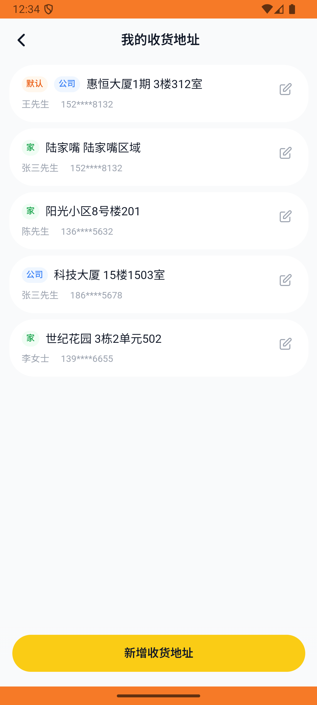
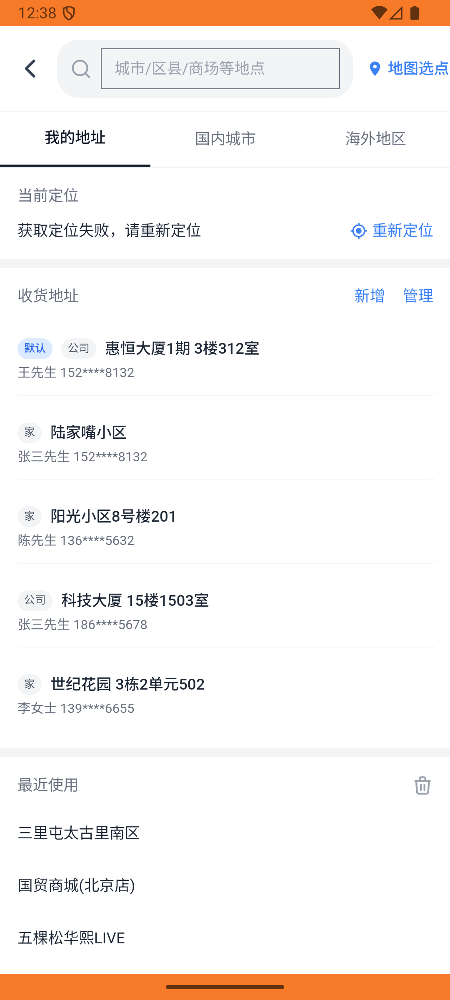
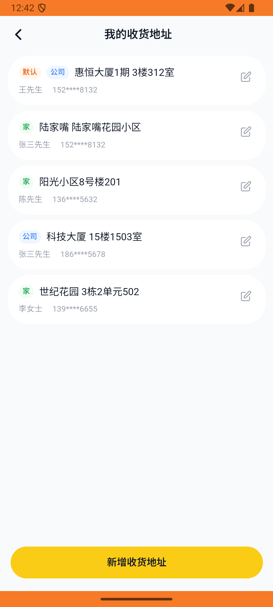

# address_v006_add_lujiazui_home_address  ❌

- **Brand**: `daishushenghuo`
- **Class**: `DaishushenghuoAddressV006AddLujiazuiHomeAddressTask`
- **Pass@3**: **0/3**  (score = 0.00)
- **Elapsed**: 728s (~12.1 min)
- **Model**: `doubao-seed-2-0-lite-260428`
- **Raw log**: [./raw_logs/DaishushenghuoAddressV006AddLujiazuiHomeAddressTask.log](./raw_logs/DaishushenghuoAddressV006AddLujiazuiHomeAddressTask.log)
- **Generated**: 2026-05-30T04:09:16+08:00

## Task Goal

> 【当前账户档案】账号：demo@rlbox.ai；昵称：张三；支付密码：123456，如需支付请使用此密码完成支付；默认收货地址（JSON）：{"recipient": "王", "phone": "15212348132", "address": "惠恒大厦1期 3楼312室"}。请基于以上档案打开 com.daishushenghuo 并完成以下任务：【地址】新增一个家庭收货地址（张三 / 陆家嘴）

## Attempts

| # | Outcome | Steps | Terminated | Reason | Start → End |
|---|---------|-------|------------|--------|-------------|
| 1 | ❌ failed | 26 | answer | 手机号 = "13912345678": 预期手机号 '13912345678'，实际为 "15212348132"; 完整地址 = 「上海市浦东新区陆家嘴环路1000号」（兼容标签/详址两种存储）: 预期完整地址 '上海市浦东新区陆家嘴环路1000号'，实际 label=... | 2026-05-30 00:30:39 → 2026-05-30 00:34:08 |
| 2 | ❌ failed | 31 | answer | 手机号 = "13912345678": 预期手机号 '13912345678'，实际为 "15212348132"; 完整地址 = 「上海市浦东新区陆家嘴环路1000号」（兼容标签/详址两种存储）: 预期完整地址 '上海市浦东新区陆家嘴环路1000号'，实际 label=... | 2026-05-30 00:34:08 → 2026-05-30 00:38:29 |
| 3 | ❌ failed | 32 | answer | 手机号 = "13912345678": 预期手机号 '13912345678'，实际为 "15212348132"; 完整地址 = 「上海市浦东新区陆家嘴环路1000号」（兼容标签/详址两种存储）: 预期完整地址 '上海市浦东新区陆家嘴环路1000号'，实际 label=... | 2026-05-30 00:38:29 → 2026-05-30 00:42:46 |

## Failure Details

### Episode 1 — ❌ failed

- steps_used: `26`
- terminated_reason: `answer`
- reason:

  ```
  手机号 = "13912345678": 预期手机号 '13912345678'，实际为 "15212348132"; 完整地址 = 「上海市浦东新区陆家嘴环路1000号」（兼容标签/详址两种存储）: 预期完整地址 '上海市浦东新区陆家嘴环路1000号'，实际 label="陆家嘴" detail_address="陆家嘴区域"（detail_only="陆家嘴区域" concat="陆家嘴陆家嘴区域"）
  Diff:
  @@ -1 +1 @@
  -true
  +false
  ```
- death shot: 
  - state: [`./death_shots/DaishushenghuoAddressV006AddLujiazuiHomeAddressTask/episode_001/step_026.json`](./death_shots/DaishushenghuoAddressV006AddLujiazuiHomeAddressTask/episode_001/step_026.json)
  - digest: [`episode_digest.md`](./death_shots/DaishushenghuoAddressV006AddLujiazuiHomeAddressTask/episode_001/episode_digest.md)

### Episode 2 — ❌ failed

- steps_used: `31`
- terminated_reason: `answer`
- reason:

  ```
  手机号 = "13912345678": 预期手机号 '13912345678'，实际为 "15212348132"; 完整地址 = 「上海市浦东新区陆家嘴环路1000号」（兼容标签/详址两种存储）: 预期完整地址 '上海市浦东新区陆家嘴环路1000号'，实际 label="陆家嘴" detail_address="陆家嘴小区"（detail_only="陆家嘴小区" concat="陆家嘴陆家嘴小区"）
  Diff:
  @@ -1 +1 @@
  -true
  +false
  ```
- death shot: 
  - state: [`./death_shots/DaishushenghuoAddressV006AddLujiazuiHomeAddressTask/episode_002/step_031.json`](./death_shots/DaishushenghuoAddressV006AddLujiazuiHomeAddressTask/episode_002/step_031.json)
  - digest: [`episode_digest.md`](./death_shots/DaishushenghuoAddressV006AddLujiazuiHomeAddressTask/episode_002/episode_digest.md)

### Episode 3 — ❌ failed

- steps_used: `32`
- terminated_reason: `answer`
- reason:

  ```
  手机号 = "13912345678": 预期手机号 '13912345678'，实际为 "15212348132"; 完整地址 = 「上海市浦东新区陆家嘴环路1000号」（兼容标签/详址两种存储）: 预期完整地址 '上海市浦东新区陆家嘴环路1000号'，实际 label="陆家嘴" detail_address="陆家嘴花园小区"（detail_only="陆家嘴花园小区" concat="陆家嘴陆家嘴花园小区"）
  Diff:
  @@ -1 +1 @@
  -true
  +false
  ```
- death shot: 
  - state: [`./death_shots/DaishushenghuoAddressV006AddLujiazuiHomeAddressTask/episode_003/step_032.json`](./death_shots/DaishushenghuoAddressV006AddLujiazuiHomeAddressTask/episode_003/step_032.json)
  - digest: [`episode_digest.md`](./death_shots/DaishushenghuoAddressV006AddLujiazuiHomeAddressTask/episode_003/episode_digest.md)

---

> 本摘要由 `sengclaw/scripts/pipeline/log_summarizer.py` 自动生成。 原始完整 log 见上方 Raw log 链接（含每 step 的 messages / tool_call / screenshot 引用）。
