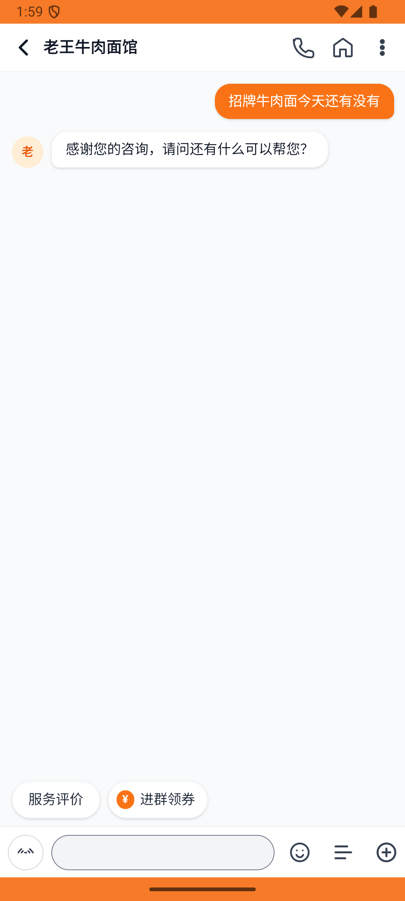
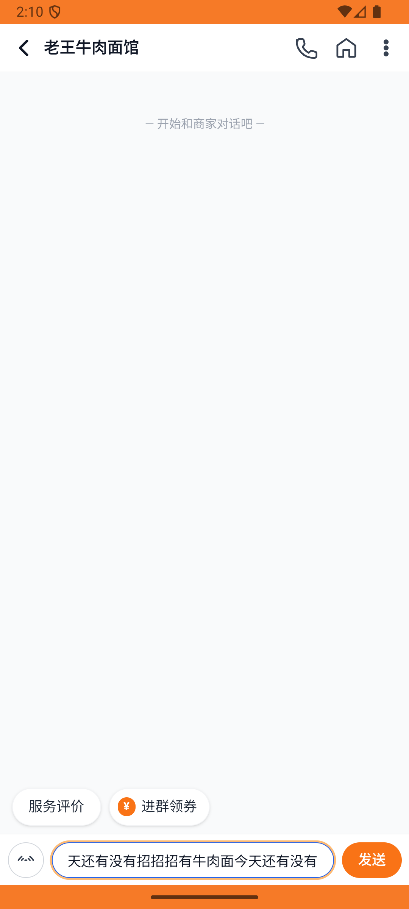

# messages_v003_send_laowang_inquiry  ❌

- **Brand**: `daishushenghuo`
- **Class**: `DaishushenghuoMessagesV003SendLaowangInquiryTask`
- **Pass@3**: **0/3**  (score = 0.00)
- **Elapsed**: 1065s (~17.8 min)
- **Model**: `doubao-seed-2-0-lite-260428`
- **Raw log**: [./raw_logs/DaishushenghuoMessagesV003SendLaowangInquiryTask.log](./raw_logs/DaishushenghuoMessagesV003SendLaowangInquiryTask.log)
- **Generated**: 2026-05-30T04:09:16+08:00

## Task Goal

> 【当前账户档案】账号：demo@rlbox.ai；昵称：张三；支付密码：123456，如需支付请使用此密码完成支付；默认收货地址（JSON）：{"recipient": "王", "phone": "15212348132", "address": "惠恒大厦1期 3楼312室"}。请基于以上档案打开 com.daishushenghuo 并完成以下任务：【消息】给老王牛肉面馆发私信问招牌牛肉面今天还有没有

## Attempts

| # | Outcome | Steps | Terminated | Reason | Start → End |
|---|---------|-------|------------|--------|-------------|
| 1 | ❌ failed | 23 | answer | 消息内容为「请问招牌牛肉面今天还有吗？」: 消息内容错误：预期 "请问招牌牛肉面今天还有吗？"，实际 "招牌牛肉面今天还有没有" | 2026-05-30 01:56:56 → 2026-05-30 01:59:50 |
| 2 | ⏰ timeout | 80 | max_steps | 用户消息已发送（聊天消息发送方为「用户」）: 未找到该会话内 sender=user 的消息记录 | 2026-05-30 01:59:50 → 2026-05-30 02:10:14 |
| 3 | ❌ failed | 36 | answer | 用户消息已发送（聊天消息发送方为「用户」）: 未找到该会话内 sender=user 的消息记录 | 2026-05-30 02:10:14 → 2026-05-30 02:14:41 |

## Failure Details

### Episode 1 — ❌ failed

- steps_used: `23`
- terminated_reason: `answer`
- reason:

  ```
  消息内容为「请问招牌牛肉面今天还有吗？」: 消息内容错误：预期 "请问招牌牛肉面今天还有吗？"，实际 "招牌牛肉面今天还有没有"
  ```
- death shot: 
  - state: [`./death_shots/DaishushenghuoMessagesV003SendLaowangInquiryTask/episode_001/step_023.json`](./death_shots/DaishushenghuoMessagesV003SendLaowangInquiryTask/episode_001/step_023.json)
  - digest: [`episode_digest.md`](./death_shots/DaishushenghuoMessagesV003SendLaowangInquiryTask/episode_001/episode_digest.md)

### Episode 2 — ⏰ timeout

- steps_used: `80`
- terminated_reason: `max_steps`
- reason:

  ```
  用户消息已发送（聊天消息发送方为「用户」）: 未找到该会话内 sender=user 的消息记录
  ```
- death shot: 
  - state: [`./death_shots/DaishushenghuoMessagesV003SendLaowangInquiryTask/episode_002/step_080.json`](./death_shots/DaishushenghuoMessagesV003SendLaowangInquiryTask/episode_002/step_080.json)
  - digest: [`episode_digest.md`](./death_shots/DaishushenghuoMessagesV003SendLaowangInquiryTask/episode_002/episode_digest.md)

### Episode 3 — ❌ failed

- steps_used: `36`
- terminated_reason: `answer`
- reason:

  ```
  用户消息已发送（聊天消息发送方为「用户」）: 未找到该会话内 sender=user 的消息记录
  ```
- death shot: 
  - state: [`./death_shots/DaishushenghuoMessagesV003SendLaowangInquiryTask/episode_003/step_036.json`](./death_shots/DaishushenghuoMessagesV003SendLaowangInquiryTask/episode_003/step_036.json)
  - digest: [`episode_digest.md`](./death_shots/DaishushenghuoMessagesV003SendLaowangInquiryTask/episode_003/episode_digest.md)

---

> 本摘要由 `sengclaw/scripts/pipeline/log_summarizer.py` 自动生成。 原始完整 log 见上方 Raw log 链接（含每 step 的 messages / tool_call / screenshot 引用）。
