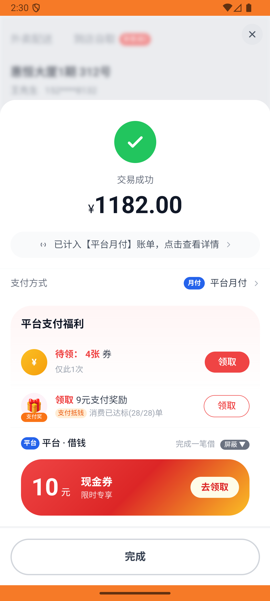

# order_v030_shenjia_sephora_multi_items  ❌

- **Brand**: `daishushenghuo`
- **Class**: `DaishushenghuoOrderV030ShenjiaSephoraMultiItemsTask`
- **Pass@3**: **0/3**  (score = 0.00)
- **Elapsed**: 1072s (~17.9 min)
- **Model**: `doubao-seed-2-0-lite-260428`
- **Raw log**: [./raw_logs/DaishushenghuoOrderV030ShenjiaSephoraMultiItemsTask.log](./raw_logs/DaishushenghuoOrderV030ShenjiaSephoraMultiItemsTask.log)
- **Generated**: 2026-05-30T04:09:16+08:00

## Task Goal

> 【当前账户档案】账号：demo@rlbox.ai；昵称：张三；支付密码：123456，如需支付请使用此密码完成支付；默认收货地址（JSON）：{"recipient": "王", "phone": "15212348132", "address": "惠恒大厦1期 3楼312室"}。请基于以上档案打开 com.daishushenghuo 并完成以下任务：在每日神价页面点击兰蔻小黑瓶进入丝芙兰，再加购祖玛珑香水，备注"请用礼盒包装"后下单

## Attempts

| # | Outcome | Steps | Terminated | Reason | Start → End |
|---|---------|-------|------------|--------|-------------|
| 1 | ❌ failed | 39 | answer | 订单状态 = 待支付: 预期 'pending'，实际 "paid" | 2026-05-30 02:25:55 → 2026-05-30 02:30:45 |
| 2 | ❌ failed | 44 | answer | 订单状态 = 待支付: 预期 'pending'，实际 "paid" | 2026-05-30 02:30:45 → 2026-05-30 02:36:17 |
| 3 | ❌ failed | 57 | answer | 订单状态 = 待支付: 预期 'pending'，实际 "paid" | 2026-05-30 02:36:17 → 2026-05-30 02:43:47 |

## Failure Details

### Episode 1 — ❌ failed

- steps_used: `39`
- terminated_reason: `answer`
- reason:

  ```
  订单状态 = 待支付: 预期 'pending'，实际 "paid"
  ```
- death shot: 
  - state: [`./death_shots/DaishushenghuoOrderV030ShenjiaSephoraMultiItemsTask/episode_001/step_039.json`](./death_shots/DaishushenghuoOrderV030ShenjiaSephoraMultiItemsTask/episode_001/step_039.json)
  - digest: [`episode_digest.md`](./death_shots/DaishushenghuoOrderV030ShenjiaSephoraMultiItemsTask/episode_001/episode_digest.md)

### Episode 2 — ❌ failed

- steps_used: `44`
- terminated_reason: `answer`
- reason:

  ```
  订单状态 = 待支付: 预期 'pending'，实际 "paid"
  ```
- death shot: 
  - state: [`./death_shots/DaishushenghuoOrderV030ShenjiaSephoraMultiItemsTask/episode_002/step_044.json`](./death_shots/DaishushenghuoOrderV030ShenjiaSephoraMultiItemsTask/episode_002/step_044.json)
  - digest: [`episode_digest.md`](./death_shots/DaishushenghuoOrderV030ShenjiaSephoraMultiItemsTask/episode_002/episode_digest.md)

### Episode 3 — ❌ failed

- steps_used: `57`
- terminated_reason: `answer`
- reason:

  ```
  订单状态 = 待支付: 预期 'pending'，实际 "paid"
  ```
- death shot: 
  - state: [`./death_shots/DaishushenghuoOrderV030ShenjiaSephoraMultiItemsTask/episode_003/step_057.json`](./death_shots/DaishushenghuoOrderV030ShenjiaSephoraMultiItemsTask/episode_003/step_057.json)
  - digest: [`episode_digest.md`](./death_shots/DaishushenghuoOrderV030ShenjiaSephoraMultiItemsTask/episode_003/episode_digest.md)

---

> 本摘要由 `sengclaw/scripts/pipeline/log_summarizer.py` 自动生成。 原始完整 log 见上方 Raw log 链接（含每 step 的 messages / tool_call / screenshot 引用）。
