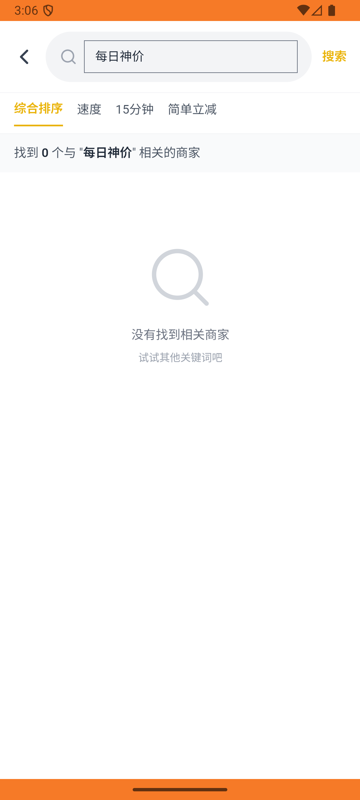

# order_v032_shenjia_mouse_charger_pay  ⚠️

- **Brand**: `daishushenghuo`
- **Class**: `DaishushenghuoOrderV032ShenjiaMouseChargerPayTask`
- **Pass@3**: **2/3**  (score = 1.00)
- **Elapsed**: 904s (~15.1 min)
- **Model**: `doubao-seed-2-0-lite-260428`
- **Raw log**: [./raw_logs/DaishushenghuoOrderV032ShenjiaMouseChargerPayTask.log](./raw_logs/DaishushenghuoOrderV032ShenjiaMouseChargerPayTask.log)
- **Generated**: 2026-05-30T04:09:16+08:00

## Task Goal

> 【当前账户档案】账号：demo@rlbox.ai；昵称：张三；支付密码：123456，如需支付请使用此密码完成支付；默认收货地址（JSON）：{"recipient": "王", "phone": "15212348132", "address": "惠恒大厦1期 3楼312室"}。请基于以上档案打开 com.daishushenghuo 并完成以下任务：在每日神价页面点击罗技鼠标进入京东到家，再加购Anker充电器，下单并支付

## Attempts

| # | Outcome | Steps | Terminated | Reason | Start → End |
|---|---------|-------|------------|--------|-------------|
| 1 | ❌ failed | 14 | answer | 订单已创建（店铺=京东到家数码旗舰）: 未找到用户在「京东到家数码旗舰」的订单 | 2026-05-30 03:04:47 → 2026-05-30 03:06:35 |
| 2 | ✅ passed | 59 | answer | – | 2026-05-30 03:06:35 → 2026-05-30 03:14:09 |
| 3 | ✅ passed | 45 | answer | – | 2026-05-30 03:14:09 → 2026-05-30 03:19:52 |

## Failure Details

### Episode 1 — ❌ failed

- steps_used: `14`
- terminated_reason: `answer`
- reason:

  ```
  订单已创建（店铺=京东到家数码旗舰）: 未找到用户在「京东到家数码旗舰」的订单
  ```
- death shot: 
  - state: [`./death_shots/DaishushenghuoOrderV032ShenjiaMouseChargerPayTask/episode_001/step_014.json`](./death_shots/DaishushenghuoOrderV032ShenjiaMouseChargerPayTask/episode_001/step_014.json)
  - digest: [`episode_digest.md`](./death_shots/DaishushenghuoOrderV032ShenjiaMouseChargerPayTask/episode_001/episode_digest.md)

---

> 本摘要由 `sengclaw/scripts/pipeline/log_summarizer.py` 自动生成。 原始完整 log 见上方 Raw log 链接（含每 step 的 messages / tool_call / screenshot 引用）。
