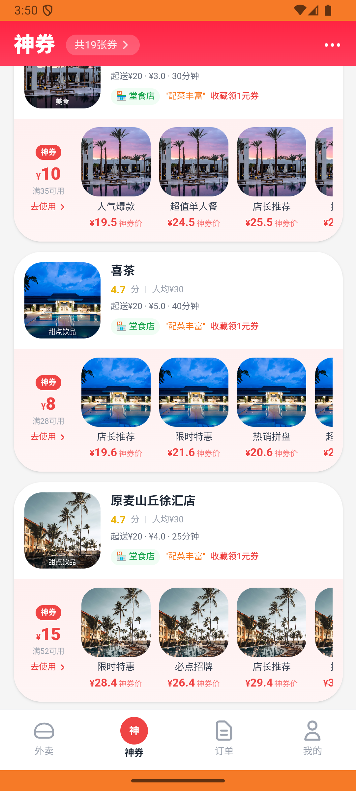

# order_v035_songnaicha_linli_send_gift  ❌

- **Brand**: `daishushenghuo`
- **Class**: `DaishushenghuoOrderV035SongnaichaLinliSendGiftTask`
- **Pass@3**: **0/3**  (score = 0.00)
- **Elapsed**: 550s (~9.2 min)
- **Model**: `doubao-seed-2-0-lite-260428`
- **Raw log**: [./raw_logs/DaishushenghuoOrderV035SongnaichaLinliSendGiftTask.log](./raw_logs/DaishushenghuoOrderV035SongnaichaLinliSendGiftTask.log)
- **Generated**: 2026-05-30T04:09:16+08:00

## Task Goal

> 【当前账户档案】账号：demo@rlbox.ai；昵称：张三；支付密码：123456，如需支付请使用此密码完成支付；默认收货地址（JSON）：{"recipient": "王", "phone": "15212348132", "address": "惠恒大厦1期 3楼312室"}。请基于以上档案打开 com.daishushenghuo 并完成以下任务：在送奶茶页面购买邻里泰绿柠檬茶券，支付后赠送给亲友

## Attempts

| # | Outcome | Steps | Terminated | Reason | Start → End |
|---|---------|-------|------------|--------|-------------|
| 1 | ❌ failed | 25 | answer | GiftOrder 已创建（product_id=4）: 未找到邻里泰绿柠檬茶的礼品券订单 | 2026-05-30 03:40:59 → 2026-05-30 03:44:31 |
| 2 | ❌ failed | 16 | answer | GiftOrder 已创建（product_id=4）: 未找到邻里泰绿柠檬茶的礼品券订单 | 2026-05-30 03:44:31 → 2026-05-30 03:46:39 |
| 3 | ❌ failed | 25 | answer | GiftOrder 已创建（product_id=4）: 未找到邻里泰绿柠檬茶的礼品券订单 | 2026-05-30 03:46:39 → 2026-05-30 03:50:09 |

## Failure Details

### Episode 1 — ❌ failed

- steps_used: `25`
- terminated_reason: `answer`
- reason:

  ```
  GiftOrder 已创建（product_id=4）: 未找到邻里泰绿柠檬茶的礼品券订单
  ```
- death shot: 
  - state: [`./death_shots/DaishushenghuoOrderV035SongnaichaLinliSendGiftTask/episode_001/step_025.json`](./death_shots/DaishushenghuoOrderV035SongnaichaLinliSendGiftTask/episode_001/step_025.json)
  - digest: [`episode_digest.md`](./death_shots/DaishushenghuoOrderV035SongnaichaLinliSendGiftTask/episode_001/episode_digest.md)

### Episode 2 — ❌ failed

- steps_used: `16`
- terminated_reason: `answer`
- reason:

  ```
  GiftOrder 已创建（product_id=4）: 未找到邻里泰绿柠檬茶的礼品券订单
  ```
- death shot: 
  - state: [`./death_shots/DaishushenghuoOrderV035SongnaichaLinliSendGiftTask/episode_002/step_016.json`](./death_shots/DaishushenghuoOrderV035SongnaichaLinliSendGiftTask/episode_002/step_016.json)
  - digest: [`episode_digest.md`](./death_shots/DaishushenghuoOrderV035SongnaichaLinliSendGiftTask/episode_002/episode_digest.md)

### Episode 3 — ❌ failed

- steps_used: `25`
- terminated_reason: `answer`
- reason:

  ```
  GiftOrder 已创建（product_id=4）: 未找到邻里泰绿柠檬茶的礼品券订单
  ```
- death shot: 
  - state: [`./death_shots/DaishushenghuoOrderV035SongnaichaLinliSendGiftTask/episode_003/step_025.json`](./death_shots/DaishushenghuoOrderV035SongnaichaLinliSendGiftTask/episode_003/step_025.json)
  - digest: [`episode_digest.md`](./death_shots/DaishushenghuoOrderV035SongnaichaLinliSendGiftTask/episode_003/episode_digest.md)

---

> 本摘要由 `sengclaw/scripts/pipeline/log_summarizer.py` 自动生成。 原始完整 log 见上方 Raw log 链接（含每 step 的 messages / tool_call / screenshot 引用）。
