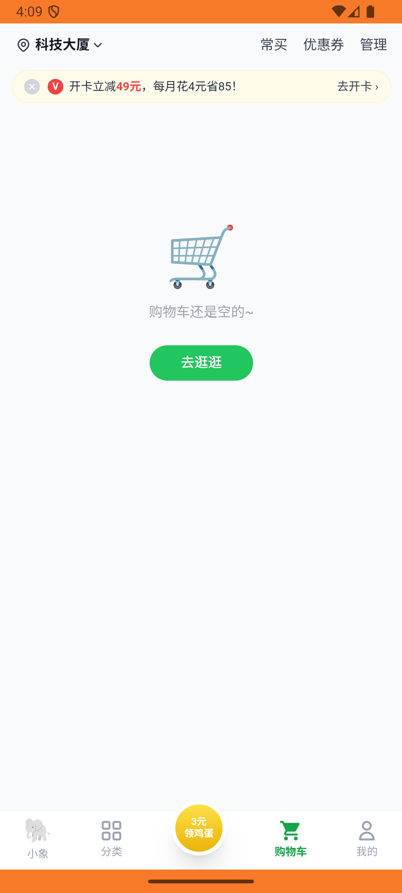

# xxsm_v038_add_xilanhua_450g  ❌

- **Brand**: `daishushenghuo`
- **Class**: `DaishushenghuoXxsmV038AddXilanhua450gTask`
- **Pass@3**: **0/3**  (score = 0.00)
- **Elapsed**: 577s (~9.6 min)
- **Model**: `doubao-seed-2-0-lite-260428`
- **Raw log**: [./raw_logs/DaishushenghuoXxsmV038AddXilanhua450gTask.log](./raw_logs/DaishushenghuoXxsmV038AddXilanhua450gTask.log)
- **Generated**: 2026-05-30T04:09:16+08:00

## Task Goal

> 【当前账户档案】账号：demo@rlbox.ai；昵称：张三；支付密码：123456，如需支付请使用此密码完成支付；默认收货地址（JSON）：{"recipient": "王", "phone": "15212348132", "address": "惠恒大厦1期 3楼312室"}。请基于以上档案打开 com.daishushenghuo 并完成以下任务：【小象超市】购物车组合操作（西兰花+薯片+西瓜汁的加改删）

## Attempts

| # | Outcome | Steps | Terminated | Reason | Start → End |
|---|---------|-------|------------|--------|-------------|
| 1 | ❌ failed | 25 | answer | 购物车存在且非空: 购物车应当有商品（西兰花+薯片），不应为空 | 2026-05-30 03:59:39 → 2026-05-30 04:02:40 |
| 2 | ❌ failed | 29 | answer | 「西兰花约 450g」数量 = 1: 预期西兰花 quantity=1，实际为 2; 「薯片 90g」数量 = 5: 购物车未找到薯片 90g; 「西瓜汁 350ml」应当已被删除: 西瓜汁 350ml 应当已从购物车删除，但仍存在; 购物车小计 = ¥38.63: 预期 ... | 2026-05-30 04:02:40 → 2026-05-30 04:05:56 |
| 3 | ❌ failed | 26 | answer | 购物车存在且非空: 购物车应当有商品（西兰花+薯片），不应为空 | 2026-05-30 04:05:56 → 2026-05-30 04:09:16 |

## Failure Details

### Episode 1 — ❌ failed

- steps_used: `25`
- terminated_reason: `answer`
- reason:

  ```
  购物车存在且非空: 购物车应当有商品（西兰花+薯片），不应为空
  ```
- death shot: 
  - state: [`./death_shots/DaishushenghuoXxsmV038AddXilanhua450gTask/episode_001/step_025.json`](./death_shots/DaishushenghuoXxsmV038AddXilanhua450gTask/episode_001/step_025.json)
  - digest: [`episode_digest.md`](./death_shots/DaishushenghuoXxsmV038AddXilanhua450gTask/episode_001/episode_digest.md)

### Episode 2 — ❌ failed

- steps_used: `29`
- terminated_reason: `answer`
- reason:

  ```
  「西兰花约 450g」数量 = 1: 预期西兰花 quantity=1，实际为 2; 「薯片 90g」数量 = 5: 购物车未找到薯片 90g; 「西瓜汁 350ml」应当已被删除: 西瓜汁 350ml 应当已从购物车删除，但仍存在; 购物车小计 = ¥38.63: 预期 subtotal ¥38.63，实际 ¥18.16
  ```
- death shot: 
  - state: [`./death_shots/DaishushenghuoXxsmV038AddXilanhua450gTask/episode_002/step_029.json`](./death_shots/DaishushenghuoXxsmV038AddXilanhua450gTask/episode_002/step_029.json)
  - digest: [`episode_digest.md`](./death_shots/DaishushenghuoXxsmV038AddXilanhua450gTask/episode_002/episode_digest.md)

### Episode 3 — ❌ failed

- steps_used: `26`
- terminated_reason: `answer`
- reason:

  ```
  购物车存在且非空: 购物车应当有商品（西兰花+薯片），不应为空
  ```
- death shot: 
  - state: [`./death_shots/DaishushenghuoXxsmV038AddXilanhua450gTask/episode_003/step_026.json`](./death_shots/DaishushenghuoXxsmV038AddXilanhua450gTask/episode_003/step_026.json)
  - digest: [`episode_digest.md`](./death_shots/DaishushenghuoXxsmV038AddXilanhua450gTask/episode_003/episode_digest.md)

---

> 本摘要由 `sengclaw/scripts/pipeline/log_summarizer.py` 自动生成。 原始完整 log 见上方 Raw log 链接（含每 step 的 messages / tool_call / screenshot 引用）。
