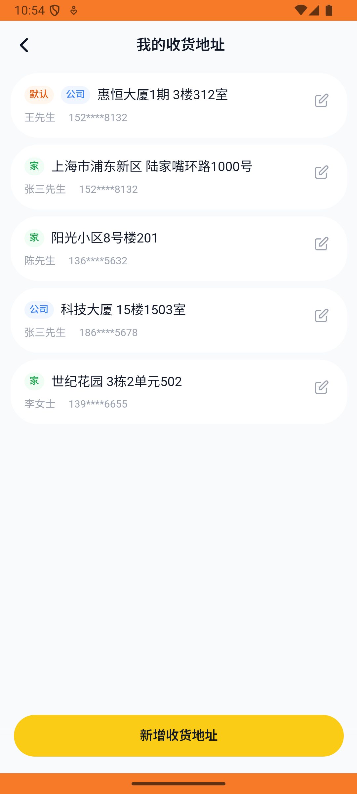

# address_v001_add_address  ❌

- **Brand**: `daishushenghuo`
- **Class**: `DaishushenghuoAddressV001AddAddressTask`
- **Pass@3**: **0/3**  (score = 0.00)
- **Elapsed**: 471s (~7.8 min)
- **Model**: `doubao-seed-2-0-lite-260428`
- **Raw log**: [./raw_logs/DaishushenghuoAddressV001AddAddressTask.log](./raw_logs/DaishushenghuoAddressV001AddAddressTask.log)
- **Generated**: 2026-06-01T03:13:29+08:00

## Task Goal

> 【当前账户档案】账号：demo@rlbox.ai；昵称：张三；支付密码：123456，如需支付请使用此密码完成支付；默认收货地址（JSON）：{"recipient": "王", "phone": "15212348132", "address": "惠恒大厦1期 3楼312室"}。请基于以上档案打开 com.daishushenghuo 并完成以下任务：新增一个家庭收货地址，联系人张三，地址上海市浦东新区陆家嘴环路1000号

## Attempts

| # | Outcome | Steps | Terminated | Reason | Start → End |
|---|---------|-------|------------|--------|-------------|
| 1 | ❌ failed | 22 | answer | 手机号 = "13912345678": 预期手机号 '13912345678'，实际为 "15212348132" | 2026-05-31 22:49:17 → 2026-05-31 22:52:11 |
| 2 | ❌ failed | 20 | answer | 手机号 = "13912345678": 预期手机号 '13912345678'，实际为 "15212348132" | 2026-05-31 22:52:11 → 2026-05-31 22:54:47 |
| 3 | ❌ failed | 18 | answer | 手机号 = "13912345678": 预期手机号 '13912345678'，实际为 "15212348132" | 2026-05-31 22:54:47 → 2026-05-31 22:57:07 |

## Failure Details

### Episode 1 — ❌ failed

- steps_used: `22`
- terminated_reason: `answer`
- reason:

  ```
  手机号 = "13912345678": 预期手机号 '13912345678'，实际为 "15212348132"
  ```
- death shot: 
  - state: [`./death_shots/DaishushenghuoAddressV001AddAddressTask/episode_001/step_022.json`](./death_shots/DaishushenghuoAddressV001AddAddressTask/episode_001/step_022.json)
  - digest: [`episode_digest.md`](./death_shots/DaishushenghuoAddressV001AddAddressTask/episode_001/episode_digest.md)

### Episode 2 — ❌ failed

- steps_used: `20`
- terminated_reason: `answer`
- reason:

  ```
  手机号 = "13912345678": 预期手机号 '13912345678'，实际为 "15212348132"
  ```
- death shot: 
  - state: [`./death_shots/DaishushenghuoAddressV001AddAddressTask/episode_002/step_020.json`](./death_shots/DaishushenghuoAddressV001AddAddressTask/episode_002/step_020.json)
  - digest: [`episode_digest.md`](./death_shots/DaishushenghuoAddressV001AddAddressTask/episode_002/episode_digest.md)

### Episode 3 — ❌ failed

- steps_used: `18`
- terminated_reason: `answer`
- reason:

  ```
  手机号 = "13912345678": 预期手机号 '13912345678'，实际为 "15212348132"
  ```
- death shot: 
  - state: [`./death_shots/DaishushenghuoAddressV001AddAddressTask/episode_003/step_018.json`](./death_shots/DaishushenghuoAddressV001AddAddressTask/episode_003/step_018.json)
  - digest: [`episode_digest.md`](./death_shots/DaishushenghuoAddressV001AddAddressTask/episode_003/episode_digest.md)

---

> 本摘要由 `sengclaw/scripts/pipeline/log_summarizer.py` 自动生成。 原始完整 log 见上方 Raw log 链接（含每 step 的 messages / tool_call / screenshot 引用）。
