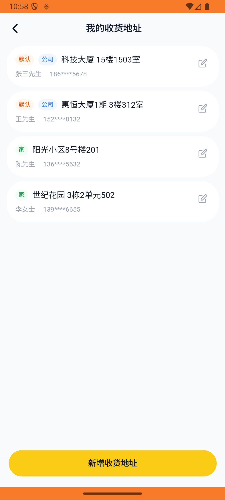

# address_v003_set_default_address  ⚠️

- **Brand**: `daishushenghuo`
- **Class**: `DaishushenghuoAddressV003SetDefaultAddressTask`
- **Pass@3**: **2/3**  (score = 1.00)
- **Elapsed**: 179s (~3.0 min)
- **Model**: `doubao-seed-2-0-lite-260428`
- **Raw log**: [./raw_logs/DaishushenghuoAddressV003SetDefaultAddressTask.log](./raw_logs/DaishushenghuoAddressV003SetDefaultAddressTask.log)
- **Generated**: 2026-06-01T03:13:29+08:00

## Task Goal

> 【当前账户档案】账号：demo@rlbox.ai；昵称：张三；支付密码：123456，如需支付请使用此密码完成支付；默认收货地址（JSON）：{"recipient": "王", "phone": "15212348132", "address": "惠恒大厦1期 3楼312室"}。请基于以上档案打开 com.daishushenghuo 并完成以下任务：把科技大厦设为默认收货地址

## Attempts

| # | Outcome | Steps | Terminated | Reason | Start → End |
|---|---------|-------|------------|--------|-------------|
| 1 | ❌ failed | 8 | answer | 「惠恒大厦1期」已不再是默认地址: 预期「惠恒大厦1期」is_default = false，实际为 true Diff: @@ -1 +1 @@ -false +true | 2026-05-31 22:57:48 → 2026-05-31 22:58:50 |
| 2 | ✅ passed | 10 | answer | – | 2026-05-31 22:58:50 → 2026-05-31 23:00:02 |
| 3 | ✅ passed | 5 | answer | – | 2026-05-31 23:00:02 → 2026-05-31 23:00:46 |

## Failure Details

### Episode 1 — ❌ failed

- steps_used: `8`
- terminated_reason: `answer`
- reason:

  ```
  「惠恒大厦1期」已不再是默认地址: 预期「惠恒大厦1期」is_default = false，实际为 true
  Diff:
  @@ -1 +1 @@
  -false
  +true
  ```
- death shot: 
  - state: [`./death_shots/DaishushenghuoAddressV003SetDefaultAddressTask/episode_001/step_008.json`](./death_shots/DaishushenghuoAddressV003SetDefaultAddressTask/episode_001/step_008.json)
  - digest: [`episode_digest.md`](./death_shots/DaishushenghuoAddressV003SetDefaultAddressTask/episode_001/episode_digest.md)

---

> 本摘要由 `sengclaw/scripts/pipeline/log_summarizer.py` 自动生成。 原始完整 log 见上方 Raw log 链接（含每 step 的 messages / tool_call / screenshot 引用）。
