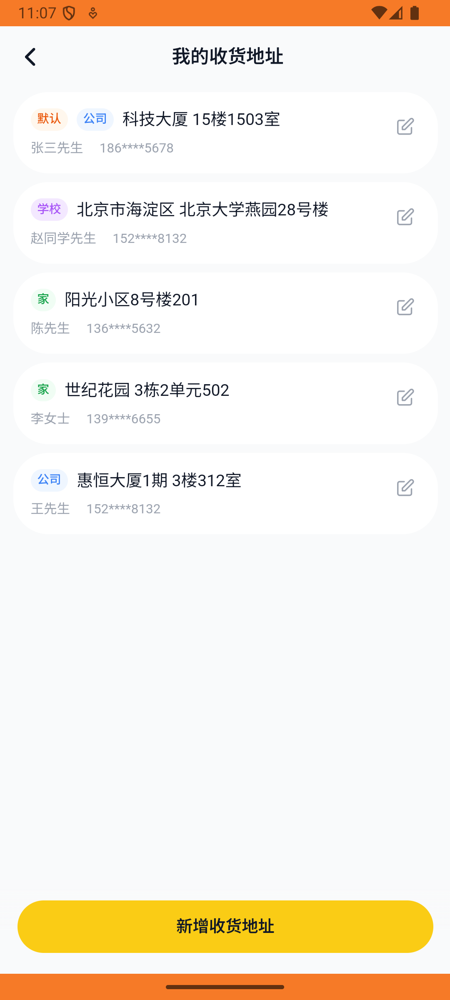

# address_v004_add_school_address  ❌

- **Brand**: `daishushenghuo`
- **Class**: `DaishushenghuoAddressV004AddSchoolAddressTask`
- **Pass@3**: **0/3**  (score = 0.00)
- **Elapsed**: 382s (~6.4 min)
- **Model**: `doubao-seed-2-0-lite-260428`
- **Raw log**: [./raw_logs/DaishushenghuoAddressV004AddSchoolAddressTask.log](./raw_logs/DaishushenghuoAddressV004AddSchoolAddressTask.log)
- **Generated**: 2026-06-01T03:13:29+08:00

## Task Goal

> 【当前账户档案】账号：demo@rlbox.ai；昵称：张三；支付密码：123456，如需支付请使用此密码完成支付；默认收货地址（JSON）：{"recipient": "王", "phone": "15212348132", "address": "惠恒大厦1期 3楼312室"}。请基于以上档案打开 com.daishushenghuo 并完成以下任务：新增一个学校收货地址，联系人赵同学，地址北京市海淀区北京大学燕园28号楼

## Attempts

| # | Outcome | Steps | Terminated | Reason | Start → End |
|---|---------|-------|------------|--------|-------------|
| 1 | ❌ failed | 17 | answer | 手机号 = "15088889999": 预期手机号 '15088889999'，实际为 "15212348132" | 2026-05-31 23:01:25 → 2026-05-31 23:03:28 |
| 2 | ❌ failed | 18 | answer | 手机号 = "15088889999": 预期手机号 '15088889999'，实际为 "15212348132" | 2026-05-31 23:03:28 → 2026-05-31 23:05:42 |
| 3 | ❌ failed | 17 | answer | 手机号 = "15088889999": 预期手机号 '15088889999'，实际为 "15212348132" | 2026-05-31 23:05:42 → 2026-05-31 23:07:47 |

## Failure Details

### Episode 1 — ❌ failed

- steps_used: `17`
- terminated_reason: `answer`
- reason:

  ```
  手机号 = "15088889999": 预期手机号 '15088889999'，实际为 "15212348132"
  ```
- death shot: 
  - state: [`./death_shots/DaishushenghuoAddressV004AddSchoolAddressTask/episode_001/step_017.json`](./death_shots/DaishushenghuoAddressV004AddSchoolAddressTask/episode_001/step_017.json)
  - digest: [`episode_digest.md`](./death_shots/DaishushenghuoAddressV004AddSchoolAddressTask/episode_001/episode_digest.md)

### Episode 2 — ❌ failed

- steps_used: `18`
- terminated_reason: `answer`
- reason:

  ```
  手机号 = "15088889999": 预期手机号 '15088889999'，实际为 "15212348132"
  ```
- death shot: 
  - state: [`./death_shots/DaishushenghuoAddressV004AddSchoolAddressTask/episode_002/step_018.json`](./death_shots/DaishushenghuoAddressV004AddSchoolAddressTask/episode_002/step_018.json)
  - digest: [`episode_digest.md`](./death_shots/DaishushenghuoAddressV004AddSchoolAddressTask/episode_002/episode_digest.md)

### Episode 3 — ❌ failed

- steps_used: `17`
- terminated_reason: `answer`
- reason:

  ```
  手机号 = "15088889999": 预期手机号 '15088889999'，实际为 "15212348132"
  ```
- death shot: 
  - state: [`./death_shots/DaishushenghuoAddressV004AddSchoolAddressTask/episode_003/step_017.json`](./death_shots/DaishushenghuoAddressV004AddSchoolAddressTask/episode_003/step_017.json)
  - digest: [`episode_digest.md`](./death_shots/DaishushenghuoAddressV004AddSchoolAddressTask/episode_003/episode_digest.md)

---

> 本摘要由 `sengclaw/scripts/pipeline/log_summarizer.py` 自动生成。 原始完整 log 见上方 Raw log 链接（含每 step 的 messages / tool_call / screenshot 引用）。
