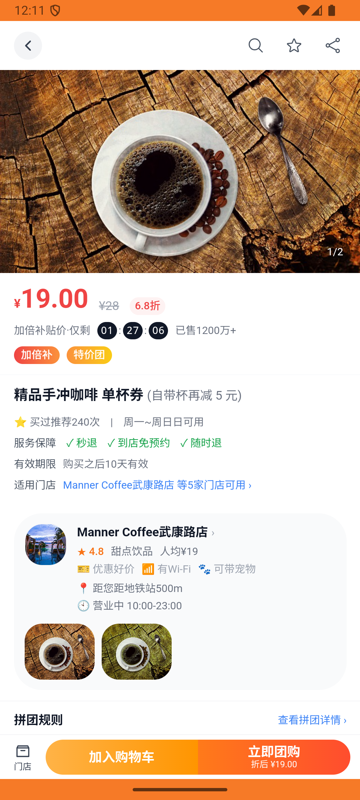
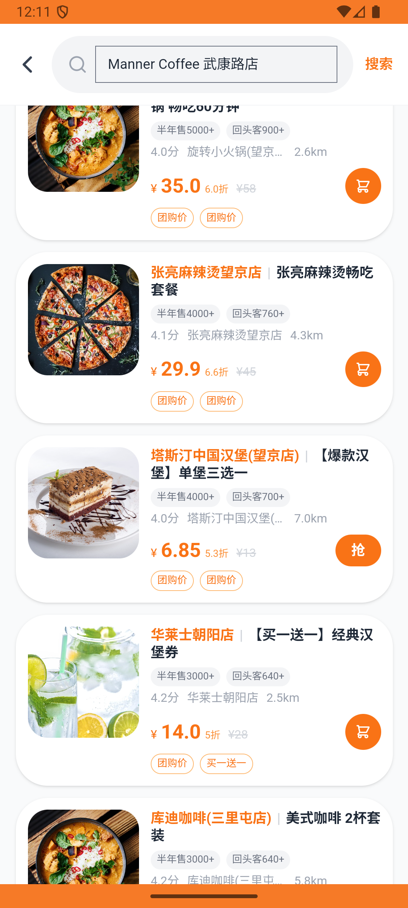
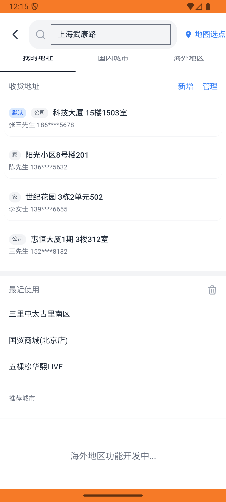

# group_deal_v005_place_order_manner  ❌

- **Brand**: `daishushenghuo`
- **Class**: `DaishushenghuoGroupDealV005PlaceOrderMannerTask`
- **Pass@3**: **0/3**  (score = 0.00)
- **Elapsed**: 636s (~10.6 min)
- **Model**: `doubao-seed-2-0-lite-260428`
- **Raw log**: [./raw_logs/DaishushenghuoGroupDealV005PlaceOrderMannerTask.log](./raw_logs/DaishushenghuoGroupDealV005PlaceOrderMannerTask.log)
- **Generated**: 2026-06-01T03:13:29+08:00

## Task Goal

> 【当前账户档案】账号：demo@rlbox.ai；昵称：张三；支付密码：123456，如需支付请使用此密码完成支付；默认收货地址（JSON）：{"recipient": "王", "phone": "15212348132", "address": "惠恒大厦1期 3楼312室"}。请基于以上档案打开 com.daishushenghuo 并完成以下任务：在 Manner Coffee 武康路店买 3 份精品手冲咖啡团购券并支付

## Attempts

| # | Outcome | Steps | Terminated | Reason | Start → End |
|---|---------|-------|------------|--------|-------------|
| 1 | ❌ failed | 37 | answer | 团购订单已创建（店铺=Manner Coffee武康路店，订单类型为团购订单）: 未找到用户 demo@rlbox.ai 在「Manner Coffee武康路店」的团购订单 | 2026-06-01 00:04:55 → 2026-06-01 00:11:05 |
| 2 | ❌ failed | 8 | answer | 团购订单已创建（店铺=Manner Coffee武康路店，订单类型为团购订单）: 未找到用户 demo@rlbox.ai 在「Manner Coffee武康路店」的团购订单 | 2026-06-01 00:11:05 → 2026-06-01 00:11:59 |
| 3 | ❌ failed | 24 | answer | 团购订单已创建（店铺=Manner Coffee武康路店，订单类型为团购订单）: 未找到用户 demo@rlbox.ai 在「Manner Coffee武康路店」的团购订单 | 2026-06-01 00:11:59 → 2026-06-01 00:15:31 |

## Failure Details

### Episode 1 — ❌ failed

- steps_used: `37`
- terminated_reason: `answer`
- reason:

  ```
  团购订单已创建（店铺=Manner Coffee武康路店，订单类型为团购订单）: 未找到用户 demo@rlbox.ai 在「Manner Coffee武康路店」的团购订单
  ```
- death shot: 
  - state: [`./death_shots/DaishushenghuoGroupDealV005PlaceOrderMannerTask/episode_001/step_037.json`](./death_shots/DaishushenghuoGroupDealV005PlaceOrderMannerTask/episode_001/step_037.json)
  - digest: [`episode_digest.md`](./death_shots/DaishushenghuoGroupDealV005PlaceOrderMannerTask/episode_001/episode_digest.md)

### Episode 2 — ❌ failed

- steps_used: `8`
- terminated_reason: `answer`
- reason:

  ```
  团购订单已创建（店铺=Manner Coffee武康路店，订单类型为团购订单）: 未找到用户 demo@rlbox.ai 在「Manner Coffee武康路店」的团购订单
  ```
- death shot: 
  - state: [`./death_shots/DaishushenghuoGroupDealV005PlaceOrderMannerTask/episode_002/step_008.json`](./death_shots/DaishushenghuoGroupDealV005PlaceOrderMannerTask/episode_002/step_008.json)
  - digest: [`episode_digest.md`](./death_shots/DaishushenghuoGroupDealV005PlaceOrderMannerTask/episode_002/episode_digest.md)

### Episode 3 — ❌ failed

- steps_used: `24`
- terminated_reason: `answer`
- reason:

  ```
  团购订单已创建（店铺=Manner Coffee武康路店，订单类型为团购订单）: 未找到用户 demo@rlbox.ai 在「Manner Coffee武康路店」的团购订单
  ```
- death shot: 
  - state: [`./death_shots/DaishushenghuoGroupDealV005PlaceOrderMannerTask/episode_003/step_024.json`](./death_shots/DaishushenghuoGroupDealV005PlaceOrderMannerTask/episode_003/step_024.json)
  - digest: [`episode_digest.md`](./death_shots/DaishushenghuoGroupDealV005PlaceOrderMannerTask/episode_003/episode_digest.md)

---

> 本摘要由 `sengclaw/scripts/pipeline/log_summarizer.py` 自动生成。 原始完整 log 见上方 Raw log 链接（含每 step 的 messages / tool_call / screenshot 引用）。
