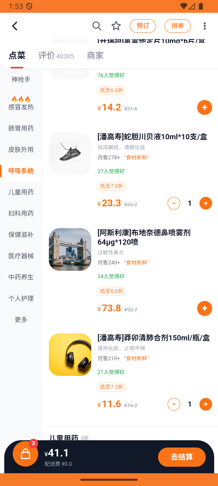

# kanbing_v007_add_via_chuncung_sheet  ⚠️

- **Brand**: `daishushenghuo`
- **Class**: `DaishushenghuoKanbingV007AddViaChuncungSheetTask`
- **Pass@3**: **1/3**  (score = 1.00)
- **Elapsed**: 544s (~9.1 min)
- **Model**: `doubao-seed-2-0-lite-260428`
- **Raw log**: [./raw_logs/DaishushenghuoKanbingV007AddViaChuncungSheetTask.log](./raw_logs/DaishushenghuoKanbingV007AddViaChuncungSheetTask.log)
- **Generated**: 2026-06-01T03:13:29+08:00

## Task Goal

> 【当前账户档案】账号：demo@rlbox.ai；昵称：张三；支付密码：123456，如需支付请使用此密码完成支付；默认收货地址（JSON）：{"recipient": "王", "phone": "15212348132", "address": "惠恒大厦1期 3楼312室"}。请基于以上档案打开 com.daishushenghuo 并完成以下任务：在南北明华药行通过凑单加购莽卯清肺合剂到购物车

## Attempts

| # | Outcome | Steps | Terminated | Reason | Start → End |
|---|---------|-------|------------|--------|-------------|
| 1 | ❌ failed | 19 | answer | 购物车明细数 = 2:  expected: 2      got: 3  (compared using ==) ; 购物车小计 = ¥17.77: 预期 ¥17.77，实际 ¥41.08 | 2026-06-01 01:51:42 → 2026-06-01 01:53:51 |
| 2 | ❌ failed | 38 | answer | 新增了[潘高寿]莽卯清肺合剂（数量 1）:  expected: 1      got: 2  (compared using ==) ; 购物车小计 = ¥17.77: 预期 ¥17.77，实际 ¥29.38 | 2026-06-01 01:53:51 → 2026-06-01 01:58:43 |
| 3 | ✅ passed | 17 | answer | – | 2026-06-01 01:58:43 → 2026-06-01 02:00:46 |

## Failure Details

### Episode 1 — ❌ failed

- steps_used: `19`
- terminated_reason: `answer`
- reason:

  ```
  购物车明细数 = 2: 
  expected: 2
       got: 3
  
  (compared using ==)
  ; 购物车小计 = ¥17.77: 预期 ¥17.77，实际 ¥41.08
  ```
- death shot: 
  - state: [`./death_shots/DaishushenghuoKanbingV007AddViaChuncungSheetTask/episode_001/step_019.json`](./death_shots/DaishushenghuoKanbingV007AddViaChuncungSheetTask/episode_001/step_019.json)
  - digest: [`episode_digest.md`](./death_shots/DaishushenghuoKanbingV007AddViaChuncungSheetTask/episode_001/episode_digest.md)

### Episode 2 — ❌ failed

- steps_used: `38`
- terminated_reason: `answer`
- reason:

  ```
  新增了[潘高寿]莽卯清肺合剂（数量 1）: 
  expected: 1
       got: 2
  
  (compared using ==)
  ; 购物车小计 = ¥17.77: 预期 ¥17.77，实际 ¥29.38
  ```
- death shot: 
  - state: [`./death_shots/DaishushenghuoKanbingV007AddViaChuncungSheetTask/episode_002/step_038.json`](./death_shots/DaishushenghuoKanbingV007AddViaChuncungSheetTask/episode_002/step_038.json)
  - digest: [`episode_digest.md`](./death_shots/DaishushenghuoKanbingV007AddViaChuncungSheetTask/episode_002/episode_digest.md)

---

> 本摘要由 `sengclaw/scripts/pipeline/log_summarizer.py` 自动生成。 原始完整 log 见上方 Raw log 链接（含每 step 的 messages / tool_call / screenshot 引用）。
