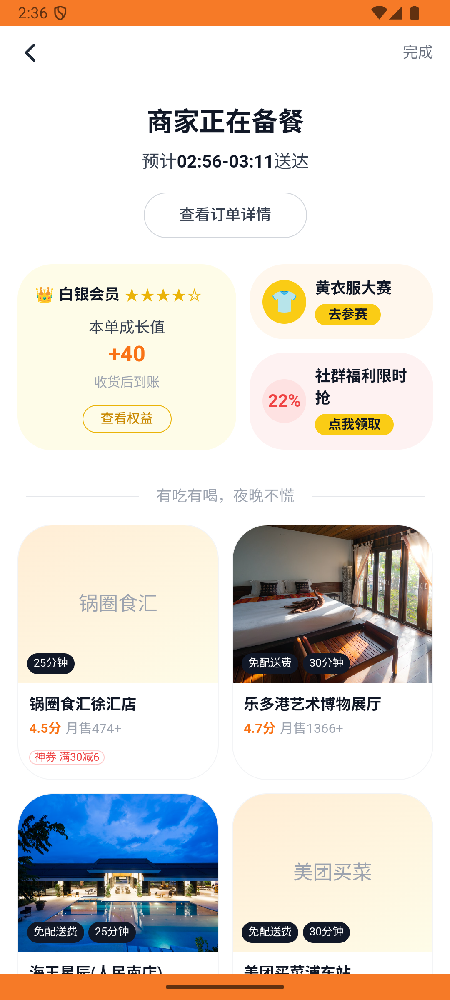
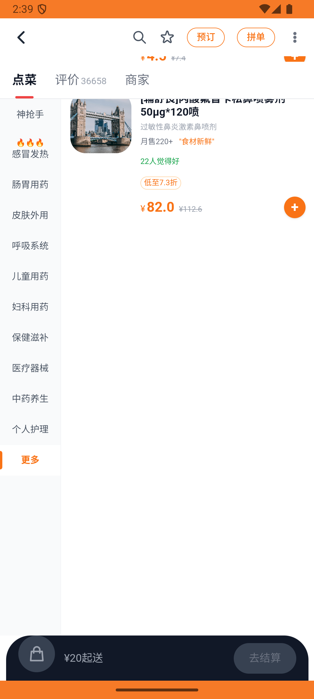

# kanbing_v011_place_order_renhe  ❌

- **Brand**: `daishushenghuo`
- **Class**: `DaishushenghuoKanbingV011PlaceOrderRenheTask`
- **Pass@3**: **0/3**  (score = 0.00)
- **Elapsed**: 681s (~11.3 min)
- **Model**: `doubao-seed-2-0-lite-260428`
- **Raw log**: [./raw_logs/DaishushenghuoKanbingV011PlaceOrderRenheTask.log](./raw_logs/DaishushenghuoKanbingV011PlaceOrderRenheTask.log)
- **Generated**: 2026-06-01T03:13:30+08:00

## Task Goal

> 【当前账户档案】账号：demo@rlbox.ai；昵称：张三；支付密码：123456，如需支付请使用此密码完成支付；默认收货地址（JSON）：{"recipient": "王", "phone": "15212348132", "address": "惠恒大厦1期 3楼312室"}。请基于以上档案打开 com.daishushenghuo 并完成以下任务：在仁和大药房下单 1 盒阿莫西林胶囊，使用默认地址

## Attempts

| # | Outcome | Steps | Terminated | Reason | Start → End |
|---|---------|-------|------------|--------|-------------|
| 1 | ❌ failed | 26 | answer | 订单已创建（店铺=仁和大药房(石龙仔二分店)）: expected: not nil      got: nil | 2026-06-01 02:27:42 → 2026-06-01 02:30:39 |
| 2 | ❌ failed | 43 | answer | 订单状态 = 「待支付」:  expected: #<Encoding:UTF-8> "pending"      got: #<Encoding:US-ASCII> "paid"  (compared using ==) | 2026-06-01 02:30:39 → 2026-06-01 02:36:44 |
| 3 | ❌ failed | 19 | answer | 订单已创建（店铺=仁和大药房(石龙仔二分店)）: expected: not nil      got: nil | 2026-06-01 02:36:44 → 2026-06-01 02:39:02 |

## Failure Details

### Episode 1 — ❌ failed

- steps_used: `26`
- terminated_reason: `answer`
- reason:

  ```
  订单已创建（店铺=仁和大药房(石龙仔二分店)）: expected: not nil
       got: nil
  ```
- death shot: 
  - state: [`./death_shots/DaishushenghuoKanbingV011PlaceOrderRenheTask/episode_001/step_026.json`](./death_shots/DaishushenghuoKanbingV011PlaceOrderRenheTask/episode_001/step_026.json)
  - digest: [`episode_digest.md`](./death_shots/DaishushenghuoKanbingV011PlaceOrderRenheTask/episode_001/episode_digest.md)

### Episode 2 — ❌ failed

- steps_used: `43`
- terminated_reason: `answer`
- reason:

  ```
  订单状态 = 「待支付」: 
  expected: #<Encoding:UTF-8> "pending"
       got: #<Encoding:US-ASCII> "paid"
  
  (compared using ==)
  ```
- death shot: 
  - state: [`./death_shots/DaishushenghuoKanbingV011PlaceOrderRenheTask/episode_002/step_043.json`](./death_shots/DaishushenghuoKanbingV011PlaceOrderRenheTask/episode_002/step_043.json)
  - digest: [`episode_digest.md`](./death_shots/DaishushenghuoKanbingV011PlaceOrderRenheTask/episode_002/episode_digest.md)

### Episode 3 — ❌ failed

- steps_used: `19`
- terminated_reason: `answer`
- reason:

  ```
  订单已创建（店铺=仁和大药房(石龙仔二分店)）: expected: not nil
       got: nil
  ```
- death shot: 
  - state: [`./death_shots/DaishushenghuoKanbingV011PlaceOrderRenheTask/episode_003/step_019.json`](./death_shots/DaishushenghuoKanbingV011PlaceOrderRenheTask/episode_003/step_019.json)
  - digest: [`episode_digest.md`](./death_shots/DaishushenghuoKanbingV011PlaceOrderRenheTask/episode_003/episode_digest.md)

---

> 本摘要由 `sengclaw/scripts/pipeline/log_summarizer.py` 自动生成。 原始完整 log 见上方 Raw log 链接（含每 step 的 messages / tool_call / screenshot 引用）。
