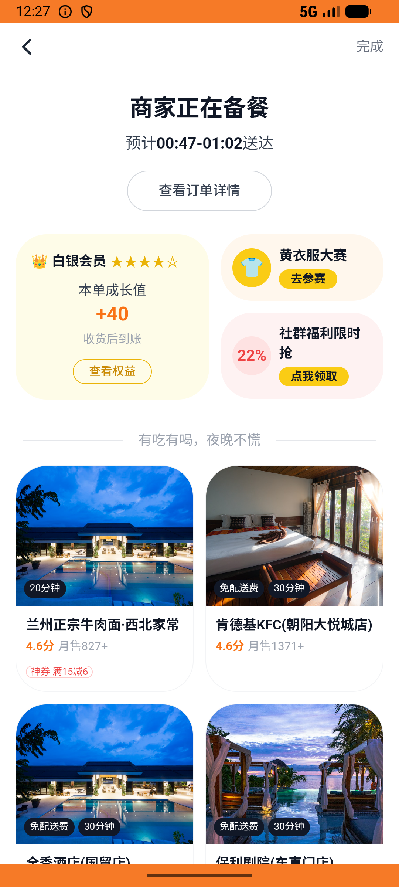

# coupon_v008_coupon_refund_rollback_and_reuse  ⚠️

- **Brand**: `daishushenghuo`
- **Class**: `DaishushenghuoCouponV008CouponRefundRollbackAndReuseTask`
- **Pass@3**: **2/3**  (score = 1.00)
- **Elapsed**: 600s (~10.0 min)
- **Model**: `doubao-seed-2-0-lite-260428`
- **Raw log**: [./raw_logs/DaishushenghuoCouponV008CouponRefundRollbackAndReuseTask.log](./raw_logs/DaishushenghuoCouponV008CouponRefundRollbackAndReuseTask.log)
- **Generated**: 2026-06-02T05:04:10+08:00

## Task Goal

> 【当前账户档案】账号：demo@rlbox.ai；昵称：张三；支付密码：123456，如需支付请使用此密码完成支付；默认收货地址（JSON）：{"recipient": "王", "phone": "15212348132", "address": "惠恒大厦1期 3楼312室"}。请基于以上档案打开 com.daishushenghuo 并完成以下任务：老王牛肉面馆上一单用了满减券，先退款再用同张券重新下单两份红烧牛肉面并支付

## Attempts

| # | Outcome | Steps | Terminated | Reason | Start → End |
|---|---------|-------|------------|--------|-------------|
| 1 | ❌ failed | 26 | answer | 存在第二笔订单（用同一张券复购）: 第二笔订单未含红烧牛肉面 | 2026-06-02 00:23:53 → 2026-06-02 00:27:13 |
| 2 | ✅ passed | 26 | answer | – | 2026-06-02 00:27:13 → 2026-06-02 00:30:15 |
| 3 | ✅ passed | 28 | answer | – | 2026-06-02 00:30:15 → 2026-06-02 00:33:53 |

## Failure Details

### Episode 1 — ❌ failed

- steps_used: `26`
- terminated_reason: `answer`
- reason:

  ```
  存在第二笔订单（用同一张券复购）: 第二笔订单未含红烧牛肉面
  ```
- death shot: 
  - state: [`./death_shots/DaishushenghuoCouponV008CouponRefundRollbackAndReuseTask/episode_001/step_026.json`](./death_shots/DaishushenghuoCouponV008CouponRefundRollbackAndReuseTask/episode_001/step_026.json)
  - digest: [`episode_digest.md`](./death_shots/DaishushenghuoCouponV008CouponRefundRollbackAndReuseTask/episode_001/episode_digest.md)

---

> 本摘要由 `sengclaw/scripts/pipeline/log_summarizer.py` 自动生成。 原始完整 log 见上方 Raw log 链接（含每 step 的 messages / tool_call / screenshot 引用）。
