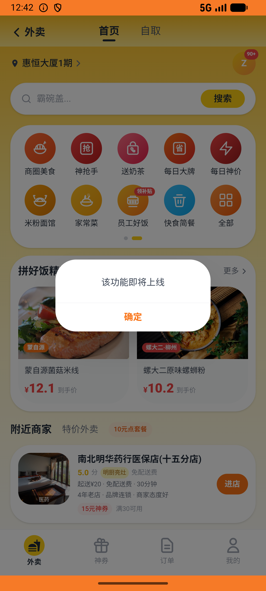

# fan_group_v001_join_fan_group  ⚠️

- **Brand**: `daishushenghuo`
- **Class**: `DaishushenghuoFanGroupV001JoinFanGroupTask`
- **Pass@3**: **2/3**  (score = 1.00)
- **Elapsed**: 600s (~10.0 min)
- **Model**: `doubao-seed-2-0-lite-260428`
- **Raw log**: [./raw_logs/DaishushenghuoFanGroupV001JoinFanGroupTask.log](./raw_logs/DaishushenghuoFanGroupV001JoinFanGroupTask.log)
- **Generated**: 2026-06-02T05:04:10+08:00

## Task Goal

> 【当前账户档案】账号：demo@rlbox.ai；昵称：张三；支付密码：123456，如需支付请使用此密码完成支付；默认收货地址（JSON）：{"recipient": "王", "phone": "15212348132", "address": "惠恒大厦1期 3楼312室"}。请基于以上档案打开 com.daishushenghuo 并完成以下任务：加入老王牛肉面馆的粉丝群

## Attempts

| # | Outcome | Steps | Terminated | Reason | Start → End |
|---|---------|-------|------------|--------|-------------|
| 1 | ✅ passed | 17 | answer | – | 2026-06-02 00:34:37 → 2026-06-02 00:36:49 |
| 2 | ❌ failed | 44 | answer | 已加入粉丝群（已生成一条粉丝群成员记录）: 未找到 demo@rlbox.ai 加入「老王牛肉面馆粉丝群」的记录（data_version=386f141d69dea1c6） | 2026-06-02 00:36:49 → 2026-06-02 00:42:43 |
| 3 | ✅ passed | 15 | answer | – | 2026-06-02 00:42:43 → 2026-06-02 00:44:36 |

## Failure Details

### Episode 2 — ❌ failed

- steps_used: `44`
- terminated_reason: `answer`
- reason:

  ```
  已加入粉丝群（已生成一条粉丝群成员记录）: 未找到 demo@rlbox.ai 加入「老王牛肉面馆粉丝群」的记录（data_version=386f141d69dea1c6）
  ```
- death shot: 
  - state: [`./death_shots/DaishushenghuoFanGroupV001JoinFanGroupTask/episode_002/step_044.json`](./death_shots/DaishushenghuoFanGroupV001JoinFanGroupTask/episode_002/step_044.json)
  - digest: [`episode_digest.md`](./death_shots/DaishushenghuoFanGroupV001JoinFanGroupTask/episode_002/episode_digest.md)

---

> 本摘要由 `sengclaw/scripts/pipeline/log_summarizer.py` 自动生成。 原始完整 log 见上方 Raw log 链接（含每 step 的 messages / tool_call / screenshot 引用）。
