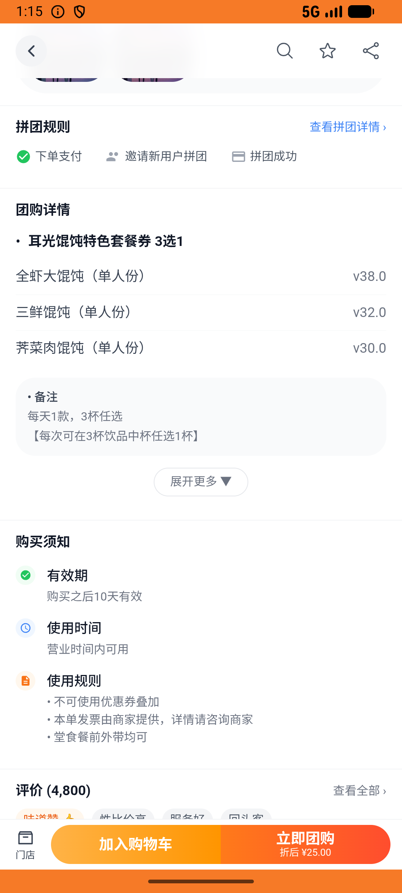
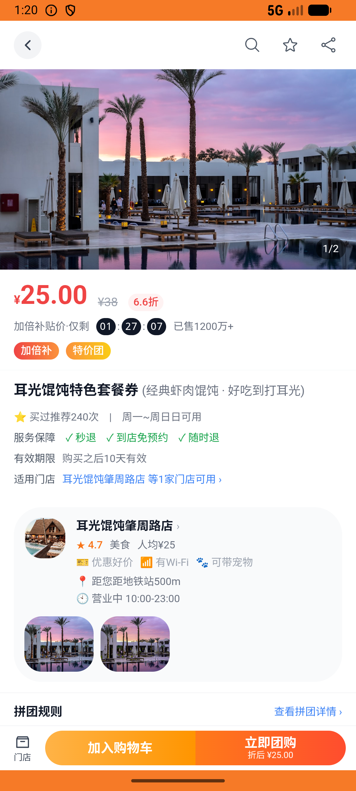

# favorite_v004_favorite_deal_and_add_to_cart  ⚠️

- **Brand**: `daishushenghuo`
- **Class**: `DaishushenghuoFavoriteV004FavoriteDealAndAddToCartTask`
- **Pass@3**: **1/3**  (score = 1.00)
- **Elapsed**: 984s (~16.4 min)
- **Model**: `doubao-seed-2-0-lite-260428`
- **Raw log**: [./raw_logs/DaishushenghuoFavoriteV004FavoriteDealAndAddToCartTask.log](./raw_logs/DaishushenghuoFavoriteV004FavoriteDealAndAddToCartTask.log)
- **Generated**: 2026-06-02T05:04:10+08:00

## Task Goal

> 【当前账户档案】账号：demo@rlbox.ai；昵称：张三；支付密码：123456，如需支付请使用此密码完成支付；默认收货地址（JSON）：{"recipient": "王", "phone": "15212348132", "address": "惠恒大厦1期 3楼312室"}。请基于以上档案打开 com.daishushenghuo 并完成以下任务：收藏 Manner Coffee 的"精品手冲咖啡 单杯券"团购，再到耳光馄饨肇周路店把蟹粉大馄饨和三鲜小馄饨各一份加入购物车（先不下单）

## Attempts

| # | Outcome | Steps | Terminated | Reason | Start → End |
|---|---------|-------|------------|--------|-------------|
| 1 | ❌ failed | 41 | answer | 购物车存在（user × 耳光馄饨肇周路店）: 未找到用户在「耳光馄饨肇周路店」的购物车 | 2026-06-02 01:09:48 → 2026-06-02 01:15:12 |
| 2 | ❌ failed | 36 | answer | 购物车存在（user × 耳光馄饨肇周路店）: 未找到用户在「耳光馄饨肇周路店」的购物车 | 2026-06-02 01:15:12 → 2026-06-02 01:20:07 |
| 3 | ✅ passed | 46 | answer | – | 2026-06-02 01:20:07 → 2026-06-02 01:26:12 |

## Failure Details

### Episode 1 — ❌ failed

- steps_used: `41`
- terminated_reason: `answer`
- reason:

  ```
  购物车存在（user × 耳光馄饨肇周路店）: 未找到用户在「耳光馄饨肇周路店」的购物车
  ```
- death shot: 
  - state: [`./death_shots/DaishushenghuoFavoriteV004FavoriteDealAndAddToCartTask/episode_001/step_041.json`](./death_shots/DaishushenghuoFavoriteV004FavoriteDealAndAddToCartTask/episode_001/step_041.json)
  - digest: [`episode_digest.md`](./death_shots/DaishushenghuoFavoriteV004FavoriteDealAndAddToCartTask/episode_001/episode_digest.md)

### Episode 2 — ❌ failed

- steps_used: `36`
- terminated_reason: `answer`
- reason:

  ```
  购物车存在（user × 耳光馄饨肇周路店）: 未找到用户在「耳光馄饨肇周路店」的购物车
  ```
- death shot: 
  - state: [`./death_shots/DaishushenghuoFavoriteV004FavoriteDealAndAddToCartTask/episode_002/step_036.json`](./death_shots/DaishushenghuoFavoriteV004FavoriteDealAndAddToCartTask/episode_002/step_036.json)
  - digest: [`episode_digest.md`](./death_shots/DaishushenghuoFavoriteV004FavoriteDealAndAddToCartTask/episode_002/episode_digest.md)

---

> 本摘要由 `sengclaw/scripts/pipeline/log_summarizer.py` 自动生成。 原始完整 log 见上方 Raw log 链接（含每 step 的 messages / tool_call / screenshot 引用）。
