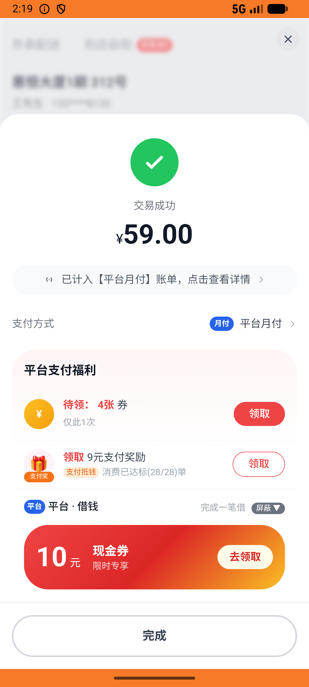
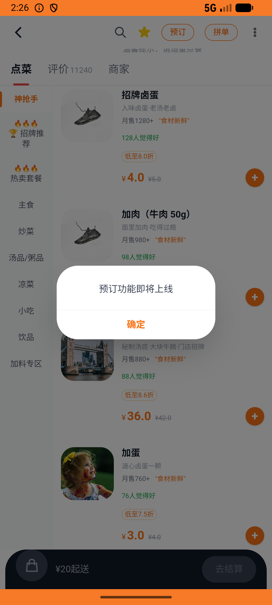

# flow_v004_fan_group_claim_and_use_coupon  ⚠️

- **Brand**: `daishushenghuo`
- **Class**: `DaishushenghuoFlowV004FanGroupClaimAndUseCouponTask`
- **Pass@3**: **1/3**  (score = 1.00)
- **Elapsed**: 1159s (~19.3 min)
- **Model**: `doubao-seed-2-0-lite-260428`
- **Raw log**: [./raw_logs/DaishushenghuoFlowV004FanGroupClaimAndUseCouponTask.log](./raw_logs/DaishushenghuoFlowV004FanGroupClaimAndUseCouponTask.log)
- **Generated**: 2026-06-02T05:04:10+08:00

## Task Goal

> 【当前账户档案】账号：demo@rlbox.ai；昵称：张三；支付密码：123456，如需支付请使用此密码完成支付；默认收货地址（JSON）：{"recipient": "王", "phone": "15212348132", "address": "惠恒大厦1期 3楼312室"}。请基于以上档案打开 com.daishushenghuo 并完成以下任务：进老王牛肉面馆粉丝群领新人福利，再用券点红烧牛肉面和清汤牛肉面下单支付

## Attempts

| # | Outcome | Steps | Terminated | Reason | Start → End |
|---|---------|-------|------------|--------|-------------|
| 1 | ✅ passed | 47 | answer | – | 2026-06-02 02:06:54 → 2026-06-02 02:13:14 |
| 2 | ❌ failed | 49 | answer | 用户已加入粉丝群: 未找到 demo@rlbox.ai 的入群记录; 已领取『新人入群红包』: 未找到群消息对应的领券记录 | 2026-06-02 02:13:14 → 2026-06-02 02:19:12 |
| 3 | ❌ failed | 53 | answer | 用户已加入粉丝群: 未找到 demo@rlbox.ai 的入群记录; 已领取『新人入群红包』: 未找到群消息对应的领券记录 | 2026-06-02 02:19:12 → 2026-06-02 02:26:12 |

## Failure Details

### Episode 2 — ❌ failed

- steps_used: `49`
- terminated_reason: `answer`
- reason:

  ```
  用户已加入粉丝群: 未找到 demo@rlbox.ai 的入群记录; 已领取『新人入群红包』: 未找到群消息对应的领券记录
  ```
- death shot: 
  - state: [`./death_shots/DaishushenghuoFlowV004FanGroupClaimAndUseCouponTask/episode_002/step_049.json`](./death_shots/DaishushenghuoFlowV004FanGroupClaimAndUseCouponTask/episode_002/step_049.json)
  - digest: [`episode_digest.md`](./death_shots/DaishushenghuoFlowV004FanGroupClaimAndUseCouponTask/episode_002/episode_digest.md)

### Episode 3 — ❌ failed

- steps_used: `53`
- terminated_reason: `answer`
- reason:

  ```
  用户已加入粉丝群: 未找到 demo@rlbox.ai 的入群记录; 已领取『新人入群红包』: 未找到群消息对应的领券记录
  ```
- death shot: 
  - state: [`./death_shots/DaishushenghuoFlowV004FanGroupClaimAndUseCouponTask/episode_003/step_053.json`](./death_shots/DaishushenghuoFlowV004FanGroupClaimAndUseCouponTask/episode_003/step_053.json)
  - digest: [`episode_digest.md`](./death_shots/DaishushenghuoFlowV004FanGroupClaimAndUseCouponTask/episode_003/episode_digest.md)

---

> 本摘要由 `sengclaw/scripts/pipeline/log_summarizer.py` 自动生成。 原始完整 log 见上方 Raw log 链接（含每 step 的 messages / tool_call / screenshot 引用）。
