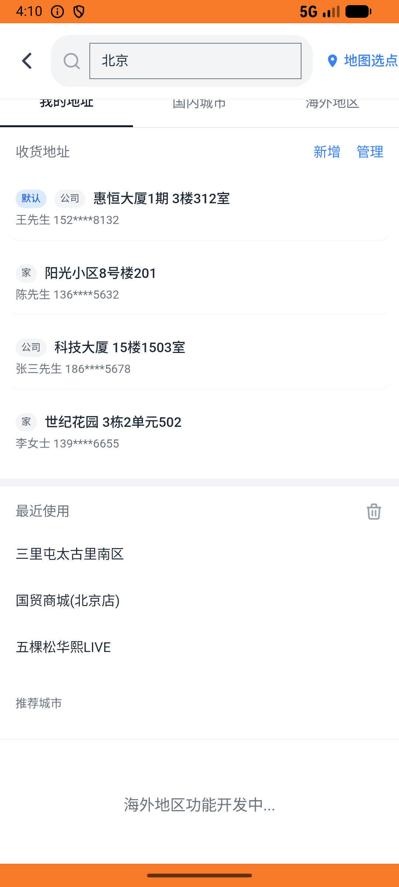

# leisure_v001_place_leisure_order  ⚠️

- **Brand**: `daishushenghuo`
- **Class**: `DaishushenghuoLeisureV001PlaceLeisureOrderTask`
- **Pass@3**: **2/3**  (score = 1.00)
- **Elapsed**: 976s (~16.3 min)
- **Model**: `doubao-seed-2-0-lite-260428`
- **Raw log**: [./raw_logs/DaishushenghuoLeisureV001PlaceLeisureOrderTask.log](./raw_logs/DaishushenghuoLeisureV001PlaceLeisureOrderTask.log)
- **Generated**: 2026-06-02T05:04:10+08:00

## Task Goal

> 【当前账户档案】账号：demo@rlbox.ai；昵称：张三；支付密码：123456，如需支付请使用此密码完成支付；默认收货地址（JSON）：{"recipient": "王", "phone": "15212348132", "address": "惠恒大厦1期 3楼312室"}。请基于以上档案打开 com.daishushenghuo 并完成以下任务：去X先生密室逃脱三里屯店下单一份周末畅玩密室逃脱双人票，只提交不支付

## Attempts

| # | Outcome | Steps | Terminated | Reason | Start → End |
|---|---------|-------|------------|--------|-------------|
| 1 | ✅ passed | 52 | answer | – | 2026-06-02 03:57:38 → 2026-06-02 04:06:52 |
| 2 | ❌ failed | 28 | answer | 团购订单已创建（订单类型为「团购订单」）: 未找到 demo@rlbox.ai 在「X先生密室逃脱(三里屯店)」【周末畅玩】密室逃脱双人票的团购订单（data_version=fcdbf939708c782c） | 2026-06-02 04:06:52 → 2026-06-02 04:10:10 |
| 3 | ✅ passed | 29 | answer | – | 2026-06-02 04:10:10 → 2026-06-02 04:13:53 |

## Failure Details

### Episode 2 — ❌ failed

- steps_used: `28`
- terminated_reason: `answer`
- reason:

  ```
  团购订单已创建（订单类型为「团购订单」）: 未找到 demo@rlbox.ai 在「X先生密室逃脱(三里屯店)」【周末畅玩】密室逃脱双人票的团购订单（data_version=fcdbf939708c782c）
  ```
- death shot: 
  - state: [`./death_shots/DaishushenghuoLeisureV001PlaceLeisureOrderTask/episode_002/step_028.json`](./death_shots/DaishushenghuoLeisureV001PlaceLeisureOrderTask/episode_002/step_028.json)
  - digest: [`episode_digest.md`](./death_shots/DaishushenghuoLeisureV001PlaceLeisureOrderTask/episode_002/episode_digest.md)

---

> 本摘要由 `sengclaw/scripts/pipeline/log_summarizer.py` 自动生成。 原始完整 log 见上方 Raw log 链接（含每 step 的 messages / tool_call / screenshot 引用）。
