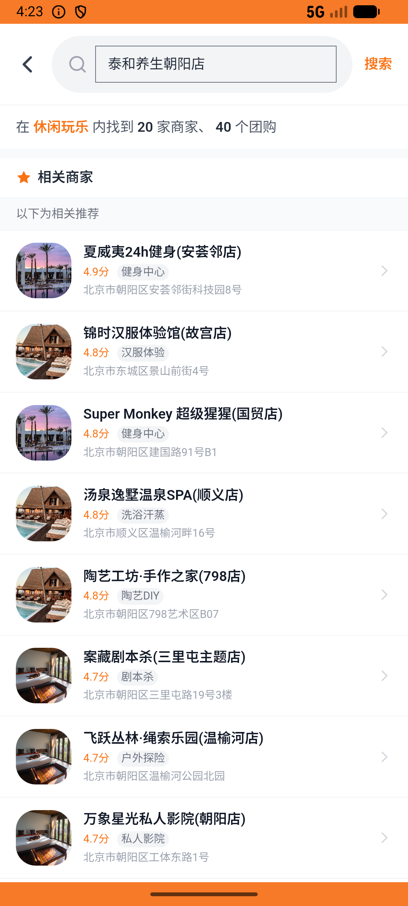
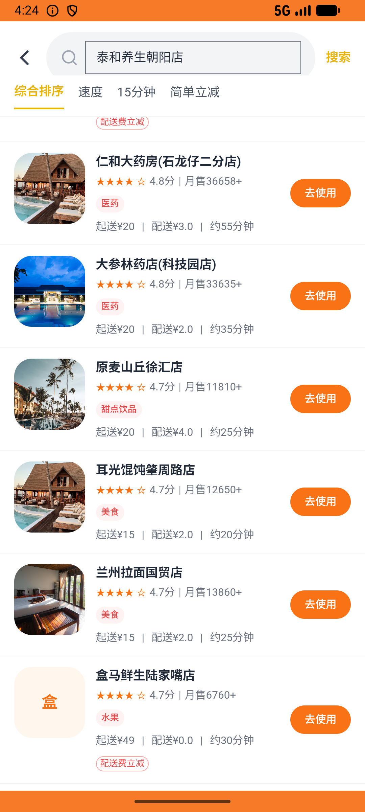
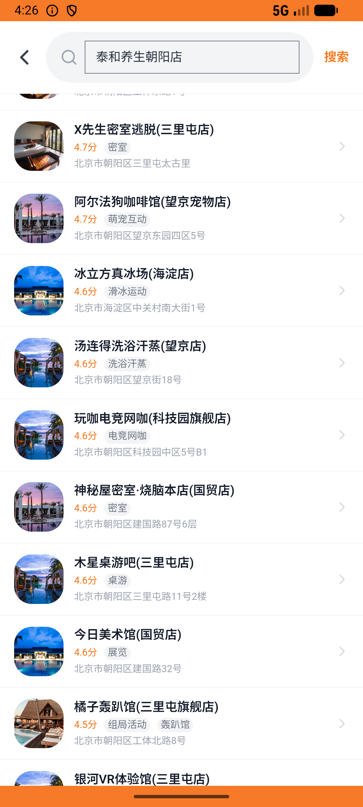

# leisure_v003_quick_pay_leisure  ❌

- **Brand**: `daishushenghuo`
- **Class**: `DaishushenghuoLeisureV003QuickPayLeisureTask`
- **Pass@3**: **0/3**  (score = 0.00)
- **Elapsed**: 253s (~4.2 min)
- **Model**: `doubao-seed-2-0-lite-260428`
- **Raw log**: [./raw_logs/DaishushenghuoLeisureV003QuickPayLeisureTask.log](./raw_logs/DaishushenghuoLeisureV003QuickPayLeisureTask.log)
- **Generated**: 2026-06-02T05:04:10+08:00

## Task Goal

> 【当前账户档案】账号：demo@rlbox.ai；昵称：张三；支付密码：123456，如需支付请使用此密码完成支付；默认收货地址（JSON）：{"recipient": "王", "phone": "15212348132", "address": "惠恒大厦1期 3楼312室"}。请基于以上档案打开 com.daishushenghuo 并完成以下任务：去泰和养生朝阳店买一份60分钟全身精油SPA并支付

## Attempts

| # | Outcome | Steps | Terminated | Reason | Start → End |
|---|---------|-------|------------|--------|-------------|
| 1 | ❌ failed | 15 | answer | 团购订单已创建并完成支付（订单类型为「团购订单」、状态为「已支付」）: 未找到 demo@rlbox.ai 在「泰和养生(朝阳店)」60分钟全身精油SPA 的已支付团购订单 | 2026-06-02 04:22:21 → 2026-06-02 04:24:02 |
| 2 | ❌ failed | 8 | answer | 团购订单已创建并完成支付（订单类型为「团购订单」、状态为「已支付」）: 未找到 demo@rlbox.ai 在「泰和养生(朝阳店)」60分钟全身精油SPA 的已支付团购订单 | 2026-06-02 04:24:02 → 2026-06-02 04:24:55 |
| 3 | ❌ failed | 15 | answer | 团购订单已创建并完成支付（订单类型为「团购订单」、状态为「已支付」）: 未找到 demo@rlbox.ai 在「泰和养生(朝阳店)」60分钟全身精油SPA 的已支付团购订单 | 2026-06-02 04:24:55 → 2026-06-02 04:26:34 |

## Failure Details

### Episode 1 — ❌ failed

- steps_used: `15`
- terminated_reason: `answer`
- reason:

  ```
  团购订单已创建并完成支付（订单类型为「团购订单」、状态为「已支付」）: 未找到 demo@rlbox.ai 在「泰和养生(朝阳店)」60分钟全身精油SPA 的已支付团购订单
  ```
- death shot: 
  - state: [`./death_shots/DaishushenghuoLeisureV003QuickPayLeisureTask/episode_001/step_015.json`](./death_shots/DaishushenghuoLeisureV003QuickPayLeisureTask/episode_001/step_015.json)
  - digest: [`episode_digest.md`](./death_shots/DaishushenghuoLeisureV003QuickPayLeisureTask/episode_001/episode_digest.md)

### Episode 2 — ❌ failed

- steps_used: `8`
- terminated_reason: `answer`
- reason:

  ```
  团购订单已创建并完成支付（订单类型为「团购订单」、状态为「已支付」）: 未找到 demo@rlbox.ai 在「泰和养生(朝阳店)」60分钟全身精油SPA 的已支付团购订单
  ```
- death shot: 
  - state: [`./death_shots/DaishushenghuoLeisureV003QuickPayLeisureTask/episode_002/step_008.json`](./death_shots/DaishushenghuoLeisureV003QuickPayLeisureTask/episode_002/step_008.json)
  - digest: [`episode_digest.md`](./death_shots/DaishushenghuoLeisureV003QuickPayLeisureTask/episode_002/episode_digest.md)

### Episode 3 — ❌ failed

- steps_used: `15`
- terminated_reason: `answer`
- reason:

  ```
  团购订单已创建并完成支付（订单类型为「团购订单」、状态为「已支付」）: 未找到 demo@rlbox.ai 在「泰和养生(朝阳店)」60分钟全身精油SPA 的已支付团购订单
  ```
- death shot: 
  - state: [`./death_shots/DaishushenghuoLeisureV003QuickPayLeisureTask/episode_003/step_015.json`](./death_shots/DaishushenghuoLeisureV003QuickPayLeisureTask/episode_003/step_015.json)
  - digest: [`episode_digest.md`](./death_shots/DaishushenghuoLeisureV003QuickPayLeisureTask/episode_003/episode_digest.md)

---

> 本摘要由 `sengclaw/scripts/pipeline/log_summarizer.py` 自动生成。 原始完整 log 见上方 Raw log 链接（含每 step 的 messages / tool_call / screenshot 引用）。
