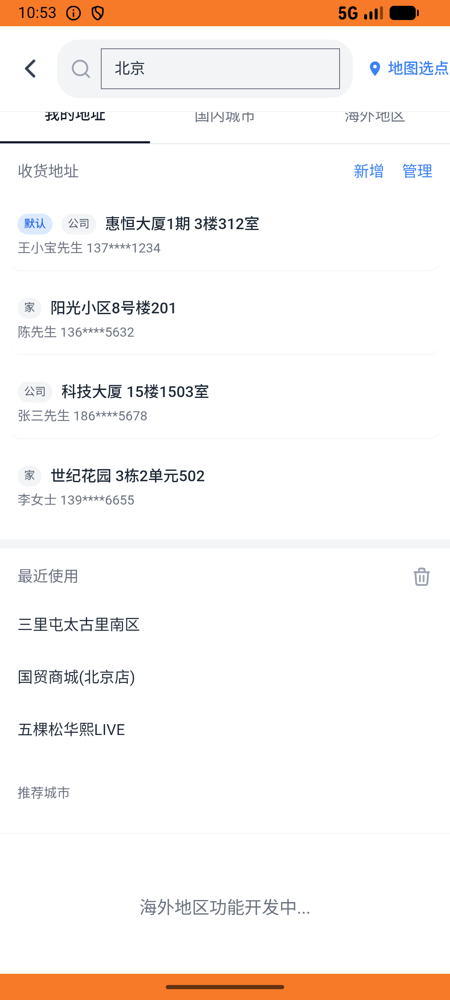

# leisure_v004_add_leisure_to_cart  ⚠️

- **Brand**: `daishushenghuo`
- **Class**: `DaishushenghuoLeisureV004AddLeisureToCartTask`
- **Pass@3**: **1/3**  (score = 1.00)
- **Elapsed**: 566s (~9.4 min)
- **Model**: `doubao-seed-2-0-lite-260428`
- **Raw log**: [./raw_logs/DaishushenghuoLeisureV004AddLeisureToCartTask.log](./raw_logs/DaishushenghuoLeisureV004AddLeisureToCartTask.log)
- **Generated**: 2026-06-03T02:38:08+08:00

## Task Goal

> 【当前账户档案】账号：demo@rlbox.ai；昵称：张三；支付密码：123456，如需支付请使用此密码完成支付；默认收货地址（JSON）：{"recipient": "王", "phone": "15212348132", "address": "惠恒大厦1期 3楼312室"}。请基于以上档案打开 com.daishushenghuo 并完成以下任务：把唱吧麦颂KTV望京店的下午场3小时欢唱套餐加入购物车

## Attempts

| # | Outcome | Steps | Terminated | Reason | Start → End |
|---|---------|-------|------------|--------|-------------|
| 1 | ✅ passed | 20 | answer | – | 2026-06-02 22:44:15 → 2026-06-02 22:47:10 |
| 2 | ❌ failed | 18 | answer | 团购购物车记录已创建: 未找到对应购物车记录（user=1, group_deal_id=47, data_version=60b91f96f64c139b） | 2026-06-02 22:47:10 → 2026-06-02 22:49:32 |
| 3 | ❌ failed | 32 | answer | 团购购物车记录已创建: 未找到对应购物车记录（user=1, group_deal_id=47, data_version=000744f69e4a8e79） | 2026-06-02 22:49:32 → 2026-06-02 22:53:40 |

## Failure Details

### Episode 2 — ❌ failed

- steps_used: `18`
- terminated_reason: `answer`
- reason:

  ```
  团购购物车记录已创建: 未找到对应购物车记录（user=1, group_deal_id=47, data_version=60b91f96f64c139b）
  ```
- death shot: 
  - state: [`./death_shots/DaishushenghuoLeisureV004AddLeisureToCartTask/episode_002/step_018.json`](./death_shots/DaishushenghuoLeisureV004AddLeisureToCartTask/episode_002/step_018.json)
  - digest: [`episode_digest.md`](./death_shots/DaishushenghuoLeisureV004AddLeisureToCartTask/episode_002/episode_digest.md)

### Episode 3 — ❌ failed

- steps_used: `32`
- terminated_reason: `answer`
- reason:

  ```
  团购购物车记录已创建: 未找到对应购物车记录（user=1, group_deal_id=47, data_version=000744f69e4a8e79）
  ```
- death shot: 
  - state: [`./death_shots/DaishushenghuoLeisureV004AddLeisureToCartTask/episode_003/step_032.json`](./death_shots/DaishushenghuoLeisureV004AddLeisureToCartTask/episode_003/step_032.json)
  - digest: [`episode_digest.md`](./death_shots/DaishushenghuoLeisureV004AddLeisureToCartTask/episode_003/episode_digest.md)

---

> 本摘要由 `sengclaw/scripts/pipeline/log_summarizer.py` 自动生成。 原始完整 log 见上方 Raw log 链接（含每 step 的 messages / tool_call / screenshot 引用）。
