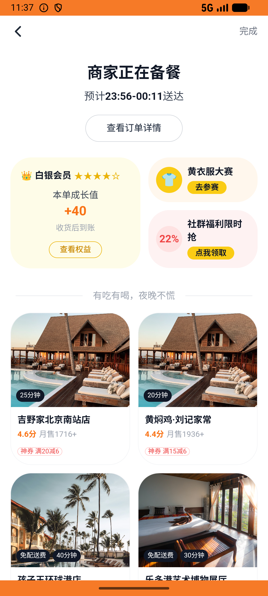
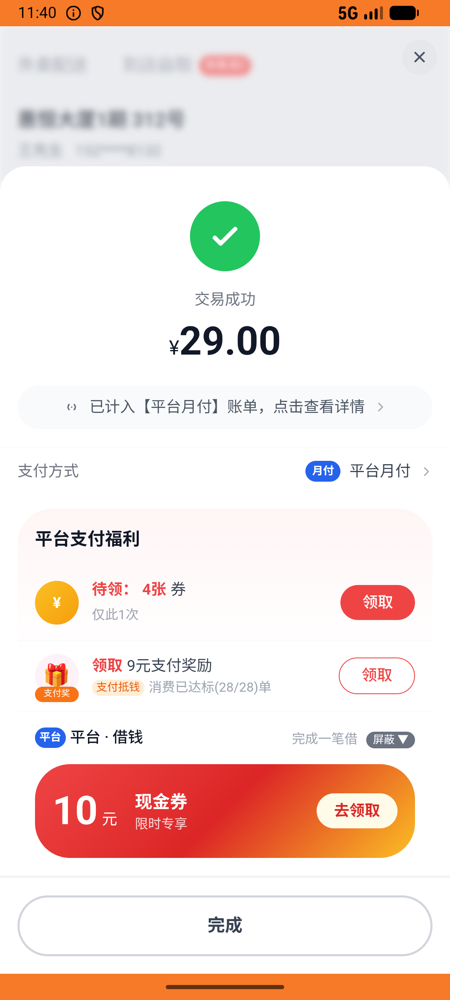

# order_v016_auto_cancel_unpaid_order  ⚠️

- **Brand**: `daishushenghuo`
- **Class**: `DaishushenghuoOrderV016AutoCancelUnpaidOrderTask`
- **Pass@3**: **1/3**  (score = 1.00)
- **Elapsed**: 1158s (~19.3 min)
- **Model**: `doubao-seed-2-0-lite-260428`
- **Raw log**: [./raw_logs/DaishushenghuoOrderV016AutoCancelUnpaidOrderTask.log](./raw_logs/DaishushenghuoOrderV016AutoCancelUnpaidOrderTask.log)
- **Generated**: 2026-06-03T02:38:08+08:00

## Task Goal

> 【当前账户档案】账号：demo@rlbox.ai；昵称：张三；支付密码：123456，如需支付请使用此密码完成支付；默认收货地址（JSON）：{"recipient": "王", "phone": "15212348132", "address": "惠恒大厦1期 3楼312室"}。请基于以上档案打开 com.daishushenghuo 并完成以下任务：取消老王牛肉面馆的待支付订单，改在黄焖鸡米饭下单 1 份黄焖鸡米饭小份并支付

## Attempts

| # | Outcome | Steps | Terminated | Reason | Start → End |
|---|---------|-------|------------|--------|-------------|
| 1 | ❌ failed | 64 | answer | 新订单商品为「黄焖鸡米饭（小份）」: 新订单未包含「黄焖鸡米饭（小份）」，可能下错商品 | 2026-06-02 23:28:42 → 2026-06-02 23:37:07 |
| 2 | ❌ failed | 31 | answer | 新订单商品为「黄焖鸡米饭（小份）」: 新订单未包含「黄焖鸡米饭（小份）」，可能下错商品 | 2026-06-02 23:37:07 → 2026-06-02 23:41:02 |
| 3 | ✅ passed | 54 | answer | – | 2026-06-02 23:41:02 → 2026-06-02 23:48:00 |

## Failure Details

### Episode 1 — ❌ failed

- steps_used: `64`
- terminated_reason: `answer`
- reason:

  ```
  新订单商品为「黄焖鸡米饭（小份）」: 新订单未包含「黄焖鸡米饭（小份）」，可能下错商品
  ```
- death shot: 
  - state: [`./death_shots/DaishushenghuoOrderV016AutoCancelUnpaidOrderTask/episode_001/step_064.json`](./death_shots/DaishushenghuoOrderV016AutoCancelUnpaidOrderTask/episode_001/step_064.json)
  - digest: [`episode_digest.md`](./death_shots/DaishushenghuoOrderV016AutoCancelUnpaidOrderTask/episode_001/episode_digest.md)

### Episode 2 — ❌ failed

- steps_used: `31`
- terminated_reason: `answer`
- reason:

  ```
  新订单商品为「黄焖鸡米饭（小份）」: 新订单未包含「黄焖鸡米饭（小份）」，可能下错商品
  ```
- death shot: 
  - state: [`./death_shots/DaishushenghuoOrderV016AutoCancelUnpaidOrderTask/episode_002/step_031.json`](./death_shots/DaishushenghuoOrderV016AutoCancelUnpaidOrderTask/episode_002/step_031.json)
  - digest: [`episode_digest.md`](./death_shots/DaishushenghuoOrderV016AutoCancelUnpaidOrderTask/episode_002/episode_digest.md)

---

> 本摘要由 `sengclaw/scripts/pipeline/log_summarizer.py` 自动生成。 原始完整 log 见上方 Raw log 链接（含每 step 的 messages / tool_call / screenshot 引用）。
