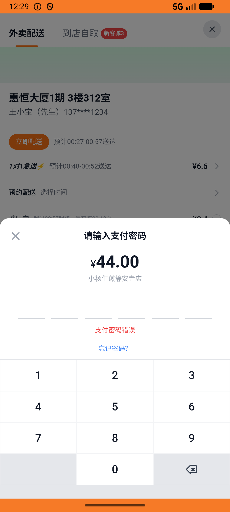

# order_v018_wucan_pay_and_refund  ⚠️

- **Brand**: `daishushenghuo`
- **Class**: `DaishushenghuoOrderV018WucanPayAndRefundTask`
- **Pass@3**: **2/3**  (score = 1.00)
- **Elapsed**: 1513s (~25.2 min)
- **Model**: `doubao-seed-2-0-lite-260428`
- **Raw log**: [./raw_logs/DaishushenghuoOrderV018WucanPayAndRefundTask.log](./raw_logs/DaishushenghuoOrderV018WucanPayAndRefundTask.log)
- **Generated**: 2026-06-03T02:38:08+08:00

## Task Goal

> 【当前账户档案】账号：demo@rlbox.ai；昵称：张三；支付密码：123456，如需支付请使用此密码完成支付；默认收货地址（JSON）：{"recipient": "王", "phone": "15212348132", "address": "惠恒大厦1期 3楼312室"}。请基于以上档案打开 com.daishushenghuo 并完成以下任务：在午餐页面进入小杨生煎静安寺店，加购鲜肉生煎（4只）和咖喱牛肉粉丝汤各一份，下单支付后申请退款

## Attempts

| # | Outcome | Steps | Terminated | Reason | Start → End |
|---|---------|-------|------------|--------|-------------|
| 1 | ✅ passed | 34 | answer | – | 2026-06-03 00:04:56 → 2026-06-03 00:09:05 |
| 2 | ✅ passed | 57 | answer | – | 2026-06-03 00:09:05 → 2026-06-03 00:17:12 |
| 3 | ⏰ timeout | 80 | max_steps | 订单状态 = refunded: 预期 'refunded'，实际 "pending" | 2026-06-03 00:17:12 → 2026-06-03 00:30:08 |

## Failure Details

### Episode 3 — ⏰ timeout

- steps_used: `80`
- terminated_reason: `max_steps`
- reason:

  ```
  订单状态 = refunded: 预期 'refunded'，实际 "pending"
  ```
- death shot: 
  - state: [`./death_shots/DaishushenghuoOrderV018WucanPayAndRefundTask/episode_003/step_080.json`](./death_shots/DaishushenghuoOrderV018WucanPayAndRefundTask/episode_003/step_080.json)
  - digest: [`episode_digest.md`](./death_shots/DaishushenghuoOrderV018WucanPayAndRefundTask/episode_003/episode_digest.md)

---

> 本摘要由 `sengclaw/scripts/pipeline/log_summarizer.py` 自动生成。 原始完整 log 见上方 Raw log 链接（含每 step 的 messages / tool_call / screenshot 引用）。
