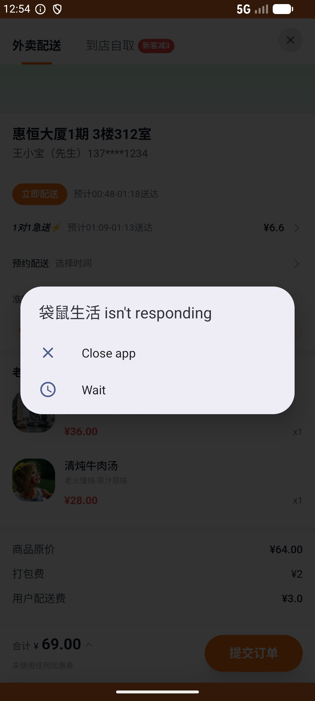
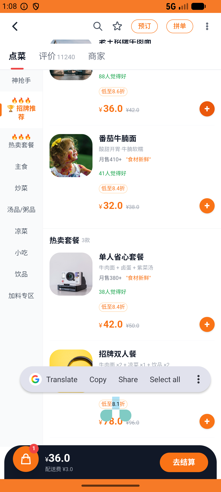

# order_v019_kuaican_search_and_remark  ⚠️

- **Brand**: `daishushenghuo`
- **Class**: `DaishushenghuoOrderV019KuaicanSearchAndRemarkTask`
- **Pass@3**: **1/3**  (score = 1.00)
- **Elapsed**: 2477s (~41.3 min)
- **Model**: `doubao-seed-2-0-lite-260428`
- **Raw log**: [./raw_logs/DaishushenghuoOrderV019KuaicanSearchAndRemarkTask.log](./raw_logs/DaishushenghuoOrderV019KuaicanSearchAndRemarkTask.log)
- **Generated**: 2026-06-03T02:38:08+08:00

## Task Goal

> 【当前账户档案】账号：demo@rlbox.ai；昵称：张三；支付密码：123456，如需支付请使用此密码完成支付；默认收货地址（JSON）：{"recipient": "王", "phone": "15212348132", "address": "惠恒大厦1期 3楼312室"}。请基于以上档案打开 com.daishushenghuo 并完成以下任务：在快食简餐页面搜索"牛肉面"，进入老王牛肉面馆，点一份老王招牌牛肉面和一份清炖牛肉汤，备注"汤多一点"后下单，待支付

## Attempts

| # | Outcome | Steps | Terminated | Reason | Start → End |
|---|---------|-------|------------|--------|-------------|
| 1 | ⏰ timeout | 80 | max_steps | 订单已创建（店铺=老王牛肉面馆）: 未找到用户在「老王牛肉面馆」的订单 | 2026-06-03 00:30:51 → 2026-06-03 00:54:27 |
| 2 | ⏰ timeout | 80 | max_steps | 订单已创建（店铺=老王牛肉面馆）: 未找到用户在「老王牛肉面馆」的订单 | 2026-06-03 00:54:27 → 2026-06-03 01:08:30 |
| 3 | ✅ passed | 27 | answer | – | 2026-06-03 01:08:30 → 2026-06-03 01:12:08 |

## Failure Details

### Episode 1 — ⏰ timeout

- steps_used: `80`
- terminated_reason: `max_steps`
- reason:

  ```
  订单已创建（店铺=老王牛肉面馆）: 未找到用户在「老王牛肉面馆」的订单
  ```
- death shot: 
  - state: [`./death_shots/DaishushenghuoOrderV019KuaicanSearchAndRemarkTask/episode_001/step_080.json`](./death_shots/DaishushenghuoOrderV019KuaicanSearchAndRemarkTask/episode_001/step_080.json)
  - digest: [`episode_digest.md`](./death_shots/DaishushenghuoOrderV019KuaicanSearchAndRemarkTask/episode_001/episode_digest.md)

### Episode 2 — ⏰ timeout

- steps_used: `80`
- terminated_reason: `max_steps`
- reason:

  ```
  订单已创建（店铺=老王牛肉面馆）: 未找到用户在「老王牛肉面馆」的订单
  ```
- death shot: 
  - state: [`./death_shots/DaishushenghuoOrderV019KuaicanSearchAndRemarkTask/episode_002/step_080.json`](./death_shots/DaishushenghuoOrderV019KuaicanSearchAndRemarkTask/episode_002/step_080.json)
  - digest: [`episode_digest.md`](./death_shots/DaishushenghuoOrderV019KuaicanSearchAndRemarkTask/episode_002/episode_digest.md)

---

> 本摘要由 `sengclaw/scripts/pipeline/log_summarizer.py` 自动生成。 原始完整 log 见上方 Raw log 链接（含每 step 的 messages / tool_call / screenshot 引用）。
