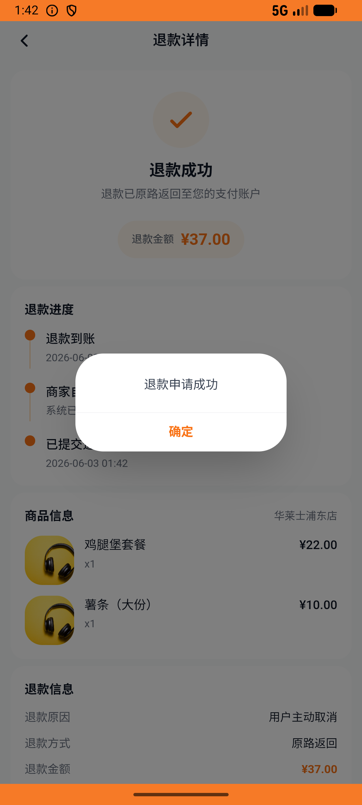

# order_v021_kuaican_place_and_cancel  ⚠️

- **Brand**: `daishushenghuo`
- **Class**: `DaishushenghuoOrderV021KuaicanPlaceAndCancelTask`
- **Pass@3**: **1/3**  (score = 1.00)
- **Elapsed**: 1353s (~22.6 min)
- **Model**: `doubao-seed-2-0-lite-260428`
- **Raw log**: [./raw_logs/DaishushenghuoOrderV021KuaicanPlaceAndCancelTask.log](./raw_logs/DaishushenghuoOrderV021KuaicanPlaceAndCancelTask.log)
- **Generated**: 2026-06-03T02:38:08+08:00

## Task Goal

> 【当前账户档案】账号：demo@rlbox.ai；昵称：张三；支付密码：123456，如需支付请使用此密码完成支付；默认收货地址（JSON）：{"recipient": "王", "phone": "15212348132", "address": "惠恒大厦1期 3楼312室"}。请基于以上档案打开 com.daishushenghuo 并完成以下任务：在快食简餐页面进入华莱士朝阳店，加购一份鸡腿堡套餐和一份薯条（大份）下单后取消订单

## Attempts

| # | Outcome | Steps | Terminated | Reason | Start → End |
|---|---------|-------|------------|--------|-------------|
| 1 | ✅ passed | 41 | answer | – | 2026-06-03 01:30:08 → 2026-06-03 01:35:48 |
| 2 | ❌ failed | 52 | answer | 订单已创建（店铺=华莱士朝阳店）: 未找到用户在「华莱士朝阳店」的订单 | 2026-06-03 01:35:48 → 2026-06-03 01:42:42 |
| 3 | ❌ failed | 66 | answer | 订单已创建（店铺=华莱士朝阳店）: 未找到用户在「华莱士朝阳店」的订单 | 2026-06-03 01:42:42 → 2026-06-03 01:52:40 |

## Failure Details

### Episode 2 — ❌ failed

- steps_used: `52`
- terminated_reason: `answer`
- reason:

  ```
  订单已创建（店铺=华莱士朝阳店）: 未找到用户在「华莱士朝阳店」的订单
  ```
- death shot: 
  - state: [`./death_shots/DaishushenghuoOrderV021KuaicanPlaceAndCancelTask/episode_002/step_052.json`](./death_shots/DaishushenghuoOrderV021KuaicanPlaceAndCancelTask/episode_002/step_052.json)
  - digest: [`episode_digest.md`](./death_shots/DaishushenghuoOrderV021KuaicanPlaceAndCancelTask/episode_002/episode_digest.md)

### Episode 3 — ❌ failed

- steps_used: `66`
- terminated_reason: `answer`
- reason:

  ```
  订单已创建（店铺=华莱士朝阳店）: 未找到用户在「华莱士朝阳店」的订单
  ```
- death shot: 
  - state: [`./death_shots/DaishushenghuoOrderV021KuaicanPlaceAndCancelTask/episode_003/step_066.json`](./death_shots/DaishushenghuoOrderV021KuaicanPlaceAndCancelTask/episode_003/step_066.json)
  - digest: [`episode_digest.md`](./death_shots/DaishushenghuoOrderV021KuaicanPlaceAndCancelTask/episode_003/episode_digest.md)

---

> 本摘要由 `sengclaw/scripts/pipeline/log_summarizer.py` 自动生成。 原始完整 log 见上方 Raw log 链接（含每 step 的 messages / tool_call / screenshot 引用）。
